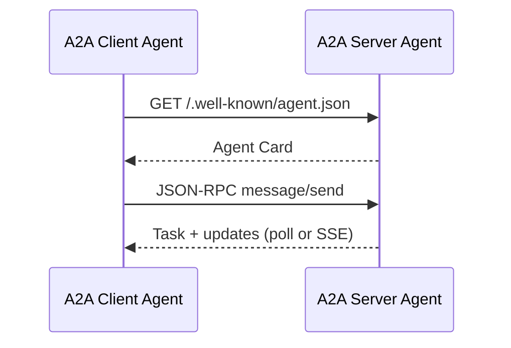

## What & When

**A2A (Agent2Agent Protocol)** is Google's open standard for **remote agents** to discover each other, exchange tasks, and collaborate over **HTTP(S) with JSON-RPC 2.0**. A client agent delegates work to a server agent without knowing its internal framework (LangGraph, [[AI — ADK]], CrewAI, custom code).

Use A2A when:

- Exposing an agent as a network service other agents can call
- Building multi-agent systems where specialists live on different hosts
- Publishing capabilities via an **Agent Card** (`.well-known/agent.json`)
- Supporting long-running tasks, streaming (SSE), or push notifications

For **IDE ↔ coding agent** (stdio), see [[AI — ACP]]. For **LLM ↔ tools**, see [[AI — MCP]].

```bash
pip install a2a-sdk
# HTTP server helpers
pip install "a2a-sdk[http-server]"
# optional: grpc, telemetry, sql task stores, encryption
pip install "a2a-sdk[all]"
```

Requires **Python 3.10+**.

Spec: [Agent2Agent Protocol](https://google.github.io/A2A/) · SDK: [a2aproject/a2a-python](https://github.com/a2aproject/a2a-python)

---

## A2A vs Related Protocols

| Protocol | Wire | Primary use | Package |
| --- | --- | --- | --- |
| **A2A** | HTTP JSON-RPC | Agent ↔ agent | `a2a-sdk` |
| **ACP** | stdio JSON-RPC | Editor ↔ coding agent | [[AI — ACP]] |
| **MCP** | stdio / HTTP | Host ↔ tools & data | [[AI — MCP]] |

| Concept | Purpose |
| --- | --- |
| **Agent Card** | JSON metadata: name, URL, skills, capabilities |
| **AgentExecutor** | Your logic: handle messages, emit events/artifacts |
| **Task** | Stateful unit of work (`submitted` → `working` → `completed`) |
| **Message / Part** | Turn-based content (`TextPart`, `FilePart`, `DataPart`) |
| **Artifact** | Task output (documents, structured data, streamed chunks) |

---

## Core Flow



1. **Discover** — fetch Agent Card from well-known URL  
2. **Send** — `message/send` or `message/stream` with user message  
3. **Execute** — server's `AgentExecutor` runs your code  
4. **Complete** — task status + artifacts returned (or streamed)

---

## Agent Card

Describes identity, endpoint, skills, and supported features (streaming, push).

```python
from a2a.types import AgentCapabilities, AgentCard, AgentSkill

skill = AgentSkill(
    id="hello_world",
    name="Say hello",
    description="Returns a friendly greeting",
    tags=["demo"],
    examples=["Say hi", "Hello"],
)

agent_card = AgentCard(
    name="Hello World Agent",
    description="Minimal A2A demo agent",
    url="http://localhost:8000/",
    version="1.0.0",
    default_input_modes=["text/plain"],
    default_output_modes=["text/plain"],
    capabilities=AgentCapabilities(streaming=True),
    skills=[skill],
)
```

Clients read `/.well-known/agent.json` (path per spec) to choose the right remote agent.

---

## AgentExecutor

Bridge between JSON-RPC handlers and your business logic. Implement `execute` (and optionally `cancel`).

```python
from a2a.server.agent_execution import AgentExecutor, RequestContext
from a2a.server.events import EventQueue
from a2a.utils import new_agent_text_message


class HelloWorldAgentExecutor(AgentExecutor):
    async def execute(self, context: RequestContext, event_queue: EventQueue) -> None:
        user_text = context.get_user_input() or "Hello"
        await event_queue.enqueue_event(
            new_agent_text_message(f"Hello from A2A! You said: {user_text}")
        )

    async def cancel(self, context: RequestContext, event_queue: EventQueue) -> None:
        pass  # optional: stop long-running work
```

Wire with a **request handler** and **task store** (in-memory for dev).

```python
from a2a.server.request_handlers import DefaultRequestHandler
from a2a.server.tasks import InMemoryTaskStore

request_handler = DefaultRequestHandler(
    agent_executor=HelloWorldAgentExecutor(),
    task_store=InMemoryTaskStore(),
)
```

---

## HTTP Server (Starlette)

```python
from a2a.server.apps import A2AStarletteApplication

# agent_card and request_handler defined above

server = A2AStarletteApplication(
    agent_card=agent_card,
    http_handler=request_handler,
)

app = server.build()
# uvicorn app:app --host 0.0.0.0 --port 8000
```

Install `a2a-sdk[http-server]` and run with **uvicorn** or embed in [[API - FastAPI]] via ASGI mount.

---

## A2A Client (call a remote agent)

```python
import httpx
from a2a.client import A2AClient
from a2a.types import Message, Part, TextPart

async def call_remote_agent(base_url: str, text: str) -> None:
    async with httpx.AsyncClient() as http:
        client = await A2AClient.connect(http, base_url)
        card = await client.get_agent_card()
        print(card.name, card.skills)

        message = Message(
            role="user",
            parts=[Part(root=TextPart(text=text))],
        )
        response = await client.send_message(message)
        print(response)
```

Exact client APIs evolve with SDK version — check `a2a.client` in your installed release.

**Task modes:** poll (`message/send` + `tasks/get`), stream (`message/stream` + SSE), or push webhooks — declare capabilities on the Agent Card. Auth travels in **HTTP headers**, not RPC bodies. Implement `execute()` with [[AI — LangGraph]], [[AI — CrewAI]], or [[AI — LangChain]] inside `AgentExecutor`.

---

## Quick Reference

| Task | Component |
| --- | --- |
| Describe agent | `AgentCard` + `AgentSkill` |
| Implement logic | Subclass `AgentExecutor` |
| Handle RPC | `DefaultRequestHandler` + `TaskStore` |
| Expose HTTP | `A2AStarletteApplication` |
| Discover | `GET /.well-known/agent.json` |
| Call remotely | `A2AClient` |

---

## Related Notes

- [[AI]] — when to pick A2A vs ACP vs MCP
- [[AI — ACP]] — editor stdio agents
- [[AI — MCP]] — tool protocol (often complementary)
- [[AI — LangChain]] · [[AI — LangGraph]] · [[AI — CrewAI]]
- [[API - FastAPI]] — host A2A alongside REST APIs
- [[Python — httpx Package]] — async HTTP client

---

## Tags

#ai #a2a #agents #json-rpc #http #multi-agent #google #python #interop #obsidian
