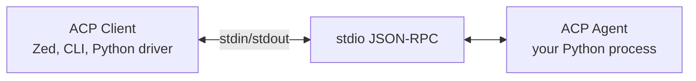

## What & When

**ACP (Agent Client Protocol)** is an open standard for connecting **editors and CLIs** (clients) to **coding agents** (servers) over **stdio JSON-RPC**. The client orchestrates sessions: prompts, streamed updates, tool calls, file edits, terminals, and permission prompts.

Use ACP when:

- Building a coding agent that runs inside Zed, Gemini CLI, kimi-cli, or similar hosts
- Embedding an agent subprocess from Python (tests, CI, custom IDE bridges)
- Implementing the **client** side that spawns and drives remote agents
- Standardizing editor ↔ agent wire format without custom IPC per product

> [!warning] Not IBM's deprecated Agent Communication Protocol  
> PyPI also lists unrelated `acp-sdk-python` packages for enterprise agent-to-agent messaging. For **editor integration**, install **`agent-client-protocol`** from [agentclientprotocol/python-sdk](https://github.com/agentclientprotocol/python-sdk).

For **agent ↔ agent** over HTTP, see [[AI — A2A]]. For **LLM ↔ tools/data**, see [[AI — MCP]].

```bash
pip install agent-client-protocol
# or
uv add agent-client-protocol
```

Requires **Python 3.10+**. Depends on **Pydantic 2.7+**.

---

## ACP vs Related Protocols

| Protocol | Transport | Connects | Python package |
| --- | --- | --- | --- |
| **ACP** | stdio JSON-RPC | Editor/CLI ↔ coding agent | `agent-client-protocol` |
| **MCP** | stdio / HTTP | Host ↔ tools & data | [[AI — MCP]] |
| **A2A** | HTTP JSON-RPC | Agent ↔ remote agent | [[AI — A2A]] |

| Role in your stack | Typical choice |
| --- | --- |
| RAG pipeline | [[AI — LangChain]], [[AI — LlamaIndex]] |
| Tool surface for any host | [[AI — MCP]] |
| Multi-agent delegation | [[AI — A2A]] |
| IDE-native coding agent | **ACP** (this note) |

---

## Architecture



| Layer | Module | Purpose |
| --- | --- | --- |
| Schema | `acp.schema` | Generated Pydantic models for every RPC payload |
| Agent API | `acp.agent`, `run_agent` | Implement `Agent`; serve on stdio |
| Client API | `acp.client`, `connect_to_agent` | Implement `Client`; talk to agent process |
| Transport | `acp.stdio`, `spawn_agent_process` | Subprocess + stream wiring |
| Builders | `acp.helpers` | `text_block`, tool-call updates, permissions |
| Contrib | `acp.contrib` | Session accumulators, permission brokers (experimental) |

---

## Minimal Echo Agent

Subclass `Agent`, stream replies via `session_update`, and run with `run_agent()`.

```python
import asyncio
from uuid import uuid4
from typing import Any

from acp import Agent, InitializeResponse, NewSessionResponse, PromptResponse, run_agent, text_block, update_agent_message
from acp.interfaces import Client


class EchoAgent(Agent):
    _conn: Client

    def on_connect(self, conn: Client) -> None:
        self._conn = conn

    async def initialize(
        self,
        protocol_version: int,
        client_capabilities=None,
        client_info=None,
        **kwargs: Any,
    ) -> InitializeResponse:
        return InitializeResponse(protocol_version=protocol_version)

    async def new_session(self, cwd: str, mcp_servers: list, **kwargs: Any) -> NewSessionResponse:
        return NewSessionResponse(session_id=uuid4().hex)

    async def prompt(self, prompt, session_id: str, **kwargs: Any) -> PromptResponse:
        for block in prompt:
            text = getattr(block, "text", "")
            await self._conn.session_update(
                session_id=session_id,
                update=update_agent_message(text_block(text)),
            )
        return PromptResponse(stop_reason="end_turn")


if __name__ == "__main__":
    asyncio.run(run_agent(EchoAgent()))
```

Point an ACP-capable editor at `python /path/to/echo_agent.py` (absolute paths in client config).

---

## Drive an Agent from Python (Client)

`spawn_agent_process` launches the agent, frames stdio, and returns a connection.

```python
import asyncio
import sys
from pathlib import Path
from typing import Any

from acp import PROTOCOL_VERSION, spawn_agent_process, text_block
from acp.interfaces import Client


class SimpleClient(Client):
    async def session_update(self, session_id, update, **kwargs) -> None:
        print("update:", session_id, update)

    async def request_permission(self, options, session_id, tool_call, **kwargs):
        return {"outcome": {"outcome": "cancelled"}}

    # Stub unimplemented client capabilities
    async def write_text_file(self, content, path, session_id, **kwargs): ...
    async def read_text_file(self, path, session_id, **kwargs): ...
    async def create_terminal(self, command, session_id, **kwargs): ...
    async def terminal_output(self, session_id, terminal_id, **kwargs): ...
    async def release_terminal(self, session_id, terminal_id, **kwargs): ...
    async def wait_for_terminal_exit(self, session_id, terminal_id, **kwargs): ...
    async def kill_terminal(self, session_id, terminal_id, **kwargs): ...
    async def ext_method(self, method, params): return {}
    async def ext_notification(self, method, params): ...


async def main() -> None:
    script = Path("echo_agent.py")
    async with spawn_agent_process(SimpleClient(), sys.executable, str(script)) as (conn, _proc):
        await conn.initialize(protocol_version=PROTOCOL_VERSION)
        session = await conn.new_session(cwd=str(script.parent), mcp_servers=[])
        await conn.prompt(session_id=session.session_id, prompt=[text_block("Hello ACP!")])


asyncio.run(main())
```

---

## Helpers — Tool Calls & Content Blocks

Use `acp.helpers` so discriminators (`type`, `sessionUpdate`, …) stay correct.

```python
from acp import start_tool_call, update_tool_call, text_block, tool_content

start_update = start_tool_call("call-42", "Read file", kind="read", status="pending")
finish_update = update_tool_call(
    "call-42",
    status="completed",
    content=[tool_content(text_block("File opened."))],
)
```

Pair with [[AI — MCP]] when the client passes MCP server definitions into `new_session(mcp_servers=[...])`.

---

## Editor Wiring (Zed example)

```json
{
  "agent_servers": {
    "My Python Agent": {
      "type": "custom",
      "command": "/abs/path/to/python",
      "args": ["/abs/path/to/my_agent.py"]
    }
  }
}
```

---

## Quick Reference

| Task | API |
| --- | --- |
| Run agent on stdio | `asyncio.run(run_agent(MyAgent()))` |
| Spawn + connect client | `spawn_agent_process(Client(), python, script.py)` |
| Manual streams | `connect_to_agent(Client(), stdin, stdout)` |
| Text in prompt | `text_block("...")` |
| Stream agent text | `update_agent_message(text_block(...))` |
| Validated payloads | `acp.schema.*` Pydantic models |
| Docs / examples | [python-sdk docs](https://agentclientprotocol.github.io/python-sdk/) |

---

## Related Notes

- [[AI]] — stack map (ACP vs MCP vs A2A)
- [[AI — MCP]] — tools and data for LLM hosts
- [[AI — A2A]] — HTTP agent-to-agent
- [[AI — LangChain]] — orchestration inside your agent
- [[Python — Pydantic]] — schema models in the SDK
- [[Python — asyncio]] — all transports are async

---

## Tags

#ai #acp #agents #json-rpc #stdio #coding-agent #zed #python #editor #obsidian
