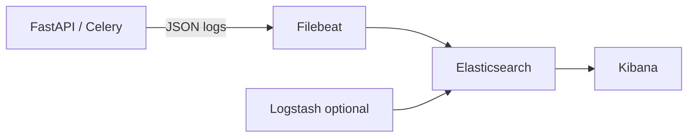

## What & When

**ELK** is the **Elasticsearch + Logstash + Kibana** stack (Elastic Stack) for **centralized log ingestion, search, and visualization**. **Elasticsearch** stores and indexes logs; **Logstash** (or **Filebeat**) ships and parses them; **Kibana** explores and dashboards. Complements [[Python — logging]] and metrics from [[DB — Prometheus & Grafana]].

Use ELK when:

- **Search production logs** across many services / pods
- **Structured JSON logs** with filters (level, trace_id, user_id)
- **Incident forensics** — grep at scale with retention
- K8s log aggregation — [[K8S]] pods → Filebeat → Elasticsearch

```bash
# App side: structured logging only — [[Python — logging]]
# Local stack: docker compose elastic/kibana + filebeat (heavy RAM)
```

Overview: [[DB]].

---

## ELK vs Related Tools

| Need | Use | Notes |
| --- | --- | --- |
| Log search | **ELK** / OpenSearch | Full text + filters |
| Metrics / SLOs | [[DB — Prometheus & Grafana]] | Counters, histograms |
| App debug locally | [[Python — logging]] | stdout / file |
| APM traces | Jaeger / Datadog (not ELK core) | Distributed tracing |
| Time-series push | [[DB — InfluxDB]] | Numeric series |

---

## Stack Components



| Component | Role |
| --- | --- |
| **Filebeat** | Lightweight shipper on each node |
| **Logstash** | Parse, enrich, transform (optional) |
| **Elasticsearch** | Index + search |
| **Kibana** | Discover, dashboards, alerts |

Modern alternative: **OpenSearch** (AWS fork) — similar API.

---

## Structured Logging (Python)

Feed ELK with parseable JSON:

```python
import logging
import json

class JsonFormatter(logging.Formatter):
    def format(self, record):
        return json.dumps({
            "level": record.levelname,
            "message": record.getMessage(),
            "logger": record.name,
            "trace_id": getattr(record, "trace_id", None),
        })

handler = logging.StreamHandler()
handler.setFormatter(JsonFormatter())
logging.getLogger().addHandler(handler)
```

Pair with request middleware in [[API - FastAPI]] to inject `trace_id`.

---

## Filebeat Config (Sketch)

```yaml
filebeat.inputs:
  - type: container
    paths:
      - /var/log/containers/*.log
    json.keys_under_root: true
    json.add_error_key: true

output.elasticsearch:
  hosts: ["http://elasticsearch:9200"]
  index: "app-logs-%{+yyyy.MM.dd}"
```

On K8s: DaemonSet per node — [[Codes/K8S — Workloads]].

---

## Kibana Discover

Common filters:

```text
level: "ERROR" AND service: "api"
trace_id: "abc-123"
message: *timeout*
@timestamp: [now-1h TO now]
```

Create **index patterns** matching `app-logs-*`.

---

## Index Lifecycle

| Policy | Action |
| --- | --- |
| Hot | Recent fast storage |
| Warm | Older, slower |
| Delete | After N days (compliance + cost) |

High log volume → aggressive retention; don't index debug in prod.

---

## Docker Compose (Dev — Minimal)

> [!warning] RAM Elasticsearch needs ~2GB+ heap for comfortable local dev; use Elastic Cloud trial or skip full stack locally and rely on structured stdout + `docker compose logs`.

```yaml
services:
  elasticsearch:
    image: docker.elastic.co/elasticsearch/elasticsearch:8.15.0
    environment:
      - discovery.type=single-node
      - xpack.security.enabled=false
      - ES_JAVA_OPTS=-Xms512m -Xmx512m
    ports:
      - "9200:9200"
  kibana:
    image: docker.elastic.co/kibana/kibana:8.15.0
    ports:
      - "5601:5601"
    depends_on:
      - elasticsearch
```

---

## ELK vs Prometheus for Errors

| Question | Tool |
| --- | --- |
| "Show stack trace for request X" | ELK |
| "Error rate > 1% last 5m" | Prometheus alert |
| "Which pod logged OOM" | ELK |

Use both — correlate `trace_id` across logs and metric spikes.

---

## Security

- Enable auth + TLS in production
- Restrict Kibana / ES network access
- Scrub PII before indexing (GDPR)
- Separate indices per environment (`staging-`, `prod-`)

---

## Quick Reference

| Task | Where |
| --- | --- |
| Search logs | Kibana Discover |
| Index naming | `app-logs-YYYY.MM.DD` |
| Ship from node | Filebeat |
| Parse grok | Logstash filter |
| Health | `GET elasticsearch:9200/_cluster/health` |

---

## Related Notes

- [[DB]]
- [[DB — Prometheus & Grafana]]
- [[Python — logging]]
- [[API - FastAPI]]
- [[K8S]]
- [[Processing — Celery]]

---

## Tags

#database #elk #elasticsearch #kibana #logstash #filebeat #logging #observability #devops
