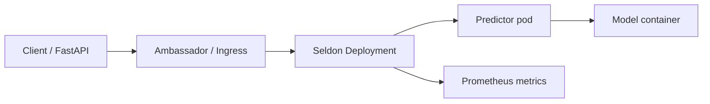

## What & When

**Seldon Core** deploys machine learning models on **Kubernetes** as scalable microservices — REST/gRPC inference, canaries, metrics, and integration with **MLflow**, sklearn, XGBoost, and custom Python servers. Use it when Bento containers need **cluster orchestration**, A/B routing, or multi-model graphs.

Use Seldon when:

- Models run on **Kubernetes** with GitOps-style manifests
- You need **canary / blue-green** rollouts and Prometheus metrics
- Serving **MLflow** `models:/` artifacts at scale
- Complementing [[ML — BentoML]] (build image) with K8s-native deployment

```bash
pip install seldon-core
# Cluster: helm install seldon-core seldon-core/seldon-core-operator
```

Gateway APIs often sit behind [[API - FastAPI]] or Ingress. Track training in [[ML — MLflow]]. Overview: [[Machine Learning]].

---

## Seldon vs Related Tools

| Need | Use | Notes |
| --- | --- | --- |
| K8s model deployment | **Seldon Core** | `SeldonDeployment` CRD |
| Python packaging | [[ML — BentoML]] | Export container → deploy with Seldon |
| Tracking | [[ML — MLflow]] | `modelUri: models:/...` |
| Simple single-container | Bento / FastAPI only | Skip Seldon ops overhead |
| Feature lookup | [[ML — Feast]] | Sidecar or pre-inference service |
| Explainability | [[ML — SHAP]] | Custom Seldon component |

---

## Architecture (Mental Model)



---

## SeldonDeployment — sklearn MLflow Model

```yaml
apiVersion: machinelearning.seldon.io/v1
kind: SeldonDeployment
metadata:
  name: iris-classifier
  namespace: ml-production
spec:
  name: iris
  predictors:
    - name: default
      graph:
        name: classifier
        type: MODEL
        modelUri: models:/iris-rf/Production
        implementation: SKLEARN_SERVER
        envSecretRefName: seldon-secret
      componentSpecs:
        - spec:
            containers:
              - name: classifier
                image: seldonio/mlflowserver:1.14.0
                resources:
                  requests:
                    memory: "512Mi"
                    cpu: "500m"
                  limits:
                    memory: "1Gi"
                    cpu: "1"
      replicas: 2
```

Apply:

```bash
kubectl apply -f seldon-iris.yaml
kubectl get seldondeployment -n ml-production
```

Ensure the cluster can reach your **MLflow tracking server** and artifact store (S3, MinIO).

---

## Custom Python Model (MLModel Class)

```python
# IrisModel.py
import os
import mlflow.sklearn
import numpy as np

class IrisModel:
    def __init__(self):
        uri = os.environ.get("MODEL_URI", "models:/iris-rf/Production")
        self.model = mlflow.sklearn.load_model(uri)

    def predict(self, X, features_names=None):
        X = np.array(X)
        preds = self.model.predict(X)
        probas = self.model.predict_proba(X)
        return {"predictions": preds.tolist(), "probabilities": probas.tolist()}
```

```yaml
# Fragment: SeldonDeployment with prepackaged server
spec:
  predictors:
    - graph:
        name: iris-node
        implementation: MLFLOW_SERVER
        modelUri: "s3://mlflow-artifacts/1/run_id/artifacts/model"
        envSecretRefName: aws-credentials
```

For full custom code, use `SELdon_DEPLOYMENT` with `implementation: SKLEARN_SERVER` or build a custom image per Seldon docs.

---

## Inference Request

```bash
# Port-forward ambassador or predictor
kubectl port-forward svc/iris-default 8000:8000 -n ml-production

curl -X POST http://localhost:8000/api/v1.0/predictions \
  -H "Content-Type: application/json" \
  -d '{"data": {"ndarray": [[5.1, 3.5, 1.4, 0.2]]}}'
```

```python
import requests

payload = {"data": {"ndarray": [[5.1, 3.5, 1.4, 0.2]]}}
r = requests.post(
    "http://iris-default.ml-production.svc:8000/api/v1.0/predictions",
    json=payload,
    timeout=3,
)
print(r.json())
```

---

## Canary Rollout

```yaml
spec:
  predictors:
    - name: main
      replicas: 3
      traffic: 90
      graph:
        name: classifier-v2
        implementation: SKLEARN_SERVER
        modelUri: models:/iris-rf/Production
    - name: canary
      replicas: 1
      traffic: 10
      graph:
        name: classifier-v3
        implementation: SKLEARN_SERVER
        modelUri: models:/iris-rf/Staging
```

Adjust `traffic` weights without rebuilding the main Ingress.

---

## FastAPI Gateway

```python
from fastapi import FastAPI
import httpx

app = FastAPI()
SELDON_URL = "http://iris-default.ml-production.svc:8000/api/v1.0/predictions"

@app.post("/score")
async def score(features: list[list[float]]):
    async with httpx.AsyncClient() as client:
        resp = await client.post(
            SELDON_URL,
            json={"data": {"ndarray": features}},
            timeout=5.0,
        )
        resp.raise_for_status()
        return resp.json()
```

Centralize auth and request validation in [[API - FastAPI]]; keep Seldon internal on the cluster network.

---

## Metrics & Monitoring

Seldon exposes **Prometheus** metrics (request count, latency). Install Prometheus Operator or scrape annotations:

```yaml
metadata:
  annotations:
    prometheus.io/scrape: "true"
    prometheus.io/port: "8000"
```

Correlate with [[ML — MLflow]] training metrics for drift investigation (separate pipeline).

---

## BentoML → Seldon Path

1. Build container with [[ML — BentoML]] `containerize`.
2. Reference image in `SeldonDeployment` `spec.predictors[].componentSpecs` instead of pre-built MLflow server image.
3. Configure probes and HPA on the Deployment.

```yaml
containers:
  - name: classifier
    image: registry.example.com/iris-classifier:v1
    ports:
      - containerPort: 3000
```

Align container **port** and **health endpoints** with Seldon's expected service port mapping.

---

## Feast + Seldon

- **Option A** — Feature enrichment in [[API - FastAPI]] before calling Seldon.
- **Option B** — Init container or sidecar calling [[ML — Feast]] online store inside predictor pod.
- **Option C** — Precompute features in streaming materialization; model receives wide vector only.

---

## Pitfalls

- **CRD not installed** — Seldon operator must run in cluster.
- **modelUri access** — pods need credentials for S3/GCS/MLflow.
- **Input schema** — Seldon expects `data.ndarray` or `data.tensor` consistently.
- **Resource limits** — OOM on large models; set requests/limits and HPA carefully.
- **Version skew** — pin Seldon operator and server image versions.

---

## Quick Reference

| Task | Resource |
| --- | --- |
| Deploy | `kubectl apply -f SeldonDeployment.yaml` |
| Predict | `POST /api/v1.0/predictions` |
| MLflow URI | `modelUri: models:/name/Production` |
| sklearn server | `implementation: SKLEARN_SERVER` |
| Canary | Multiple predictors + `traffic` % |
| Status | `kubectl get sdep` |
| Logs | `kubectl logs deployment/<predictor>` |

---

## Related Notes

- [[Machine Learning]]
- [[ML — scikit-learn]]
- [[ML — MLflow]]
- [[ML — BentoML]]
- [[ML — Feast]]
- [[ML — SHAP]]
- [[API - FastAPI]]

---

## Tags

#python #machine-learning #seldon #kubernetes #mlops #model-serving #k8s #mlflow
