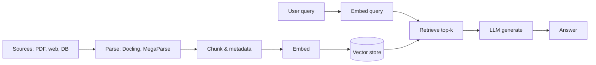
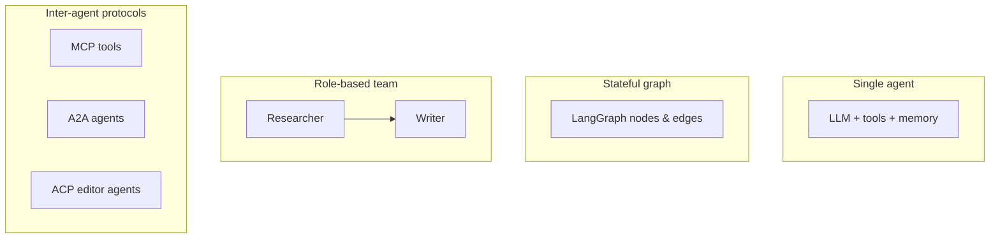

**Key Points:**

- **RAG is a pipeline, not a library** — ingest → chunk → embed → store → retrieve → generate; different tools own different stages.
- **LangChain + LangGraph** — default orchestration stack for composable chains and stateful multi-step agents.
- **Vector DB choice** — Chroma for local/dev, Qdrant/Milvus for production scale, FAISS for in-process search.
- **MCP vs A2A vs ACP** — MCP connects LLMs to tools/data; A2A connects agents to agents; ACP connects coding agents to editors (stdio JSON-RPC).
- **ADK (Google)** — code-first agents + Workflow graphs; deploy on [[GCP]]; pairs with Gemini and [[AI — A2A]].
- **Agent Framework (Microsoft)** — production agents + graph workflows on Azure Foundry / OpenAI; migration path from AutoGen and Semantic Kernel — [[AI — Agent Framework]].
- **Evaluate before shipping** — use RAGAS for retrieval quality; Mem0 (or framework memory) for long-term user context.
- **Browser agents need a control surface** — CLI refs ([[Commands/CLI — agent-browser]]) or MCP ([[Browser Automation — Obscura]]); stealth fetch via [[Browser Automation — Camoufox]] when sites block bots.

# AI — Overview & Stack Map

> **From scratch checklist:** [[Build an AI Application from Scratch]] · All roadmaps: [[README]]

## What is an AI Application?

An **AI application** in Python goes beyond a single `chat.completions` call. It combines **models**, **retrieval**, **tools**, **memory**, and often **multi-agent coordination** into a system that can answer questions, act on data, and automate workflows reliably.

Common shapes in this vault:

- **RAG chatbot** — documents → vector store → grounded answers
- **Tool-using agent** — LLM decides when to search, query APIs, or run code
- **Multi-agent workflow** — researcher + writer + reviewer (CrewAI, LangGraph, Agno)
- **Protocol-native services** — expose tools via MCP or agents via A2A/ACP

---

## The RAG Pipeline

Most knowledge apps follow the same flow — tools differ by stage:

| Stage | Role | Notes in this vault |
| --- | --- | --- |
| Fetch / scrape | Get raw content | [[Python — httpx Package]], [[Browser Automation — crawl4ai]], [[Browser Automation — Camoufox]] |
| Parse | PDF/HTML → structured text | [[AI — Docling]], [[AI — MegaParse]] |
| Orchestrate | Chain steps, agents, tools | [[AI — LangChain]], [[AI — LangGraph]], [[AI — Agent Framework]] |
| Index / retrieve | Embeddings + search | [[AI — LlamaIndex]], [[AI — Haystack]], vector stores |
| Generate | LLM + tools + memory | Agents below |
| Evaluate | Quality metrics | [[AI — RAGAS]] |

---

## Agent Architectures

| Pattern                   | Best when                           | Primary references                                      |
| ------------------------- | ----------------------------------- | ------------------------------------------------------- |
| Single tool-calling agent | One domain, few tools               | [[AI — LangChain]], [[AI — Pydantic AI]], [[AI — Agno]] |
| Microsoft / Azure agents | Foundry, workflows, OTel | [[AI — Agent Framework]] |
| Google-native agent + deploy | Gemini, Cloud Run, Vertex paths  | [[AI — ADK]]                                            |
| Graph / state machine     | Branching, loops, human-in-the-loop | [[AI — LangGraph]], [[AI — ADK]] (Workflow), [[AI — Agent Framework]] |
| Role crew                 | Clear job titles and handoffs       | [[AI — CrewAI]]                                         |
| Declarative programs      | Optimize prompts/pipelines          | [[AI — DSPy]]                                           |
| Tool protocol             | Standard tool surface for any host  | [[AI — MCP]]                                            |
| Agent-to-agent            | Remote agents on HTTP               | [[AI — A2A]]                                            |
| Editor integration        | IDE ↔ coding agent                  | [[AI — ACP]]                                            |

---

## Vector Stores — When to Use Which

| Store      | Deployment              | Strengths                          | References      |
| ---------- | ----------------------- | ---------------------------------- | --------------- |
| **Chroma** | Embedded / local server | Fastest local dev, simple API      | [[AI — Chroma]] |
| **FAISS**  | In-process library      | Maximum speed, no server           | [[AI — FAISS]]  |
| **Qdrant** | Self-hosted or cloud    | Filters, hybrid search, production | [[AI — Qdrant]] |
| **Milvus** | Cluster / Zilliz cloud  | Billion-scale, heavy workloads     | [[AI — Milvus]] |

Framework wrappers: [[AI — LlamaIndex]], [[AI — LangChain]], [[AI — Haystack]] integrate most of these.

---

## AI in the Broader Landscape

| Concern                | Typical choice                |
| ---------------------- | ----------------------------- |
| Orchestration          | LangChain, LangGraph, Agent Framework |
| Google agent SDK       | ADK                           |
| Microsoft agent SDK    | Agent Framework               |
| RAG framework          | LlamaIndex, Haystack          |
| Document parsing       | Docling, MegaParse            |
| Vector storage         | Chroma, Qdrant, FAISS, Milvus |
| Multi-agent crews      | CrewAI, Agno, ADK             |
| Typed agents           | Pydantic AI                   |
| Prompt optimization    | DSPy                          |
| Tool standard          | MCP                           |
| Agent interoperability | A2A                           |
| IDE agents             | ACP                           |
| Browser control (CLI)  | [[Commands/CLI — agent-browser]] |
| Browser control (MCP)  | [[Browser Automation — Obscura]] |
| Stealth browser fetch  | [[Browser Automation — Camoufox]] |
| RAG evaluation         | RAGAS                         |
| Long-term memory       | Mem0                          |
| Cloud deploy (Google)  | ADK + [[GCP]]                 |
| Validation / settings  | [[Python — Pydantic]]         |
| API surface            | [[API - FastAPI]]             |
| Async I/O              | [[Python — asyncio]]          |

---

## Recommended Learning Path

1. **Basics** — [[AI — LangChain]] (models, prompts, tools, simple RAG)
2. **Stateful agents** — [[AI — LangGraph]]
3. **Vectors** — [[AI — Chroma]] locally, then [[AI — Qdrant]] for production patterns
4. **Documents** — [[AI — Docling]] for PDFs; [[AI — MegaParse]] for layout-heavy files
5. **Teams** — [[AI — CrewAI]] or [[AI — Agno]]
6. **Google stack** — [[AI — ADK]] + [[GCP]] when standardizing on Gemini and Cloud Run
7. **Microsoft / Azure stack** — [[AI — Agent Framework]] + Foundry when on Azure
8. **Protocols** — [[AI — MCP]] for tools; [[AI — A2A]] if agents call remote agents
9. **Browser agents** — [[Commands/CLI — agent-browser]] or [[Browser Automation — Obscura]] MCP
10. **Quality** — [[AI — RAGAS]] + [[AI — Mem0]] for memory-heavy apps

See also [[Python Development]] Phase 7 and [[NLP]].

---

## Related Notes

### Orchestration & RAG frameworks

- [[AI — LangChain]]
- [[AI — LangGraph]]
- [[AI — Haystack]]
- [[AI — LlamaIndex]]

### Document ingestion

- [[AI — Docling]]
- [[AI — MegaParse]]

### Vector stores

- [[AI — Chroma]]
- [[AI — FAISS]]
- [[AI — Milvus]]
- [[AI — Qdrant]]

### Agents & optimization

- [[AI — Agent Framework]]
- [[AI — ADK]]
- [[AI — CrewAI]]
- [[AI — Agno]]
- [[AI — Pydantic AI]]
- [[AI — DSPy]]

### Protocols

- [[AI — MCP]]
- [[AI — ACP]]
- [[AI — A2A]]

### Browser agents & stealth

- [[Commands/CLI — agent-browser]]
- [[Browser Automation — Obscura]]
- [[Browser Automation — Camoufox]]
- [[Browser Automation]] — full scraping stack

### Evaluation & memory

- [[AI — RAGAS]]
- [[AI — Mem0]]

### Classical NLP (hybrid pipelines)

- [[NLP]] — spaCy, NLTK, Gensim for preprocessing and metadata before RAG

### Connected vault notes

- [[Python — Pydantic]]
- [[Python — markdownify]]
- [[API - FastAPI]]
- [[GCP]]
- [[Cybersecurity — Threats & Attacks]] — adversarial AI
- [[Python Development]]

---

## Tags

#ai #llm #rag #agents #mcp #vector-db #langchain #obsidian
