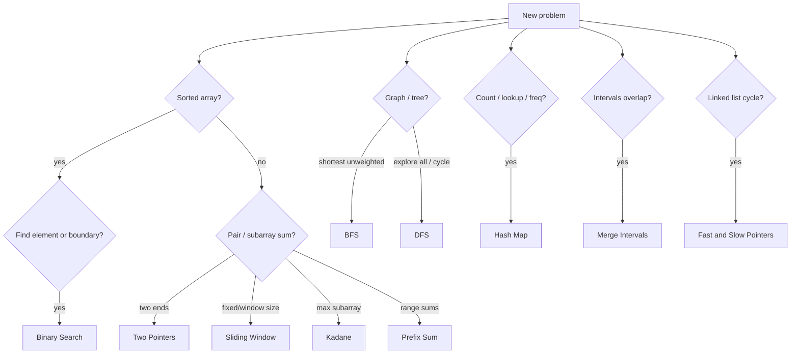

**Key Points:**

- **Pattern first** — interviews and leetcode-style problems reward recognizing **two pointers**, **sliding window**, **BFS/DFS**, not memorizing every variant.
- **State complexity** — always state **time and space**; use the complexity cheat sheet below.
- **Python stdlib is enough** — `collections.deque`, `defaultdict`, `bisect`; no exotic deps for fundamentals.
- **Graph work links to ML** — [[ML — NetworkX]] for production graph algorithms; BFS/DFS here for interview foundations.
- **Sorted data → binary search** — O(log n) beats linear scan when the array is ordered.

# Algorithms — Overview & Interview Patterns

> Cheatsheet-style reference for **coding interviews** and array/graph problem solving. Python examples in **Codes/Algorithms —** notes.

---

## What is This Series?

**Algorithms** in this vault covers **must-know patterns** for technical interviews and everyday problem decomposition — not a full CS curriculum. Each note includes concept, when to use it, Python code, and complexity.

Typical outcomes:

- Recognize the right pattern in 2–3 minutes under interview pressure
- Implement clean Python without reaching for the wrong tool
- Explain trade-offs (time, space, edge cases)

---

## Pattern Decision Flow

---

## Must-Know Algorithms (Cheatsheet Map)

| # | Pattern | When to use | Note |
| --- | --- | --- | --- |
| 1 | **Binary search** | Sorted data, find index/boundary | [[Codes/Algorithms — Binary Search]] |
| 2 | **Kadane's algorithm** | Maximum sum subarray | [[Codes/Algorithms — Kadane's Algorithm]] |
| 3 | **Prefix sum** | Range sum queries O(1) | [[Codes/Algorithms — Prefix Sum]] |
| 4 | **Hash map** | Frequency, lookup, two-sum | [[Codes/Algorithms — Hash Map Patterns]] |
| 5 | **BFS** | Shortest path, level-order | [[Codes/Algorithms — BFS & DFS]] |
| 6 | **DFS** | Components, cycles, backtracking | [[Codes/Algorithms — BFS & DFS]] |
| 7 | **Two pointers** | Sorted pairs, palindrome, in-place | [[Codes/Algorithms — Two Pointers]] |
| 8 | **Sliding window** | Fixed/variable subarray substring | [[Codes/Algorithms — Sliding Window]] |
| 9 | **Merge intervals** | Overlapping ranges | [[Codes/Algorithms — Merge Intervals]] |
| 10 | **Fast & slow pointers** | Linked list cycle, middle node | [[Codes/Algorithms — Fast & Slow Pointers]] |

---

## Complexity Cheat Sheet

| Big-O | Name | Typical example |
| --- | --- | --- |
| **O(1)** | Constant | Hash lookup, index access |
| **O(log n)** | Logarithmic | [[Codes/Algorithms — Binary Search]] |
| **O(n)** | Linear | Single array pass, BFS/DFS on sparse graph |
| **O(n log n)** | Linearithmic | Sort (merge/quick), [[Codes/Algorithms — Merge Intervals]] |
| **O(n²)** | Quadratic | Nested loops, naive all-pairs |
| **O(2ⁿ)** | Exponential | Naive subsets (avoid without DP memo) |

**Space:** auxiliary memory counts — hash maps O(n), recursion stack O(depth), two pointers O(1).

---

## When to Use What (Quick Reference)

| Problem signal | Reach for |
| --- | --- |
| Sorted array / answer space monotonic | Binary search |
| Pair in sorted array, remove duplicates | Two pointers |
| Subarray/substring with constraint | Sliding window |
| Range sum query many times | Prefix sum |
| Count / frequency / "have we seen?" | Hash map |
| Shortest path unweighted graph | BFS |
| Connected components, maze, tree paths | DFS |
| Overlapping time ranges | Merge intervals |
| Cycle in linked list | Fast & slow pointers |
| Max sum contiguous subarray | Kadane |

**Dynamic programming** — overlapping subproblems, optimal substructure; build on these patterns (dedicated note *TODO* if needed).

---

## Interview Tips

1. **Understand the problem** — examples, edge cases, constraints (empty input, negatives, duplicates).
2. **Identify the pattern** — use the decision flow above; say it out loud.
3. **Choose optimal approach** — state brute force first, then optimize.
4. **Write clean code** — meaningful names; extract helpers if needed.
5. **Analyze complexity** — time and space before you finish.

Pair with [[Unit Testing - pytest]] to lock examples into tests when practicing.

---

## Algorithms in the Broader Vault

| Area | Link |
| --- | --- |
| Python language | [[Python Development]], [[Python — typing]] |
| Graphs in production | [[ML — NetworkX]] |
| NumPy vectorization | [[ML — NumPy]] (different from interview loops) |
| System design scale | [[System Design — Fundamentals & Patterns]] |

---

## Recommended Learning Path

1. **Hash map** + **two pointers** — most array/string warmups
2. **Binary search** — sorted arrays and "binary search on answer"
3. **Sliding window** + **prefix sum** — subarray family
4. **Kadane** — classic max subarray
5. **BFS & DFS** — graphs and trees
6. **Merge intervals** + **fast/slow** — common follow-ups

---

## Related Notes

### Fundamentals

- [[Codes/Algorithms — Binary Search]]
- [[Codes/Algorithms — Kadane's Algorithm]]
- [[Codes/Algorithms — Prefix Sum]]
- [[Codes/Algorithms — Hash Map Patterns]]

### Graphs

- [[Codes/Algorithms — BFS & DFS]]

### Array techniques

- [[Codes/Algorithms — Two Pointers]]
- [[Codes/Algorithms — Sliding Window]]
- [[Codes/Algorithms — Merge Intervals]]
- [[Codes/Algorithms — Fast & Slow Pointers]]

### Connected vault notes

- [[Python Development]]
- [[ML — NetworkX]]
- [[Unit Testing - pytest]]

---

## Tags

#algorithms #dsa #interview #python #binary-search #bfs #dfs #sliding-window #complexity
