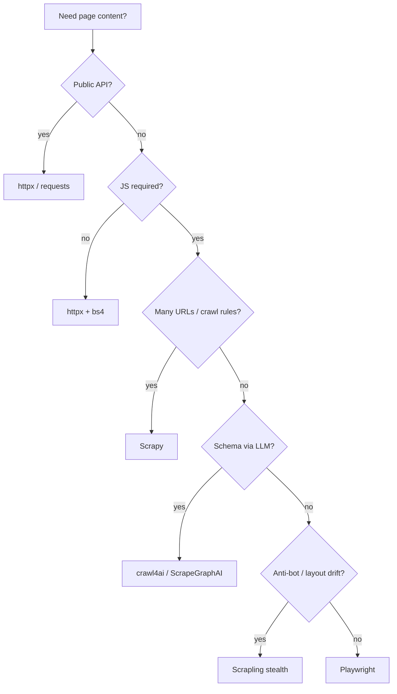

**Key Points:**

- **Start with httpx** — static HTML and APIs need no browser; see [[Python — httpx Package]] and [[Python — BeautifulSoup4 (bs4)]] first.
- **Playwright is the default browser** — full JS rendering, auth flows, screenshots, and the engine behind many AI scrapers.
- **Scrapy for scale** — crawl thousands of URLs with middlewares, pipelines, and politeness built in.
- **LLM scrapers when selectors break** — [[Browser Automation — crawl4ai]], [[Browser Automation — ScrapeGraphAI]] extract by prompt/schema instead of brittle CSS.
- **Scrapling for adaptive + stealth** — parser + fetchers that survive layout changes and light anti-bot.

# Browser Automation — Overview & Scraping Stack

## What is Browser Automation?

**Browser automation** means driving a real (or headless) browser — or a crawl framework — to fetch pages that **plain HTTP cannot**: JavaScript-rendered SPAs, login walls, infinite scroll, and sites that fingerprint simple clients.

In this vault it sits **above** the HTTP scraping layer:

| Layer | Tools | When |
| --- | --- | --- |
| HTTP only | [[Python — httpx Package]], [[Python — requests Package]] | Static HTML, public APIs |
| Parse & normalize | [[Python — BeautifulSoup4 (bs4)]], [[Python — markdownify]] | Extract structure / Markdown |
| Resilience | [[Python — tenacity]], [[Python — asyncio]] | Retries, concurrency |
| **Browser / crawl** | This series | JS, auth, large crawls, AI extract |
| Anti-bot (advanced) | camoufox, botright, botasaurus, proxies | Heavy protection — *TODO: Codes* |

---

## Decision Flow



---

## Tool Roles

| Tool | Best for | References |
| --- | --- | --- |
| **Playwright** | General browser control, E2E-style scraping, login | [[Browser Automation — Playwright]] |
| **Scrapy** | High-volume crawls, pipelines, sitemaps | [[Browser Automation — Scrapy]] |
| **crawl4ai** | LLM-ready Markdown, RAG ingest, async crawl | [[Browser Automation — crawl4ai]] |
| **ScrapeGraphAI** | Prompt/schema-driven extract graphs | [[Browser Automation — ScrapeGraphAI]] |
| **Scrapling** | Adaptive selectors, stealth fetchers, MCP | [[Browser Automation — Scrapling]] |

---

## Typical Pipelines

### Static path (no browser)

```text
httpx → bs4 → markdownify → vector DB / LLM
```

See [[Python Development]] Phase 4.

### Browser path

```text
Playwright / Scrapy → bs4 or LLM extract → store
```

### AI ingest path

```text
crawl4ai / ScrapeGraphAI → chunk → embed → [[AI — Chroma]]
```

See [[AI]] RAG pipeline.

---

## Browser Automation in the Broader Landscape

| Concern | Tool |
| --- | --- |
| HTTP client | [[Python — httpx Package]] |
| HTML parse | [[Python — BeautifulSoup4 (bs4)]] |
| HTML → Markdown | [[Python — markdownify]] |
| Retries | [[Python — tenacity]] |
| Async orchestration | [[Python — asyncio]] |
| Full browser | [[Browser Automation — Playwright]] |
| Distributed crawl | [[Browser Automation — Scrapy]] |
| LLM extraction | [[Browser Automation — crawl4ai]], [[Browser Automation — ScrapeGraphAI]] |
| Stealth / adaptive | [[Browser Automation — Scrapling]] |
| RAG downstream | [[AI — LangChain]], [[AI — LlamaIndex]] |

---

## Recommended Learning Path

1. Master **httpx + bs4** before opening a browser — [[Python — httpx Package]]
2. Add **Playwright** for one JS-heavy target — [[Browser Automation — Playwright]]
3. Scale to many URLs with **Scrapy** — [[Browser Automation — Scrapy]]
4. For RAG pipelines use **crawl4ai** — [[Browser Automation — crawl4ai]]
5. When CSS breaks often try **Scrapling** or **ScrapeGraphAI**

---

## Related Notes

- [[Browser Automation — Playwright]]
- [[Browser Automation — Scrapy]]
- [[Browser Automation — crawl4ai]]
- [[Browser Automation — ScrapeGraphAI]]
- [[Browser Automation — Scrapling]]
- [[Python — httpx Package]]
- [[Python — BeautifulSoup4 (bs4)]]
- [[Python — markdownify]]
- [[Python — tenacity]]
- [[AI]]
- [[Python Development]]

---

## Tags

#browser-automation #scraping #playwright #scrapy #crawl4ai #web #python #backend
