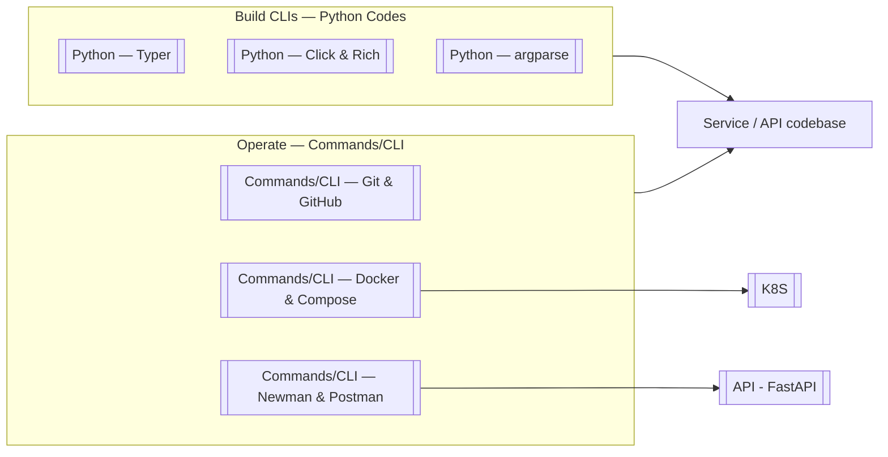

**Key Points:**

- **Two CLI layers in this vault** — **build** CLIs in Python ([[Python — Typer]], [[Python — Click & Rich]]); **operate** with dev tools (git, Docker, Newman) in **Commands/CLI —** notes.
- **git + gh** — version control locally; GitHub CLI for PRs, issues, Actions from the terminal.
- **git-cliff** — changelogs and release notes from Conventional Commits + tags.
- **Docker + Compose** — package and run apps locally before [[K8S]]; same images often deploy to cluster.
- **Postman + Newman** — design API collections in GUI; run them headless in CI with Newman against [[API - FastAPI]] services.
- **Load testing CLIs** — oha, hey, JMeter in **Commands/Load Testing —**; k6 and Locust scripts in **Codes/** — hub [[Load Testing]].
- **Linux operator stack** — files, systemd, networking in **Commands/Linux —**; architecture and Bash patterns in [[Linux]].
- **Commands folder** — copy-paste shell for operator tools; Python CLI patterns stay under **Codes/Python —**.

# CLI — Overview & Developer Command-Line Stack

## What is CLI (in this vault)?

**CLI** here covers **command-line workflows** for backend developers — both **authoring** Python CLIs and **using** standard operator tools. This hub maps your checklist (Newman/Postman, git/gh, Docker/Compose) and links to existing Python CLI notes.

Typical outcomes:

- **Ship a management command** — Typer app sharing types with [[API - FastAPI]]
- **Commit, branch, open PR** — git + `gh`
- **Run stack locally** — `docker compose up` for API + Postgres + Redis
- **CI API smoke tests** — Newman collection against staging URL
- **Deploy containers** — build image → push registry → [[K8S]] Deployment

---

## Two Layers



| Layer              | Folder           | Examples                                     |
| ------------------ | ---------------- | -------------------------------------------- |
| **Author CLIs**    | `Codes/Python —` | Typer subcommands, Click options             |
| **Operator tools** | `Commands/CLI —` | `git commit`, `docker compose`, `newman run` |
| **Platform CLI**   | `Commands/K8S —` | kubectl, minikube (see [[K8S]])              |

---

## Checklist Map

| Topic | Commands note | Related vault |
| --- | --- | --- |
| Git / GitHub / gh | [[Commands/CLI — Git & GitHub]] | [[Linting — pre-commit]], PR workflow |
| Changelog / releases | [[Commands/CLI — git-cliff]] | Conventional Commits, tags |
| Agent browser (IDE) | [[Commands/CLI — agent-browser]] | [[AI]], [[Browser Automation]] |
| Docker / docker-compose | [[Commands/CLI — Docker & Compose]] | [[K8S]], [[ML — BentoML]] images |
| Postman / Newman | [[Commands/CLI — Newman & Postman]] | [[API - FastAPI]], [[Unit Testing - pytest]] |
| Load testing (oha, hey, JMeter) | [[Commands/Load Testing — oha]], [[Commands/Load Testing — hey]], [[Commands/Load Testing — JMeter]] | [[Load Testing]] |
| Linux (essentials → admin) | [[Commands/Linux — Essentials]] … [[Commands/Linux — Bash Scripting]] | [[Linux]] |
| Build Python CLI | [[Python — Typer]] | [[Python Development]] Phase 6 |
| Node / npm / yarn | [[Commands/JavaScript — Node Toolchain]] | [[JavaScript Development]] |
| Vite dev server | [[Commands/JavaScript — Vite]] | React SPA |
| Rich terminal UI | [[Python — Click & Rich]] | Progress, tables |
| Stdlib CLI | [[Python — argparse]] | No dependencies |

---

## Daily Developer Flow

```text
git checkout -b feature/x
docker compose up -d          # local API + deps
pytest                        # unit tests
newman run collection.json    # API contract smoke (optional)
git commit && gh pr create    # review
docker build → push → kubectl apply   # deploy via [[K8S]]
```

---

## When to Use What

| Question | Choose |
| --- | --- |
| New Python CLI for operators? | [[Python — Typer]] |
| Pretty tables in terminal? | [[Python — Click & Rich]] |
| Script with zero deps? | [[Python — argparse]] |
| Save history / collaborate? | [[Commands/CLI — Git & GitHub]] |
| Open PR from terminal? | `gh pr create` → [[Commands/CLI — Git & GitHub]] |
| Generate release changelog? | [[Commands/CLI — git-cliff]] |
| Browser automation for AI agent in IDE? | [[Commands/CLI — agent-browser]] |
| Run app + Postgres locally? | [[Commands/CLI — Docker & Compose]] |
| Test REST collection in CI? | [[Commands/CLI — Newman & Postman]] |
| Quick HTTP bench / load smoke? | [[Commands/Load Testing — oha]], [[Load Testing]] |
| Scripted load with CI thresholds? | [[Load Testing — k6]] |
| Orchestrate containers in prod? | [[K8S]] |

---

## CLI in the Broader Landscape

| Concern | Tool |
| --- | --- |
| HTTP API | [[API - FastAPI]] |
| API testing (code) | [[Unit Testing - pytest]] + httpx |
| API testing (collection) | Newman |
| Load / performance | [[Load Testing]] |
| Server OS / shell | [[Linux]] |
| Quality on commit | [[Linting — pre-commit]] |
| Package manager | [[Python — uv]] |
| Container images | Docker → [[Codes/K8S — Workloads]] |
| Cluster ops | [[Commands/K8S — kubectl & Minikube]] |

---

## Recommended Learning Path

1. **git basics** — commit, branch, merge — [[Commands/CLI — Git & GitHub]]
2. **gh** — PRs and repo ops from terminal
3. **git-cliff** — tags and release notes — [[Commands/CLI — git-cliff]]
4. **Docker Compose** — one-file local stack — [[Commands/CLI — Docker & Compose]]
5. **Typer** — first management CLI — [[Python — Typer]]
6. **Newman** — export Postman collection, run in CI — [[Commands/CLI — Newman & Postman]]
7. **Load testing** — oha bench → k6 thresholds — [[Load Testing]]
8. **Connect to deploy** — image → [[K8S]]

---

## Related Notes

### Commands (operator CLIs)

- [[Commands/CLI — Git & GitHub]]
- [[Commands/CLI — git-cliff]]
- [[Commands/CLI — agent-browser]]
- [[Commands/CLI — Docker & Compose]]
- [[Commands/CLI — Newman & Postman]]

### Commands (load testing)

- [[Commands/Load Testing — oha]]
- [[Commands/Load Testing — hey]]
- [[Commands/Load Testing — JMeter]]

### Commands (Linux)

- [[Commands/Linux — Essentials]]
- [[Commands/Linux — Files Advanced]]
- [[Commands/Linux — Text & Sessions]]
- [[Commands/Linux — Permissions & Users]]
- [[Commands/Linux — Processes & Services]]
- [[Commands/Linux — Networking]]
- [[Commands/Linux — Packages & Archives]]
- [[Commands/Linux — Disk & Storage]]
- [[Commands/Linux — Bash Scripting]]
- [[Commands/Linux — Kali in Docker]]
- [[Commands/Linux — Kali Tools]]

### Python CLI authoring

- [[Python — Typer]]
- [[Python — Click & Rich]]
- [[Python — argparse]]

### Connected

- [[API - FastAPI]]
- [[K8S]]
- [[Linting — pre-commit]]
- [[Python Development]]
- [[Unit Testing - pytest]]
- [[Load Testing]]
- [[Linux]]

---

## Tags

#cli #git #github #docker #postman #newman #git-cliff #changelog #load-testing #linux #devops #terminal #python #typer
