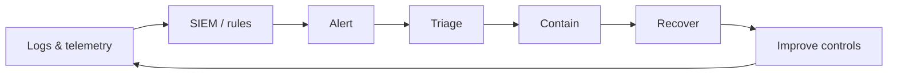

**Key Points:**

- **Security operations** — detect, analyze, contain, eradicate, recover, and learn from incidents.
- **SIEM** aggregates logs for correlation, dashboards, and alerting — not a replacement for metrics stacks.
- **Playbooks** standardize response; **chain of custody** preserves evidence for legal or regulatory use.
- **Tool categories** — AV, IDS/IPS, encryption, vuln assessment, authorized pen testing.
- **Vault observability** — [[DB — ELK]] for logs, [[DB — Prometheus & Grafana]] for metrics; SIEM adds security context.

# Cybersecurity — Security Operations

Part of [[Cybersecurity]]. Concept-only.

---

## Security Operations Domain

Focus areas:

- **Monitoring and logging**
- **Incident response**
- **Forensics and evidence handling**
- **Vulnerability management**
- **Patch and configuration management**
- **Business continuity**

Aligns with NIST **Detect**, **Respond**, **Recover** — [[Cybersecurity — Frameworks & Compliance]].

---

## SIEM — Security Information and Event Management

**SIEM** collects, normalizes, and correlates **logs and security events** from many sources to:

- Detect suspicious patterns
- Investigate incidents
- Produce compliance and executive reports
- Track indicators of compromise (IOCs)

### vs Log aggregation in this vault

| | SIEM (e.g. Splunk, Chronicle) | ELK-style stack |
| --- | --- | --- |
| **Primary goal** | Security detection & investigation | Log search, app debugging |
| **Correlation rules** | Built-in detections | Often custom |
| **SOC workflow** | Case management, playbooks | Flexible, DIY |

[[DB — ELK]] and [[DB — Prometheus & Grafana]] complement security ops; organizations may use **both**.

### Example dashboard themes (conceptual)

**Splunk-style:**

- Security posture
- Executive summary
- Incident review
- Risk analysis

**Chronicle-style (Google):**

- Enterprise insights
- Data ingestion health
- IOC matches
- Rule detections
- User sign-in overview

Dashboards translate **telemetry into decisions** for SOC and leadership.

---

## Packet Analysis (Concept)

**Network packet analyzers** (packet sniffers) capture frames for troubleshooting and **authorized** investigations. Misuse on networks you do not own is illegal. Legitimate use: incident response on owned infrastructure, with scope.

Relates to [[Cybersecurity — Network Security]] packet sniffing attacks — defenders use similar visibility with permission.

---

## Playbooks and Incident Response

**Playbooks** are **step-by-step runbooks** for recurring scenarios:

- Phishing reported
- Ransomware detected
- Credential leak
- DDoS in progress

Phases (common model):

1. **Preparation** — contacts, tools, backups
2. **Detection & analysis**
3. **Containment**
4. **Eradication**
5. **Recovery**
6. **Post-incident review**

### Chain of custody

When evidence may be used **legally or regulatorily**:

- Document who collected it, when, and how
- **Protect and preserve** integrity — hashes, sealed storage
- Limit access to authorized analysts

---

## Security Tools (Categories)

| Category | Purpose |
| --- | --- |
| **Programming** | Secure SDLC, automation — [[Cybersecurity — Fundamentals & Controls]] |
| **Operating systems** | Hardening, patching — [[Linux]] |
| **Web vulnerability** | Assess HTTP apps — [[API - FastAPI]] |
| **Antivirus / EDR** | Malware detection on endpoints |
| **IDS / IPS** | Network anomaly — [[Cybersecurity — Network Security]] |
| **Encryption** | Protect confidentiality at rest and in transit |
| **Penetration testing** | Authorized simulation — [[Linux — Kali & Security Labs]] |

**Security assessment and testing** domain includes vuln scans, pen tests, and code review — scheduled and scoped.

---

## Detection and Response Loop

---

## Boot and Trust (Conceptual)

**BIOS** vs **UEFI** — firmware that starts the hardware before the OS. **Secure Boot** (when enabled) helps ensure only signed bootloaders run — relevant to **integrity** of the chain from power-on to kernel.

**Task execution stack** (user → application → OS → hardware) mirrors trust boundaries — compromise at lower layer affects all above. See [[Linux — Architecture]].

---

## Related Notes

- [[Cybersecurity]]
- [[Cybersecurity — Frameworks & Compliance]]
- [[Cybersecurity — Threats & Attacks]]
- [[Cybersecurity — Network Security]]
- [[DB — ELK]]
- [[DB — Prometheus & Grafana]]
- [[Linux — Kali & Security Labs]]
- [[K8S]] — runtime security, audit logs

---

## Tags

#cybersecurity #siem #soc #incident-response #playbooks #forensics #splunk #operations
