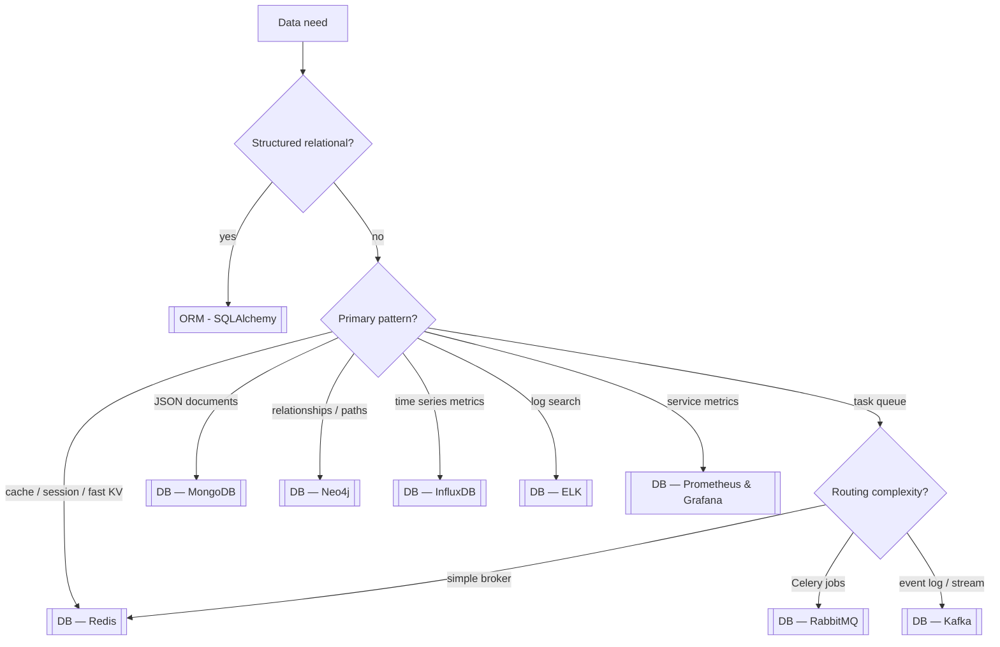

**Key Points:**

- **Relational data lives under [[ORM - SQLAlchemy]]** — PostgreSQL/SQLite via SQLAlchemy; this hub covers **everything else** in your checklist.
- **Redis** — cache, sessions, rate limits, Celery broker/backend, pub/sub.
- **Kafka / RabbitMQ** — event streaming vs task queues; RabbitMQ pairs with [[Processing — Celery]].
- **MongoDB / Neo4j / InfluxDB** — document, graph, and time-series stores for different shape data.
- **ELK + Prometheus/Grafana** — logs vs metrics; observability stack alongside [[Python — logging]].

# DB — Overview & Data Platform Stack

## What is DB (in this vault)?

**DB** here means **databases, brokers, and observability backends** beyond core relational persistence — the supporting data plane for [[API - FastAPI]] services, [[Processing]] workers, and [[Machine Learning]] pipelines.

Typical outcomes:

- **Cache hot reads** — Redis in front of Postgres
- **Async jobs** — RabbitMQ or Redis with [[Processing — Celery]]
- **Event bus** — Kafka between microservices
- **Flexible documents** — MongoDB for catalog / user prefs
- **Graph queries** — Neo4j for relationships
- **Metrics & logs** — Prometheus/Grafana + ELK

---

## Relational vs This Hub

| Need | Where in vault |
| --- | --- |
| Tables, migrations, ORM | [[ORM - SQLAlchemy]] → Setup, Models, CRUD, Queries, Async, Migrations |
| PostgreSQL in Docker | [[Commands/CLI — Docker & Compose]] |
| SQLModel with FastAPI | [[Python — SQLModel]] |

This hub starts where SQLAlchemy stops.

---

## Decision Flow



---

## Checklist Map

| Tool | Codes note | Common Python / ops use |
| --- | --- | --- |
| Redis | [[DB — Redis]] | Cache, Celery, locks, pub/sub |
| Kafka | [[DB — Kafka]] | Event streaming, audit log |
| RabbitMQ | [[DB — RabbitMQ]] | Celery broker, AMQP routing |
| Mongo | [[DB — MongoDB]] | Document store, flexible schema |
| Neo4j | [[DB — Neo4j]] | Graph traversal, recommendations |
| ELK | [[DB — ELK]] | Centralized logs (Elasticsearch) |
| Influx | [[DB — InfluxDB]] | High-cardinality time series |
| Prometheus | [[DB — Prometheus & Grafana]] | Pull metrics, alerting |
| Grafana | [[DB — Prometheus & Grafana]] | Dashboards, visualization |

---

## Store Comparison

| Store | Model | Best for | Avoid when |
| --- | --- | --- | --- |
| PostgreSQL + ORM | Relational | ACID, joins, reports | Unstructured blob-only (still often fine) |
| [[DB — Redis]] | Key-value / structures | Cache, ephemeral state | Primary source of truth |
| [[DB — MongoDB]] | Document JSON | Evolving schema, catalogs | Heavy cross-doc transactions |
| [[DB — Neo4j]] | Property graph | Paths, recommendations | Simple CRUD tables |
| [[DB — InfluxDB]] | Time series | IoT, per-second metrics | General OLTP |
| [[DB — Kafka]] | Log / stream | Many consumers, replay | Single worker job queue only |
| [[DB — RabbitMQ]] | Message broker | Task queues, routing | Long-term event archive |

---

## Typical Backend Architecture

```text
Client → FastAPI → PostgreSQL ([[ORM - SQLAlchemy]])
                 → Redis (cache / rate limit)
                 → Celery → RabbitMQ → workers
                 → Kafka (domain events)
Metrics: app → Prometheus → Grafana
Logs:    stdout → Logstash/Filebeat → Elasticsearch → Kibana
```

Local stack: [[Commands/CLI — Docker & Compose]]. Production: [[K8S]] + [[Codes/K8S — Storage]].

---

## Brokers: Kafka vs RabbitMQ vs Redis

| | [[DB — Kafka]] | [[DB — RabbitMQ]] | [[DB — Redis]] |
| --- | --- | --- | --- |
| Pattern | Durable log, many consumers | Queue, exchanges, ACK | List/stream, pub/sub |
| Ordering | Per partition | Per queue | Best-effort |
| Retention | Long (configurable) | Until consumed/ TTL | Memory-bound |
| Python jobs | Consumers, Faust | [[Processing — Celery]] | Celery broker |
| Ops complexity | Higher | Medium | Lower |

---

## Observability Split

| Stack | Question it answers | Note |
| --- | --- | --- |
| [[DB — ELK]] | "What did the logs say at 14:32?" | Full-text log search |
| [[DB — Prometheus & Grafana]] | "What was p99 latency?" | Counters, histograms, alerts |
| [[Python — logging]] | App-side structured logs | Feed into ELK |

Use **both** in production: metrics for SLOs, logs for incident forensics.

---

## When to Use What

| Question | Choose |
| --- | --- |
| User accounts + orders? | [[ORM - SQLAlchemy]] + PostgreSQL |
| Cache API responses? | [[DB — Redis]] |
| Background email send? | [[Processing — Celery]] + [[DB — RabbitMQ]] or Redis |
| Audit trail many services read? | [[DB — Kafka]] |
| Product catalog JSON? | [[DB — MongoDB]] |
| Friend-of-friend queries? | [[DB — Neo4j]] |
| Sensor readings per second? | [[DB — InfluxDB]] |
| Search production logs? | [[DB — ELK]] |
| Dashboard CPU/error rate? | [[DB — Prometheus & Grafana]] |

---

## Recommended Learning Path

1. **PostgreSQL + SQLAlchemy** — [[ORM - SQLAlchemy]] (baseline)
2. **Redis** — cache + Celery backend — [[DB — Redis]]
3. **RabbitMQ + Celery** — [[DB — RabbitMQ]], [[Processing — Celery]]
4. **Docker Compose stack** — [[Commands/CLI — Docker & Compose]]
5. **Prometheus/Grafana** — metrics — [[DB — Prometheus & Grafana]]
6. **Kafka or Mongo** — when shape demands — pick one deep dive

---

## Related Notes

- [[DB — Redis]]
- [[DB — Kafka]]
- [[DB — RabbitMQ]]
- [[DB — MongoDB]]
- [[DB — Neo4j]]
- [[DB — InfluxDB]]
- [[DB — ELK]]
- [[DB — Prometheus & Grafana]]
- [[ORM - SQLAlchemy]]
- [[Processing — Celery]]
- [[API - FastAPI]]
- [[Python Development]]

---

## Tags

#database #redis #kafka #rabbitmq #mongodb #neo4j #influxdb #elk #prometheus #grafana #observability #data-platform
