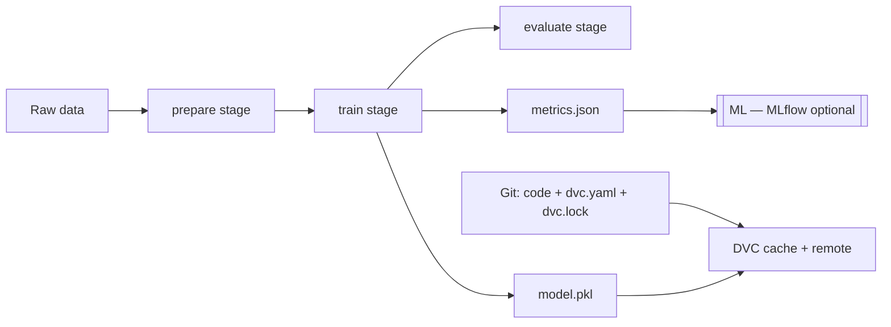

**Key Points:**

- **DVC versions data and pipelines alongside Git** — code in Git; large datasets and models as small `.dvc` pointer files + remote storage.
- **Pipelines (`dvc.yaml`)** — reproducible DAG of stages (prepare → train → evaluate) with `dvc repro`.
- **Complements [[ML — MLflow]]** — DVC for data/pipeline lineage; MLflow for experiment metrics and model registry.
- **Requires a Git repo** — `dvc init` inside a project already using [[Commands/CLI — Git & GitHub]].
- **Examples** — [[ML — DVC]]; remote storage often [[GCP]] GCS or S3.

# DVC — Overview & Data-Centric MLOps

## What is DVC (in this vault)?

**DVC (Data Version Control)** is an open-source tool for **versioning datasets**, **models**, and **ML pipelines** in the same workflow as Git. Git stores code and lightweight metadata; DVC stores content hashes in a local cache and syncs blobs to **remote storage** so teams can reproduce any commit’s data state.

Typical outcomes:

- **Track 10GB+ CSV** without bloating Git history
- **Define pipelines** — preprocess, train, evaluate — with automatic skip when inputs unchanged
- **Share data** across machines via S3, GCS, Azure, SSH
- **Parameterize stages** — `params.yaml` changes trigger only affected stages on `dvc repro`
- **Pair with MLflow** — log metrics from pipeline stages while DVC pins data versions

---

## How DVC Fits the ML Lifecycle



| Layer | Tool | Tracks |
| --- | --- | --- |
| Code & pipeline definition | Git + `dvc.yaml` | Scripts, stage graph |
| Exact reproducibility | `dvc.lock` | Hashes of deps/outs |
| Large files | DVC + remote | Data, models, artifacts |
| Experiment comparison | [[ML — MLflow]] | Params, metrics, registry |
| Online features | [[ML — Feast]] | Serving-time features |

---

## Core Concepts

| Concept | Meaning |
| --- | --- |
| **Workspace** | Your working tree — may show symlinks or copies from cache |
| **Cache** | `.dvc/cache` — content-addressed store (like Git objects for data) |
| **`.dvc` file** | Small metadata committed to Git — points to cache entry |
| **Remote** | S3, GCS, SSH, etc. — team shares data without Git LFS for everything |
| **Stage** | One command in a pipeline with deps, params, outs, metrics |
| **`dvc repro`** | Run pipeline; skip stages whose inputs did not change |
| **`dvc.lock`** | Locked versions — commit with `dvc.yaml` |

---

## DVC vs Related Tools

| Need | Use | Notes |
| --- | --- | --- |
| Version datasets & models with Git workflow | **DVC** | `dvc add`, remotes |
| Reproducible multi-step ML DAG | **DVC pipelines** | `dvc.yaml` |
| Compare 50 training runs, registry | [[ML — MLflow]] | Often used together |
| Feature store for production | [[ML — Feast]] | Different problem |
| Ad-hoc ETL at scale | [[Processing — Ray]] / Spark | Can feed DVC-tracked outputs |
| Container deploy | [[ML — BentoML]] / [[K8S]] | Model from DVC-tracked artifact |

**Rule of thumb:** DVC answers *“which data and code produced this model file?”* MLflow answers *“how did this run compare to others?”*

---

## When to Use DVC

| Situation | Use DVC? |
| --- | --- |
| Dataset > few MB in Git | ✅ `dvc add` or pipeline `outs` |
| Team needs `git pull` + same data | ✅ `dvc pull` + remote |
| Manual script order in README | ✅ encode in `dvc.yaml` |
| Single notebook, tiny CSV in repo | Optional — Git may suffice |
| Only experiment metrics matter | [[ML — MLflow]] may be enough alone |

---

## Project Layout (Typical)

```text
ml-project/
├── .git/
├── .dvc/              # config + cache
├── .dvcignore
├── dvc.yaml           # pipeline stages
├── dvc.lock           # reproducibility lock (commit!)
├── params.yaml        # hyperparameters
├── data/
│   └── raw.csv.dvc    # pointer file in Git
├── src/
│   ├── prepare.py
│   └── train.py
└── models/            # outs — tracked by DVC
```

---

## Workflow Summary

1. `git init` → `dvc init`
2. `dvc remote add` (S3/GCS)
3. `dvc add data/` or define pipeline stages
4. `dvc repro` to build artifacts
5. `git commit` code + `dvc.yaml` + `dvc.lock` + `.dvc` files
6. `dvc push` to upload data; teammates `dvc pull`

Step-by-step commands and scripts: [[ML — DVC]].

---

## Recommended Learning Path

1. **Git comfort** — [[Commands/CLI — Git & GitHub]]
2. **Track one file** — `dvc add`, `dvc push` / `dvc pull`
3. **Two-stage pipeline** — prepare + train in `dvc.yaml`
4. **Parameters** — `params.yaml` + `dvc repro`
5. **MLflow inside train** — log metrics while DVC versions outputs
6. **CI** — `dvc repro` on push (with remote credentials)

---

## Related Notes

- [[ML — DVC]]
- [[Machine Learning]]
- [[ML — MLflow]]
- [[ML — scikit-learn]]
- [[Commands/CLI — Git & GitHub]]
- [[GCP]]
- [[Processing]]
- [[Python Development]]

---

## Tags

#dvc #mlops #data-versioning #pipelines #reproducibility #git #machine-learning
