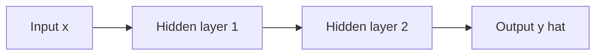
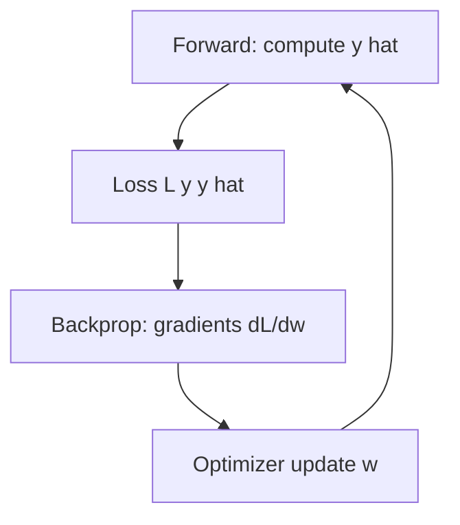
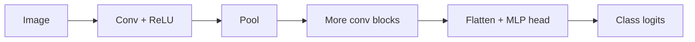
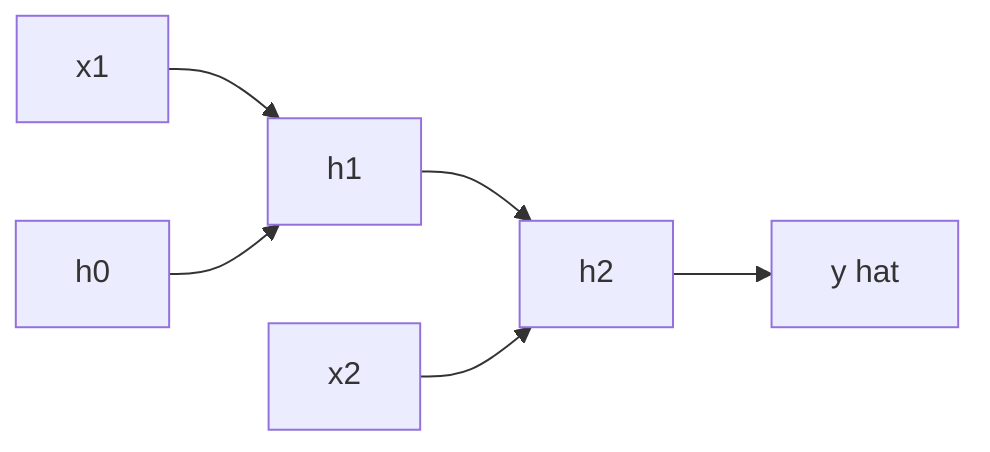
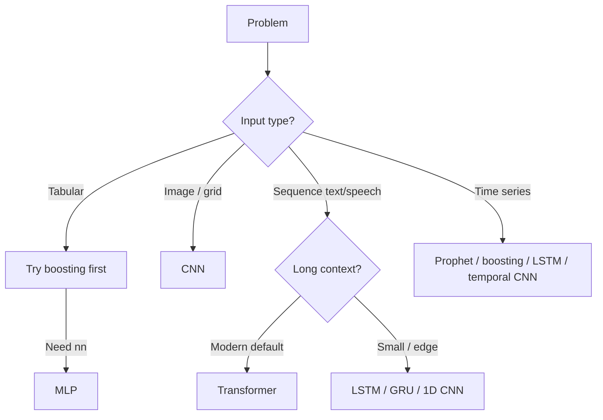

**Key Points:**

- **Neural networks** stack linear layers + non-linear activations; **backpropagation** trains weights via chain rule on a loss.
- **ANN / MLP** — universal tabular and generic function approximators; often lose to boosting on small structured data.
- **CNN** — local filters + weight sharing for grid data (images); hierarchy from edges → objects.
- **RNN / LSTM / GRU** — sequential state for time series and text before transformers; struggle with very long dependencies.
- **Training tricks** — dropout, batch norm, weight init, learning rate schedule, early stopping.
- **Implementation** — [[ML — PyTorch]]; escalate to [[Transformers — Attention & Architecture]] for modern NLP/vision-language.

# Deep Learning — Theory

> Concept-only reference for **neural network architectures** and **training concepts**. Parent hub: [[Machine Learning]]. Classical ML: [[Machine Learning — Algorithms Theory]].

---

## What is Deep Learning?

**Deep learning** uses **neural networks with many layers** to learn hierarchical representations from data. "Deep" refers to depth (stacked layers), not mystery — still optimization of a loss on parameters.

Typical outcomes:

- Map a problem to ANN vs CNN vs RNN/LSTM vs transformer
- Understand forward pass, loss, backprop, and common training failures
- Know when deep learning is worth the data and compute cost

---

## Artificial Neural Network (ANN / MLP)

### Perceptron → multi-layer perceptron (MLP)

**Single neuron:** z = w·x + b, a = activation(z)  
**MLP:** stack layers — input → hidden (ReLU) → … → output (linear / softmax)

| Component | Role |
| --- | --- |
| **Weights w** | Learned direction and strength of each connection |
| **Bias b** | Shift activation threshold |
| **Activation** | Non-linearity — without it, stack collapses to one linear map |
| **Output layer** | Regression: linear; binary: sigmoid; multiclass: softmax |

### Common activations

| Activation | Formula (idea) | Use |
| --- | --- | --- |
| **ReLU** | max(0, z) | Default hidden layer |
| **Leaky ReLU / GELU** | Small slope or smooth variant | Transformers (GELU), avoid dead ReLU |
| **Sigmoid** | 1/(1+e⁻ᶻ) | Binary output, gates in LSTM |
| **Tanh** | (−1, 1) | RNN hidden (historical) |
| **Softmax** | Normalized exponentials | Multiclass probabilities |

**Universal approximation:** MLP with one hidden layer can approximate continuous functions (width trade-off) — depth often learns more efficiently.

---

## Training: Forward Pass, Loss, Backprop

| Step | What happens |
| --- | --- |
| **Forward pass** | Compute predictions layer by layer |
| **Loss** | Scalar error — MSE (regression), cross-entropy (classification) |
| **Backpropagation** | Chain rule from loss to each weight |
| **Optimizer** | SGD, momentum, Adam — update weights using gradients |

### Optimizers (concept)

| Optimizer | Idea |
| --- | --- |
| **SGD** | w ← w − η∇L |
| **Momentum** | Velocity-smoothed gradients |
| **Adam** | Adaptive per-parameter learning rates — common default |

### Learning rate

| Too high | Too low |
| --- | --- |
| Divergence, loss spikes | Slow convergence, stuck in sharp minima |

Use schedules (warmup, cosine decay) and validation loss for early stopping.

---

## Regularization & Stabilization

| Technique | Mechanism | Effect |
| --- | --- | --- |
| **L2 weight decay** | Penalize ‖w‖² | Smoother weights |
| **Dropout** | Randomly zero neurons during train | Reduces co-adaptation |
| **Batch normalization** | Normalize activations per mini-batch | Faster, stabler training |
| **Layer normalization** | Normalize within layer (common in transformers) | Sequence models |
| **Data augmentation** | Random transforms on inputs | ↓ overfit on images/text |
| **Early stopping** | Stop when val loss rises | Prevent memorization |

**Vanishing/exploding gradients:** deep stacks without skip connections or proper init — LSTM gates and **residual connections** help.

---

## Convolutional Neural Network (CNN)

**For grid-like data** — images, spectrograms, some 1D signals.

| Idea | Meaning |
| --- | --- |
| **Convolution** | Small **filter** slides over input → local feature map |
| **Weight sharing** | Same filter everywhere → fewer params, translation equivariance |
| **Pooling** | Downsample (max/avg) → spatial invariance, less compute |
| **Channels** | RGB = 3 input channels; deeper layers = many feature maps |

**Hierarchy:** early layers ≈ edges/textures; deep layers ≈ parts and objects (interpretability via activation maps).

| Variant | Note |
| --- | --- |
| **ResNet** | Skip connections — train very deep nets |
| **EfficientNet / ConvNeXt** | Scale depth/width/resolution |
| **1D CNN** | Sequences, time series, text chars |

**When CNN:** images, video frames, spatial patterns. **Not default** for pure tabular (use boosting).

---

## Recurrent Neural Network (RNN)

**For sequences** — time series, text tokens, sensor streams.

**Idea:** maintain **hidden state h_t** updated at each time step:

- h_t = f(W_x x_t + W_h h_{t-1} + b)
- y_t = g(W_y h_t)

| Issue | Cause |
| --- | --- |
| **Vanishing gradient** | Long-range dependencies fade through many steps |
| **Exploding gradient** | Gradient clipping mitigates |
| **Sequential compute** | Hard to parallelize over time — transformers address this |

**Variants:** bidirectional RNN (past + future context for encoding), many-to-one (sequence → label), one-to-many (captioning).

---

## LSTM & GRU (Gated RNNs)

**LSTM (Long Short-Term Memory)** adds **gates** to control information flow:

| Gate | Role |
| --- | --- |
| **Forget gate** | Drop irrelevant past cell state |
| **Input gate** | Write new candidate into cell |
| **Output gate** | Read from cell to hidden |

**Cell state** acts as a "memory highway" — gradients flow better than vanilla RNN.

**GRU (Gated Recurrent Unit):** simplified LSTM (fewer gates) — often similar performance, less compute.

| When LSTM/GRU | Limit |
| --- | --- |
| Moderate-length sequences | Very long context → attention/transformers |
| Smaller models on device | Slower training than parallel attention |
| Time series baselines | Often compete with specialized models + [[ML — Prophet]] |

**Historical note:** pre-2018 NLP was LSTM/GRU + attention; **transformers** replaced most seq2seq encoders — see [[Transformers — Attention & Architecture]].

---

## Autoencoders & Representation Learning

| Architecture | Structure | Use |
| --- | --- | --- |
| **Autoencoder** | Encode → bottleneck → decode | Denoising, dimensionality reduction |
| **VAE** | Probabilistic latent | Generation, smooth latent space |
| **Contrastive learning** | Pull similar pairs, push dissimilar | Self-supervised vision (SimCLR) |

Bridges classical **unsupervised** learning and modern pretraining.

---

## Transfer Learning

**Idea:** train on large source task (ImageNet, web text), **fine-tune** on small target task.

| Mode | What freezes | When |
| --- | --- | --- |
| **Feature extractor** | Backbone frozen, train head only | Tiny target data |
| **Full fine-tune** | All layers | More target data, domain shift |
| **Adapter / LoRA** | Small trainable blocks | Efficient LLM fine-tune — [[AI]] |

Dominant practice in vision and NLP — train big once, adapt cheaply.

---

## Deep Learning vs Classical ML

| Criterion | Prefer classical ([[Machine Learning — Algorithms Theory]]) | Prefer deep learning |
| --- | --- | --- |
| Data | Small/medium tabular | Large unstructured (images, text, audio) |
| Features | Hand-crafted strong | Raw inputs OK |
| Interpretability | Higher (linear, trees) | Lower |
| Compute | CPU | GPU/TPU for training |
| Latency | Often lower for small models | Depends on model size |

---

## Architecture Decision Flow

---

## Common Failure Modes

| Symptom | Likely cause | Fix |
| --- | --- | --- |
| Train ↓ val ↑ | Overfit | Dropout, more data, simpler net, early stop |
| Loss flat | LR too low / bad init | LR sweep, He/Xavier init |
| Loss NaN | LR too high | Lower LR, grad clip, check normalization |
| Great train, random val | Leakage / bad split | Fix splits, group by entity |
| GPU OOM | Batch too large | Gradient accumulation, mixed precision |

Track with [[ML — MLflow]]; tune with [[ML — Optuna]].

---

## Recommended Learning Path

1. **MLP + backprop intuition** — forward, loss, one backward step
2. **Activations, optimizers, regularization**
3. **CNN** — conv, pool, ResNet idea
4. **RNN → LSTM** — sequential state and gates
5. **Implement** — [[ML — PyTorch]] training loop
6. **Modern sequence/NLP** — [[Transformers — Attention & Architecture]]
7. **Production** — [[ML — BentoML]], [[ML — MLflow]]

---

## Related Notes

### Theory

- [[Machine Learning — Algorithms Theory]]
- [[Statistics — Theory & A/B Testing]]
- [[Transformers — Attention & Architecture]]

### Implementation & hubs

- [[ML — PyTorch]]
- [[Machine Learning]]
- [[NLP]]
- [[AI]]

---

## Tags

#deep-learning #neural-networks #cnn #rnn #lstm #backprop #pytorch #theory
