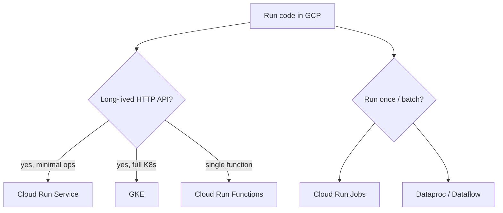

**Key Points:**

- **Cloud Run** — default home for containerized [[API - FastAPI]] / [[ML — BentoML]] APIs without managing servers.
- **GKE** — when you need full [[K8S]] control; same manifests, Google-managed control plane.
- **Cloud SQL + Secret Manager** — managed Postgres/MySQL plus credentials; pairs with [[ORM - SQLAlchemy]] locally, Cloud SQL in prod.
- **BigQuery + GCS** — warehouse and object storage for analytics pipelines; overlaps conceptually with [[DB]] patterns.
- **Vertex AI** — managed training/serving alongside [[Machine Learning]] in this vault.

# GCP — Overview & Google Cloud Stack (Conceptual)

## What is GCP (in this vault)?

**Google Cloud Platform** is the **managed cloud layer** above your Python apps — run containers, schedule jobs, store data, and observe production without owning VMs. This note is **concept-only** (no CLI/Codes series); use it to pick the right product, then follow Google docs or vault links below.

---

## Checklist Map

| Product | Role | Vault link |
| --- | --- | --- |
| **Cloud Run Service** | HTTP containers, scale to zero | [[API - FastAPI]], [[Web — Flask]] |
| **Cloud Run Functions** | Event-triggered functions | Lightweight handlers |
| **Cloud Run Jobs** | Run container to completion | Migrations, batch export |
| **Cloud Tasks** | Managed task queue + HTTP targets | Like [[Processing — Celery]] offload |
| **Cloud Scheduler** | Cron → HTTP / Pub/Sub / Tasks | Periodic jobs |
| **GKE** | Managed Kubernetes | [[K8S]], [[ML — Seldon]] |
| **Cloud Build** | CI build from repo | With [[Commands/CLI — Git & GitHub]] |
| **Artifact Registry** | Docker / package images | Image store for Run / GKE |
| **GCS** | Object storage | Artifacts, static files, ML data |
| **BigQuery** | Analytics warehouse | SQL at scale, [[ML — Feast]] offline |
| **Cloud SQL** | Managed PostgreSQL/MySQL | Prod DB for [[ORM - SQLAlchemy]] |
| **Firestore** | Document NoSQL | Mobile/web sync, flexible docs |
| **Dataflow** | Beam stream/batch | Large ETL |
| **Cloud Dataproc** | Managed Spark/Hadoop | Batch on clusters |
| **Composer** | Managed Airflow | [[ORCHESTRATION — Airflow]] |
| **Vertex AI** | Training, endpoints, pipelines | [[Machine Learning]] |
| **ADK agents** | Build/deploy Gemini agents | [[AI — ADK]], [[AI]] |
| **Cloud Logging & Monitoring** | Logs + metrics | Like [[DB — ELK]] / [[DB — Prometheus & Grafana]] |
| **Secret Manager** | Central secrets | Prod env vars |
| **IAM** | Who can do what | Service accounts per service |
| **VPC** | Private networking | Connect Run/GKE to Cloud SQL |

---

## Compute: When to Use What



| Question | Choose |
| --- | --- |
| FastAPI API, low ops? | Cloud Run Service |
| Need Ingress, CRDs, mesh? | GKE → [[K8S]] |
| One-off container script? | Cloud Run Jobs |
| Cron HTTP ping? | Cloud Scheduler |
| Defer work from API? | Cloud Tasks (or [[Processing — Celery]] on GKE) |

---

## Data & ML (Conceptual)

| Need | GCP | Alternative in vault |
| --- | --- | --- |
| Relational OLTP | Cloud SQL | Postgres in [[Commands/CLI — Docker & Compose]] |
| Document store | Firestore | [[DB — MongoDB]] |
| Object/files | GCS | S3-compatible patterns |
| Analytics SQL | BigQuery | Warehouse, not app OLTP |
| Stream/batch ETL | Dataflow | [[Processing — Celery]] chains (smaller scale) |
| Spark jobs | Dataproc | Self-hosted Spark |
| Workflow DAGs | Composer | [[ORCHESTRATION — Airflow]] |
| Model platform | Vertex AI | [[ML — MLflow]], [[ML — BentoML]], [[ML — Seldon]] on GKE |

---

## Platform Layer

```text
App (Run / GKE) → service account (IAM) → Cloud SQL, GCS, Secret Manager
              → VPC connector → private Cloud SQL
              → Logging / Monitoring → alerts
```

- **IAM** — least privilege; one service account per workload.
- **Secret Manager** — replaces baking secrets into images ([[Python — python-dotenv]] locally).
- **VPC** — private access to databases and internal services.

---

## Typical Python Backend on GCP

```text
GitHub → Cloud Build → Artifact Registry → Cloud Run Service
                                        → Cloud SQL (via VPC)
                                        → Secret Manager
Cloud Scheduler → Cloud Tasks → internal endpoints
Logs/metrics → Cloud Logging & Monitoring
```

Local dev stays on [[Commands/CLI — Docker & Compose]]; deploy same container to Run or GKE.

---

## Related Notes

- [[K8S]]
- [[DB]]
- [[ORM - SQLAlchemy]]
- [[Processing]]
- [[API - FastAPI]]
- [[Machine Learning]]
- [[CLI]]
- [[Python Development]]
- [[Cybersecurity — Network Security]]
- [[Cybersecurity — Frameworks & Compliance]]

---

## Tags

#gcp #google-cloud #cloud-run #gke #bigquery #vertex-ai #concept #platform
