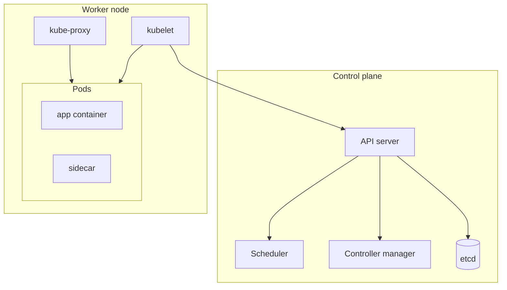
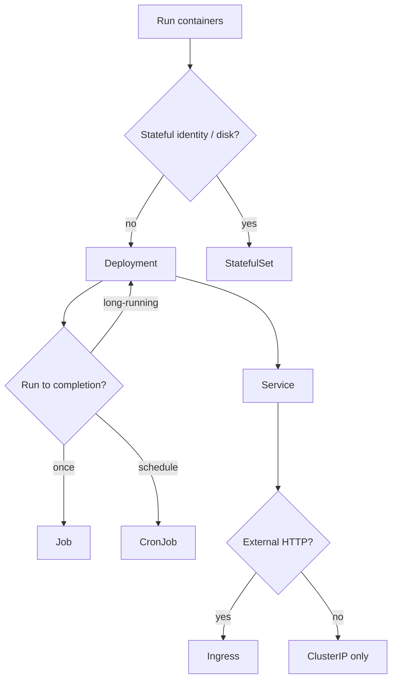

**Key Points:**

- **Kubernetes orchestrates containers** — schedule Pods, heal failures, scale, roll out updates; you declare desired state in YAML, controllers reconcile.
- **Namespace = isolation boundary** — dev/staging/prod or team slices; most objects are namespaced.
- **Deployment + Service = default app pattern** — Deployment runs stateless replicas; Service gives stable cluster DNS; Ingress exposes HTTP(S) externally.
- **ConfigMap / Secret inject config** — never bake env-specific values into images; pair with [[Python — python-dotenv]] locally, K8s in prod.
- **kubectl + Minikube locally** — CLI and single-node cluster for learning; production commands live in [[Commands/K8S — kubectl & Minikube]]; YAML patterns in **Codes/K8S —** notes.
- **Nodes run Linux** — debug with [[Linux]], [[Commands/Linux — Processes & Services]], [[Commands/Linux — Networking]].

# K8S — Overview & Kubernetes Stack

> **From scratch checklist:** [[Build a DevOps and Platform Stack from Scratch]] · All roadmaps: [[README]]

## What is K8S (in this vault)?

**Kubernetes (K8s)** is a **container orchestration platform** — it runs Docker/OCI images across a **cluster** of nodes, keeps workloads healthy, and exposes networking and storage primitives. This hub maps the object model from your checklist and links **concept/YAML notes** ([[Codes/K8S — Cluster & Namespaces]], workloads, networking, storage, config) separately from **CLI commands** ([[Commands/K8S — kubectl & Minikube]]).

Typical outcomes:

- **Run [[API - FastAPI]] / [[Web — Flask]]** behind Deployment + Service + Ingress
- **Deploy ML models** — [[ML — Seldon]], [[ML — BentoML]] containers, [[ML — MLflow]] tracking sidecars
- **Scheduled batch** — CronJob for ETL; Job for one-off migrations
- **Stateful data** — StatefulSet + PVC for databases (often managed DB off-cluster instead)

---

## Cluster Mental Model



| Component | Role |
| --- | --- |
| **API server** | Validates and stores object specs |
| **Scheduler** | Assigns Pods to nodes |
| **Controllers** | Deployment, ReplicaSet, Job controllers reconcile desired vs actual |
| **kubelet** | Runs containers on the node |
| **kube-proxy** | Service cluster IP / load balancing rules |

Deep dive: [[Codes/K8S — Cluster & Namespaces]].

---

## Object Map (Your Checklist)

| Topic                            | Codes note                               | Commands                              |
| -------------------------------- | ---------------------------------------- | ------------------------------------- |
| Cluster architecture             | [[Codes/K8S — Cluster & Namespaces]]     | [[Commands/K8S — kubectl & Minikube]] |
| Namespaces                       | [[Codes/K8S — Cluster & Namespaces]]     | `kubectl get ns`                      |
| Deployments / Pods / ReplicaSets | [[Codes/K8S — Workloads]]                | `kubectl get deploy,pods`             |
| StatefulSets                     | [[Codes/K8S — Workloads]]                | `kubectl get sts`                     |
| Jobs / CronJobs                  | [[Codes/K8S — Workloads]]                | `kubectl get jobs,cronjobs`           |
| Services                         | [[Codes/K8S — Networking]]               | `kubectl get svc`                     |
| Ingress                          | [[Codes/K8S — Networking]]               | `kubectl get ingress`                 |
| PVC / StorageClass               | [[Codes/K8S — Storage]]                  | `kubectl get pvc,sc`                  |
| ConfigMaps / Secrets             | [[Codes/K8S — Configuration & Security]] | `kubectl get cm,secret`               |
| ServiceAccounts                  | [[Codes/K8S — Configuration & Security]] | `kubectl get sa`                      |
| Local dev cluster                | [[Commands/K8S — kubectl & Minikube]]    | `minikube start`                      |

---

## Workload Decision Flow



See [[Codes/K8S — Workloads]].

---

## Default Application Stack

```text
Ingress (TLS, host rules)
    → Service (ClusterIP / LoadBalancer)
        → Deployment (replicas, rolling update)
            → Pod(s) → container image (FastAPI, Bento, etc.)
        → ConfigMap / Secret (env, files)
        → ServiceAccount (RBAC, cloud IAM bind)
```

Example: FastAPI container from [[API - FastAPI]] + Uvicorn, env from Secret, Postgres connection string in ConfigMap, HPA on CPU (advanced — not in checklist).

---

## K8S in This Vault's Landscape

| Concern | K8s piece | Vault link |
| --- | --- | --- |
| HTTP API container | Deployment + Service | [[API - FastAPI]] |
| Model serving | SeldonDeployment CRD | [[ML — Seldon]] |
| Build & push image | Docker (Inbox) | [[ML — BentoML]] |
| Env vars locally | `.env` | [[Python — python-dotenv]] |
| Background jobs | CronJob or [[Processing — Celery]] | [[Processing]] |
| Vector DB on cluster | Helm / StatefulSet | [[AI — Milvus]], [[AI — Qdrant]] |
| Experiment tracking | MLflow server Deployment | [[ML — MLflow]] |

---

## When to Use What Workload

| Question | Choose |
| --- | --- |
| Stateless web API? | Deployment + Service |
| Stable pod name + disk? | StatefulSet + PVC |
| One-off migration script? | Job |
| Nightly batch? | CronJob |
| Internal only traffic? | ClusterIP Service |
| Public HTTPS? | Ingress + TLS cert |
| Non-sensitive config? | ConfigMap |
| Passwords / API keys? | Secret |
| Pod calls K8s API or cloud? | ServiceAccount + RBAC |

---

## Recommended Learning Path

1. **Local cluster** — install kubectl + Minikube — [[Commands/K8S — kubectl & Minikube]]
2. **Namespaces & labels** — [[Codes/K8S — Cluster & Namespaces]]
3. **First Deployment** — nginx or FastAPI — [[Codes/K8S — Workloads]]
4. **Expose Service + port-forward** — [[Codes/K8S — Networking]]
5. **ConfigMap / Secret** — [[Codes/K8S — Configuration & Security]]
6. **Ingress** (Minikube addon) — [[Codes/K8S — Networking]]
7. **Deploy ML** — [[ML — Seldon]] on same cluster

---

## Codes vs Commands

| Folder | Purpose | Examples |
| --- | --- | --- |
| **Codes/K8S —** | Object model, YAML manifests, patterns | Deployment spec, Ingress rules |
| **Commands/K8S —** | CLI reference, Minikube, day-2 ops | `kubectl apply`, `minikube tunnel`, debug |

Keep YAML in Codes; keep copy-paste shell in Commands.

---

## Related Notes

### Codes (resources & YAML)

- [[Codes/K8S — Cluster & Namespaces]]
- [[Codes/K8S — Workloads]]
- [[Codes/K8S — Networking]]
- [[Codes/K8S — Storage]]
- [[Codes/K8S — Configuration & Security]]

### Commands (CLI)

- [[Commands/K8S — kubectl & Minikube]]

### Vault cross-links

- [[Linux]] — node troubleshooting (processes, disk, network)

- [[ML — Seldon]]
- [[ML — BentoML]]
- [[ML — MLflow]]
- [[API - FastAPI]]
- [[Python — python-dotenv]]
- [[Processing — Celery]]
- [[Python Development]]
- [[CLI]]
- [[Commands/CLI — Docker & Compose]]

---

## Tags

#kubernetes #k8s #devops #containers #yaml #platform #mlops #ingress #deployment
