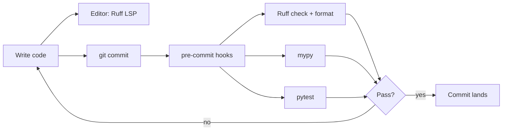

**Key Points:**

- **Ruff first** — one fast tool for linting and formatting; replaces Flake8, isort, pyupgrade, and Black for most Python projects.
- **mypy second** — catches type errors that Ruff cannot; pair with [[Python — typing]] and [[Python — Pydantic]].
- **pre-commit last mile** — runs Ruff, mypy, and tests automatically before every commit so bad code never lands locally.
- **Configure in `pyproject.toml`** — single source of truth shared by local dev, pre-commit, and CI.

# Linting — Overview & Code Quality Stack

## What is Linting?

**Linting** (in this vault) means automated checks that keep Python code **consistent**, **readable**, and **correct before runtime** — style violations, common bugs, import order, formatting, and type errors.

It complements [[Unit Testing - pytest]]:

| Layer | Catches | When |
| --- | --- | --- |
| **Ruff** | Style, imports, many bug patterns | Edit / commit |
| **mypy** | Type mismatches | Edit / commit / CI |
| **pytest** | Wrong behavior | Commit / CI |
| **pre-commit** | Orchestrates all of the above | Every `git commit` |

---

## Why a Defined Stack Matters

Without automation, style and types drift — reviews waste time on formatting, and optional type hints never get checked. A fixed stack gives:

1. **Fast feedback** — Ruff runs in milliseconds on the whole repo
2. **One formatter** — no Black vs Ruff debates
3. **Enforced types** — mypy on CI catches refactors that tests miss
4. **No forgotten checks** — pre-commit hooks run the same commands every time

This vault's default **Phase 1** quality bar: [[Python — uv]] or [[Python — Poetry]] → [[Linting — Ruff]] → [[Linting — mypy]] → [[Linting — pre-commit]] → [[Unit Testing - pytest]].

See [[Python Development]] Phase 1.

---

## The Quality Pipeline



---

## Tool Roles

| Tool | Role | Replaces (mostly) |
| --- | --- | --- |
| [[Linting — Ruff]] | Linter + formatter | Flake8, isort, Black, pyupgrade, autoflake |
| [[Linting — mypy]] | Static type checker | Manual type review |
| [[Linting — pre-commit]] | Git hook runner | "Remember to run lint" |

Ruff does **not** replace mypy — they overlap slightly on typing syntax but mypy performs deep type inference.

---

## Recommended `pyproject.toml` Layout

```toml
[project]
name = "my-app"
requires-python = ">=3.11"

[dependency-groups]
dev = ["ruff>=0.8", "mypy>=1.13", "pre-commit>=4", "pytest>=8"]

[tool.ruff]
target-version = "py311"
line-length = 88

[tool.ruff.lint]
select = ["E", "F", "I", "UP", "B", "SIM"]

[tool.ruff.format]
quote-style = "double"

[tool.mypy]
python_version = "3.11"
strict = true
plugins = ["pydantic.mypy"]
```

Details per tool: [[Linting — Ruff]], [[Linting — mypy]].

---

## Local Development Workflow

```bash
# One-time setup
uv sync --group dev          # or: poetry install
pre-commit install           # install git hooks

# During development
ruff check . --fix           # lint + auto-fix
ruff format .                # format
mypy src tests               # type check
pytest                       # tests

# pre-commit runs the same on commit automatically
git commit -m "feat: add endpoint"
```

With [[Python — uv]]: `uv run ruff check .`, `uv run mypy src`.

---

## CI Integration (GitHub Actions sketch)

```yaml
- run: uv sync --group dev
- run: uv run ruff check .
- run: uv run ruff format --check .
- run: uv run mypy src tests
- run: uv run pytest
```

pre-commit can also run in CI: `pre-commit run --all-files` — ensures hook config matches local.

---

## Linting in the Broader Landscape

| Concern | Tool in this vault |
| --- | --- |
| Style & imports | [[Linting — Ruff]] |
| Formatting | [[Linting — Ruff]] (`ruff format`) |
| Type safety | [[Linting — mypy]] + [[Python — typing]] |
| Git automation | [[Linting — pre-commit]] |
| Runtime validation | [[Python — Pydantic]] |
| Behavior tests | [[Unit Testing - pytest]] |
| Package / deps | [[Python — uv]], [[Python — Poetry]] |

---

## When to Use What

| Question | Answer |
| --- | --- |
| Fix import order? | `ruff check --fix` — [[Linting — Ruff]] |
| Format code? | `ruff format` — not Black |
| Find `Optional` misuse? | mypy — [[Linting — mypy]] |
| Run checks on every commit? | pre-commit — [[Linting — pre-commit]] |
| FastAPI / Pydantic types? | mypy + `pydantic.mypy` plugin |
| New project bootstrap? | [[Python — Copier]] templates often include this stack |

---

## Related Notes

- [[Linting — Ruff]]
- [[Linting — mypy]]
- [[Linting — pre-commit]]
- [[Python — typing]]
- [[Python — Pydantic]]
- [[Unit Testing - pytest]]
- [[Python — uv]]
- [[Python — Poetry]]
- [[Python Development]]

---

## Tags

#linting #ruff #mypy #pre-commit #code-quality #python #ci #backend
