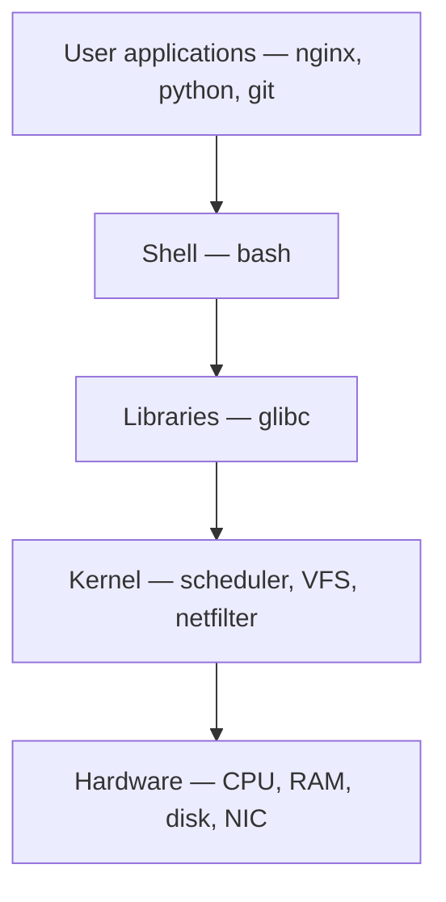

**Key Points:**

- **Kernel vs user space** — apps and shells cannot touch hardware directly; they use **system calls** through `glibc`.
- **Everything is a file** — devices, sockets, and process info often appear under `/dev`, `/proc`, `/sys`.
- **PID 1 is systemd** on modern distros — services, targets, and journals.
- **VFS** abstracts ext4, xfs, nfs behind one directory tree.
- **Namespaces + cgroups** — isolation foundation for [[K8S]] and [[Commands/CLI — Docker & Compose]].

# Linux — Architecture

Part of [[Linux]]. Concept-only; operator commands: [[Commands/Linux — Processes & Services]], [[Commands/Linux — Disk & Storage]].

---

## Layered Model



| Layer | Role |
| --- | --- |
| **Hardware** | CPU, RAM, disks, network interfaces |
| **Kernel** | Process, memory, device, filesystem, network management |
| **Libraries** | Stable APIs (`open`, `read`, `write`) wrapping syscalls |
| **Shell / tools** | Human interface (`bash`, `ls`, `systemctl`) |
| **Applications** | Business logic ([[API - FastAPI]], databases) |

---

## Kernel Space vs User Space

| | User space | Kernel space |
| --- | --- | --- |
| **Runs** | Apps, shells, daemons | Kernel only |
| **Access** | Restricted | Full hardware |
| **Failure impact** | Process crash | System instability |

Flow: `App → libc → syscall → kernel → driver → hardware`

---

## System Calls (Examples)

Programs request kernel services via syscalls, not direct hardware access:

- `open`, `read`, `write`, `close` — files
- `fork`, `exec`, `wait` — processes
- `socket`, `connect`, `send` — networking

Inspect with `strace` (advanced) — see [[Commands/Linux — Essentials]].

---

## Process Model

| State | Meaning |
| --- | --- |
| **R** | Runnable / running |
| **S** | Sleeping (interruptible) |
| **D** | Uninterruptible sleep (often I/O) |
| **T** | Stopped |
| **Z** | Zombie (child not reaped) |

- **Parent/child** hierarchy — init is **systemd** (PID 1)
- **Signals** — `SIGTERM` graceful, `SIGKILL` force — [[Commands/Linux — Processes & Services]]

---

## Memory

| Concept | Purpose |
| --- | --- |
| **Virtual memory** | Per-process address space |
| **RAM** | Physical pages |
| **Swap** | Overflow to disk |
| **Page cache** | Speed up file reads |

Commands: `free -h`, `vmstat` — [[Commands/Linux — Processes & Services]].

---

## Filesystem (FHS)

| Path | Purpose |
| --- | --- |
| `/` | Root of tree |
| `/bin`, `/sbin` | Essential binaries |
| `/etc` | Configuration |
| `/var` | Logs, spools, variable data |
| `/home` | User home directories |
| `/proc` | Kernel/process pseudo-files |
| `/sys` | Device/driver info |
| `/tmp` | Temporary files |

**VFS** lets ext4, xfs, btrfs, nfs mount at different mount points with one API.

---

## Boot Sequence (Modern)

```text
UEFI/BIOS → GRUB → Linux kernel → initramfs → systemd (PID 1) → target units → services
```

- **systemd** starts units in dependency order
- **Targets** group units (multi-user, graphical)
- Logs: `journalctl` — [[Commands/Linux — Processes & Services]]

---

## Networking (Kernel View)

```text
Application (curl, uvicorn)
    → Transport TCP/UDP
    → Network IP
    → Link Ethernet/Wi-Fi
```

Kernel provides routing table, **netfilter** (firewall), and **network namespaces** (per-container interfaces).

User tools: `ip`, `ss` — [[Commands/Linux — Networking]].

---

## Security Model

| Mechanism | Role |
| --- | --- |
| **DAC** | User/group/other `rwx` — [[Commands/Linux — Permissions & Users]] |
| **ACLs** | Finer-grained permissions |
| **SELinux / AppArmor** | Mandatory access control |
| **Capabilities** | Split root powers (`CAP_NET_BIND_SERVICE`) |
| **Namespaces** | PID, mount, network isolation |

---

## Containers Connection

Docker and [[K8S]] pods use:

| Feature | Effect |
| --- | --- |
| **Namespaces** | Separate view of PID, network, mount, hostname |
| **cgroups** | CPU, memory, I/O limits |

Same kernel — lighter than full VMs. Deep ops: [[K8S]], [[Commands/CLI — Docker & Compose]].

---

## Interview One-Liners

- Kernel runs in **kernel space**; apps in **user space**
- **PID 1** is **systemd** on most current distros
- **VFS** unifies filesystem types
- **Everything is a file** (including many devices)
- **Syscalls** are the boundary between user and kernel

---

## Related Notes

- [[Linux]]
- [[Commands/Linux — Processes & Services]]
- [[Commands/Linux — Disk & Storage]]
- [[K8S]]
- [[Commands/CLI — Docker & Compose]]

---

## Tags

#linux #architecture #kernel #systemd #filesystem #containers #namespaces #cgroups
