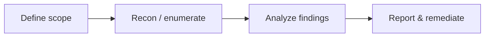

**Key Points:**

- **Kali is a Debian-based security distribution** — recon, vuln analysis, forensics; not a general production server OS.
- **Authorized testing only** — systems you own or have written permission to test.
- **Docker Kali** — lightweight labs; see [[Commands/Linux — Kali in Docker]]; wireless and full hardware often need a VM.
- **Tool catalogs** — [[Commands/Linux — Kali Tools]]; learn *categories* before memorizing every binary.
- **Complements [[Browser Automation]]** and [[Load Testing]]** — different goals (security assessment vs functional/load).

# Linux — Kali & Security Labs

Part of [[Linux]]. Commands: [[Commands/Linux — Kali Tools]], [[Commands/Linux — Kali in Docker]].

---

## What is Kali?

**Kali Linux** (Offensive Security) ships hundreds of preinstalled security tools for:

- Information gathering
- Vulnerability analysis
- Web application testing
- Password auditing (authorized)
- Wireless assessment (hardware permitting)
- Forensics and reporting

Default desktop: Xfce. Package management: `apt` (Debian family).

---

## Legal and Ethical Scope

| Rule | Detail |
| --- | --- |
| **Authorization** | Contract or explicit owner approval |
| **Scope** | Document IPs, domains, methods allowed |
| **Disclosure** | Responsible reporting for real findings |
| **Evidence** | Logs and reports matter more than exploits |

Unauthorized access is illegal — this vault documents **defensive learning and lab practice**.

---

## Tool Categories (Mental Model)

| Category | Purpose |
| --- | --- |
| Information gathering | Recon, OSINT, scanning |
| Vulnerability analysis | Identify weaknesses |
| Web application analysis | HTTP-layer testing |
| Password attacks | Credential strength (authorized) |
| Wireless | Wi-Fi security (often needs VM + adapter) |
| Exploitation frameworks | Controlled lab exploitation |
| Sniffing & spoofing | Traffic analysis (isolated nets) |
| Post-exploitation | Privilege / persistence research |
| Forensics | Incident artifacts |

Command reference: [[Commands/Linux — Kali Tools]].

---

## Typical Lab Workflow (High Level)



1. **Scope** — rules of engagement
2. **Enumerate** — services, versions, exposure (e.g. `nmap` in lab)
3. **Analyze** — map to OWASP / CVE / misconfig
4. **Report** — reproduce steps, impact, remediation
5. **Fix** — patch on *your* systems; retest

---

## Kali vs Ubuntu Server (Production)

| | Kali | Ubuntu/Debian server |
| --- | --- | --- |
| **Purpose** | Security testing | Run apps ([[API - FastAPI]]) |
| **Attack surface** | Many tools | Minimal packages |
| **Updates** | Rolling security tools | Stable app stack |
| **Use in prod** | ❌ | ✅ |

Run apps on hardened server images; use Kali only in **lab networks**.

---

## Kali Deployment Options

| Mode | Fit |
| --- | --- |
| **Docker** | Fast, disposable, CI-friendly — [[Commands/Linux — Kali in Docker]] |
| **VM** | Full kernel, wireless, exam-style labs |
| **Bare metal** | Dedicated lab machine |
| **WSL** | Mixed; GUI tools limited |

Docker limitations: no real `systemd`, weak wireless, no arbitrary kernel modules — fine for web recon scripting.

---

## Important Paths (On Kali)

| Path | Content |
| --- | --- |
| `/usr/share/wordlists` | Wordlists |
| `/usr/share/metasploit-framework` | Metasploit |
| `/opt` | Third-party tools |
| `/var/log` | Logs |

---

## Updating Kali

```bash
sudo apt update && sudo apt full-upgrade -y
sudo apt install kali-linux-large   # optional meta-package
```

Inside Docker, changes are lost unless you commit an image or use volumes — [[Commands/Linux — Kali in Docker]].

---

## Exam / Career Context (Conceptual)

Topics often emphasized: enumeration before exploitation, Linux/Windows privilege paths, OWASP Top 10 for web, network segmentation, clear reporting (OSCP-style mindset without step-by-step exploits in this vault).

---

## Related Notes

- [[Linux]]
- [[Commands/Linux — Kali in Docker]]
- [[Commands/Linux — Kali Tools]]
- [[Commands/CLI — Docker & Compose]]
- [[Browser Automation]]
- [[Load Testing]]
- [[Cybersecurity]]
- [[Cybersecurity — Security Operations]]

---

## Tags

#linux #kali #security #pentest #ethical-hacking #lab #forensics
