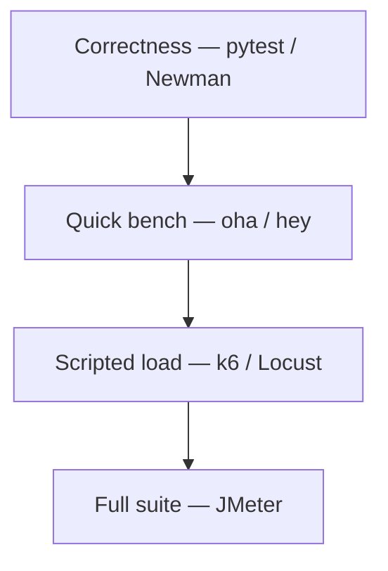

**Key Points:**

- **Load testing validates capacity and SLOs** — not correctness alone; pair with [[Unit Testing - pytest]] and [[Commands/CLI — Newman & Postman]] for functional checks.
- **Match tool to depth** — `oha`/`hey` for quick HTTP benches; **k6** / **Locust** for scripted load; **JMeter** for GUI-heavy, multi-protocol suites.
- **Always test from realistic targets** — staging that mirrors prod topology; watch [[DB — Prometheus & Grafana]] during runs.
- **Headless in CI** — `oha --no-tui`, `k6 run`, `locust --headless`, `jmeter -n` for pipelines.
- **Respect rate limits** — [[API - FastAPI — Rate Limiting (SlowAPI)]] and WAF rules affect results.

# Load Testing — Overview & Tool Map

## What is Load Testing (in this vault)?

**Load testing** measures how a system behaves under **expected or peak traffic** — latency percentiles, error rates, throughput, and resource usage. It answers: *Can we handle Black Friday? Will p99 stay under 200ms at 500 RPS?*

This hub is **concept-first**; runnable examples live in **Codes** (k6, Locust) and **Commands** (oha, hey, JMeter).

Typical outcomes:

- **Baseline** a [[API - FastAPI]] deploy before release
- **Find saturation point** — CPU, DB connections, queue depth
- **Validate autoscaling** — [[K8S]] HPA, [[GCP]] Cloud Run concurrency
- **Regression in CI** — smoke load on every merge (lightweight)

---

## Testing Pyramid (HTTP APIs)

| Layer | Tool | Duration | Vault note |
| --- | --- | --- | --- |
| Unit / integration | pytest, Newman | ms–s | [[Unit Testing - pytest]], [[Commands/CLI — Newman & Postman]] |
| Quick HTTP bench | oha, hey | seconds | [[Commands/Load Testing — oha]], [[Commands/Load Testing — hey]] |
| Code-as-test load | k6 (JavaScript) | minutes | [[Load Testing — k6]] |
| Python scenarios | Locust | minutes–hours | [[Load Testing — Locust]] |
| GUI + protocols | JMeter | minutes–hours | [[Commands/Load Testing — JMeter]] |

---

## When to Use Which Tool

| Question | Choose |
| --- | --- |
| "Is the server up and how fast is one endpoint?" | [[Commands/Load Testing — oha]] or [[Commands/Load Testing — hey]] |
| Need live TUI + JSON for CI? | [[Commands/Load Testing — oha]] (`--no-tui`, `--output-format json`) |
| Load test in CI with thresholds as code? | [[Load Testing — k6]] |
| Team knows Python; complex user flows? | [[Load Testing — Locust]] |
| Non-dev testers, JDBC, legacy protocols? | [[Commands/Load Testing — JMeter]] |
| Only API contract smoke, not load? | Newman — [[Commands/CLI — Newman & Postman]] |

---

## Comparison at a Glance

| | oha | hey | k6 | Locust | JMeter |
| --- | --- | --- | --- | --- | --- |
| **Language** | Rust CLI | Go CLI | JavaScript | Python | Java GUI + CLI |
| **Authoring** | Flags only | Flags only | `.js` scripts | `locustfile.py` | `.jmx` GUI/XML |
| **Headless / CI** | ✅ `--no-tui` | ✅ always | ✅ `k6 run` | ✅ `--headless` | ✅ `-n` |
| **Install (macOS)** | `brew install oha` | `brew install hey` | `brew install k6` | `pip install locust` | `brew install jmeter` |
| **HTTP/2** | ✅ | ✅ | ✅ | ✅ | ✅ |
| **Web UI** | TUI (optional) | No | No | ✅ built-in | ✅ GUI |
| **Best fit** | Fast bench + JSON | Minimal hey-style | SRE / CI gates | Python backends | Enterprise QA |

---

## What to Measure

| Metric | Why it matters |
| --- | --- |
| **Throughput** (RPS) | Capacity planning |
| **Latency p50 / p95 / p99** | SLOs — [[System Design — Economics & Performance]] |
| **Error rate** | 5xx, timeouts, 429 from [[API - FastAPI — Rate Limiting (SlowAPI)]] |
| **CPU / memory** | Node and pod limits — [[K8S]] |
| **DB pool / queue depth** | Hidden bottlenecks — [[ORM - SQLAlchemy]], [[Processing — Celery]] |

---

## Safe Load Testing Practices

- **Never load-test production** without explicit approval and windows
- **Ramp up** — start low RPS, increase gradually (Locust `-r`, k6 `stages`, oha `-q`)
- **Isolate the target** — one variable at a time (app vs DB vs cache)
- **Warm up** — discard first N seconds from results
- **Coordinate with [[DB — Redis]]** if using distributed rate limits during test

---

## Recommended Learning Path

1. **hey or oha** — bench local [[API - FastAPI]] after `docker compose up`
2. **k6** — one script with thresholds in CI
3. **Locust** — multi-step user journey if team is Python-heavy
4. **JMeter** — when QA owns GUI plans or you need non-HTTP samplers
5. **Observe** — metrics during test — [[DB — Prometheus & Grafana]]

---

## Related Notes

### Commands (CLI)

- [[Commands/Load Testing — oha]]
- [[Commands/Load Testing — hey]]
- [[Commands/Load Testing — JMeter]]

### Codes (scripts)

- [[Load Testing — k6]]
- [[Load Testing — Locust]]

### Connected vault

- [[API - FastAPI]]
- [[API - FastAPI — Rate Limiting (SlowAPI)]]
- [[Commands/CLI — Docker & Compose]]
- [[Commands/CLI — Newman & Postman]]
- [[CLI]]
- [[K8S]]
- [[GCP]]
- [[System Design — Economics & Performance]]
- [[Unit Testing - pytest]]
- [[Python Development]]

---

## Tags

#load-testing #performance #oha #hey #k6 #locust #jmeter #slo #throughput #latency
