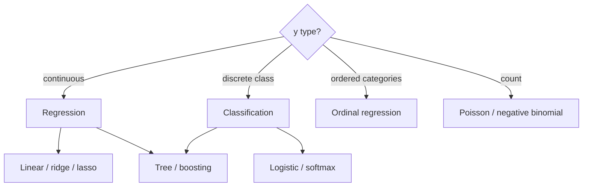
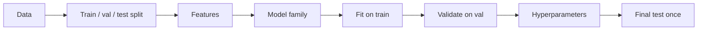
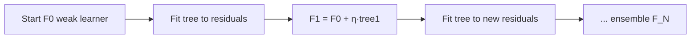

**Key Points:**

- **Supervised learning** maps inputs X to targets y — regression (continuous) or classification (discrete).
- **Bias–variance trade-off** — simple models underfit; complex models overfit; validation tells you where you are.
- **Linear models** — fast, interpretable baselines; regularization (L1/L2) controls complexity.
- **Tree-based models** — capture non-linear interactions; random forests and boosting dominate tabular production.
- **Ensembles combine weak learners** — bagging reduces variance; boosting reduces bias; stacking learns to blend.
- **Implementation** — [[ML — scikit-learn]], [[ML — XGBoost]], [[ML — LightGBM]]; theory here, APIs in Codes notes.

# Machine Learning — Algorithms Theory

> Concept-only reference for **classical ML algorithms** — regression, trees, ensembles, and evaluation. Parent hub: [[Machine Learning]]. Statistics foundation: [[Statistics — Theory & A/B Testing]].

---

## What is Machine Learning (Theory)?

**Machine learning** learns a function **f(X) → y** from data instead of hand-coded rules. This note covers **algorithm families** and **when they apply** — not MLOps tooling (see [[Machine Learning]]).

Typical outcomes:

- Pick linear vs tree vs ensemble for a tabular problem
- Understand why boosting beats a single decision tree on many benchmarks
- Choose metrics aligned with business cost (not accuracy alone)
- Know when to escalate to [[Deep Learning — Theory]]

---

## Learning Paradigms

| Paradigm | Labels | Goal | Examples |
| --- | --- | --- | --- |
| **Supervised** | y provided | Predict y for new X | Regression, classification |
| **Unsupervised** | No y | Structure in X | Clustering, PCA, topic models |
| **Semi-supervised** | Few labels | Leverage unlabeled data | Self-training |
| **Self-supervised** | Labels from X itself | Pretrain representations | Word2Vec, masked LM (→ [[Transformers — Attention & Architecture]]) |
| **Reinforcement** | Reward signal | Sequential decisions | Policy learning (outside vault depth) |

**This note focuses on supervised tabular/classical ML.**

---

## Supervised Problem Types

| Task | Output | Loss intuition | Common metrics |
| --- | --- | --- | --- |
| **Regression** | Real number | Squared error (MSE) | RMSE, MAE, R² |
| **Binary classification** | {0,1} | Log loss | AUC-ROC, F1, precision/recall |
| **Multiclass** | {1…K} | Cross-entropy | Macro/micro F1, log loss |
| **Ranking** | Order | Pairwise/listwise | NDCG, MAP |
| **Imbalanced classification** | Rare positive | Weighted loss | PR-AUC, recall @ precision |

---

## The ML Workflow (Conceptual)

| Split | Purpose |
| --- | --- |
| **Train** | Fit parameters |
| **Validation** | Compare models & hyperparameters |
| **Test** | Unbiased final estimate (touch once) |
| **Cross-validation** | K-fold rotation when data is limited |

**Data leakage:** target encoding, scaling, or feature selection on full dataset before split → optimistic metrics.

---

## Bias, Variance, and Model Complexity

| | High bias (underfit) | High variance (overfit) |
| --- | --- | --- |
| **Symptom** | Poor on train and val | Great train, poor val |
| **Model** | Too simple (linear on non-linear data) | Too flexible (deep tree, memorization) |
| **Fix** | More features, complex model | Regularization, more data, simpler model, ensemble averaging |

**Bias–variance decomposition:** expected error = bias² + variance + irreducible noise.

| Technique | Effect |
| --- | --- |
| **Regularization** | Penalize large weights (ridge, lasso) |
| **Early stopping** | Stop before memorization (boosting, neural nets) |
| **Dropout / pruning** | Limit effective capacity |
| **Bagging** | Average models → ↓ variance |
| **More data** | Often ↓ variance |

---

## Linear Models

### Linear regression

**Model:** ŷ = w₀ + w₁x₁ + … + wₚxₚ  
**Loss:** minimize Σ(y − ŷ)² (ordinary least squares, OLS)  
**Assumptions (classical):** linearity, independent errors, homoscedasticity, no extreme multicollinearity

| Variant | Penalty | Effect |
| --- | --- | --- |
| **Ridge (L2)** | λΣwᵢ² | Shrinks weights; handles correlated features |
| **Lasso (L1)** | λΣ\|wᵢ\| | Sparse features (some wᵢ → 0) |
| **Elastic Net** | L1 + L2 | Balance sparsity and grouping |

### Logistic regression (classification)

**Model:** P(y=1|x) = σ(w·x + b) with sigmoid σ  
**Loss:** log loss (cross-entropy)  
**Interpretation:** log-odds linear in features — strong baseline for tabular binary problems

| When linear models shine | When they struggle |
| --- | --- |
| Interpretability, compliance | Strong non-linear interactions |
| High-dimensional sparse text (with regularization) | Image/audio raw pixels |
| Fast training at scale | Complex sequential patterns |

---

## Tree-Based Models

### Decision tree

**Idea:** recursively split features to minimize impurity (Gini / entropy for classification, MSE for regression).

| Pros | Cons |
| --- | --- |
| Non-linear, automatic interactions | High variance (unstable) |
| Handles mixed types | Overfits without limits |
| Interpretable (small trees) | Axis-aligned splits only |

**Controls:** max depth, min samples per leaf, max features per split.

### Random forest (bagging trees)

**Idea:** train many trees on **bootstrap samples** + random feature subsets; **average** (regression) or **vote** (classification).

| Effect | Why |
| --- | --- |
| ↓ Variance | Decorrelated trees via bagging + feature randomness |
| Robust default | Strong tabular baseline before tuning boosting |

### Gradient boosting (XGBoost, LightGBM, CatBoost)

**Idea:** add trees **sequentially**, each correcting residual errors of the ensemble; optimize a differentiable loss via gradient descent in function space.

| Concept | Meaning |
| --- | --- |
| **Learning rate η** | Shrink each tree's contribution |
| **Depth of trees** | Interaction order (depth 3 ≈ 3-way interactions) |
| **Subsampling** | Row/column sampling per tree (stochastic boosting) |
| **Regularization** | L1/L2 on leaf weights, min loss reduction |

**Boosting vs random forest:** boosting often wins on structured tabular data with tuning; RF is harder to overfit with defaults and parallelizes naturally.

---

## Ensemble Methods Summary

| Method | Mechanism | Reduces | Examples |
| --- | --- | --- | --- |
| **Bagging** | Parallel models on bootstrap samples, average | Variance | Random forest |
| **Boosting** | Sequential models on weighted/residual errors | Bias | AdaBoost, GBM, XGBoost |
| **Stacking** | Meta-learner combines base model outputs | Both (if done well) | Level-1 OOF preds → level-2 logistic |
| **Voting / blending** | Simple average or weighted vote | Variance | Model soup in competitions |

**When to ensemble:** Kaggle and production tabular — often top solution; watch latency and explainability ([[ML — SHAP]] works on tree models).

---

## Other Classical Algorithms (Brief)

| Algorithm | Type | Idea |
| --- | --- | --- |
| **k-NN** | Instance-based | Label by nearest neighbors in feature space |
| **Naive Bayes** | Probabilistic | Class-conditional features ( independence assumption) |
| **SVM** | Margin classifier | Maximize separation with kernel trick |
| **k-means** | Clustering | Partition by centroid distance |
| **PCA** | Dimensionality reduction | Orthogonal directions of max variance |
| **GMM** | Soft clustering | Mixture of Gaussians |

---

## Evaluation & Model Selection

### Regression metrics

| Metric | Sensitive to |
| --- | --- |
| **MSE / RMSE** | Large errors (squares) |
| **MAE** | Outliers less than RMSE |
| **R²** | Explained variance (can mislead on non-linear truth) |
| **MAPE** | Percent error (undefined at y=0) |

### Classification metrics

| Metric | Use when |
| --- | --- |
| **Accuracy** | Balanced classes (rarely production-only) |
| **Precision** | False positives costly (spam filter) |
| **Recall** | False negatives costly (fraud, disease) |
| **F1** | Balance precision/recall |
| **ROC-AUC** | Ranking quality, threshold-independent |
| **PR-AUC** | Imbalanced positives |

**Confusion matrix:** TN, FP, FN, TP — derive all metrics from it.

### Validation strategies

| Strategy | When |
| --- | --- |
| **Hold-out** | Large data |
| **k-fold CV** | Medium data, stable estimate |
| **Stratified k-fold** | Classification with imbalance |
| **Time-series split** | Temporal data — never shuffle future into past |
| **Group k-fold** | Same entity in one fold only (users, stores) |

Hyperparameter search: grid/random ([[ML — scikit-learn]]) or Bayesian ([[ML — Optuna]]).

---

## Feature Engineering (Conceptual)

| Technique | Purpose |
| --- | --- |
| **Encoding** | One-hot, target encoding (with CV!), embeddings for high cardinality |
| **Scaling** | StandardScaler for linear/SVM/k-NN; trees often unscaled |
| **Imputation** | Mean/median/mode or model-based missing values |
| **Polynomial / interactions** | Explicit non-linearity for linear models |
| **Binning** | Non-linear steps for linear models |
| **Domain features** | Often beat algorithm tuning |

---

## When to Use What

| Signal                         | Start with                            | Level up                                          |
| ------------------------------ | ------------------------------------- | ------------------------------------------------- |
| Tabular, need interpretability | Logistic / linear regression          | GAM, shallow tree + SHAP                          |
| Tabular, moderate data         | Random forest                         | [[ML — XGBoost]], [[ML — LightGBM]]               |
| Text as tabular features       | Logistic on TF-IDF                    | [[NLP]] → embeddings → [[Deep Learning — Theory]] |
| Images, audio, long sequences  | —                                     | [[Deep Learning — Theory]]                        |
| Strict latency, small model    | Logistic, small tree                  | Quantized or distilled models                     |
| Experiment analysis            | [[Statistics — Theory & A-B Testing]] | Not prediction — different goal                   |

---

## ML Theory vs Deep Learning

| | Classical ML (this note) | [[Deep Learning — Theory]] |
| --- | --- | --- |
| Features | Often hand-engineered | Learned representations |
| Data scale | Works on small/medium tabular | Shines with large unstructured data |
| Interpretability | Trees, linear coefs | Harder; attention maps partial |
| Compute | CPU-friendly | GPU for large nets |
| Default tabular SOTA | Boosting ensembles | MLP sometimes; often loses to XGB |

---

## Recommended Learning Path

1. **Linear & logistic regression** — loss, regularization, interpretation
2. **Decision trees** — splits, overfitting intuition
3. **Random forest & boosting** — bagging vs boosting
4. **Metrics & CV** — choose metrics for the business problem
5. **Implement** — [[ML — scikit-learn]] then [[ML — XGBoost]]
6. **Explain** — [[ML — SHAP]] on tree models
7. **Unstructured data** — [[Deep Learning — Theory]] → [[Transformers — Attention & Architecture]]

---

## Related Notes

### Theory

- [[Statistics — Theory & A/B Testing]]
- [[Deep Learning — Theory]]
- [[Transformers — Attention & Architecture]]

### Implementation

- [[ML — scikit-learn]]
- [[ML — XGBoost]]
- [[ML — LightGBM]]
- [[ML — H2O]]
- [[ML — Optuna]]
- [[ML — SHAP]]

### Hubs

- [[Machine Learning]]
- [[NLP]]
- [[AI]]

---

## Tags

#machine-learning #regression #classification #decision-trees #ensemble #xgboost #bias-variance #theory
