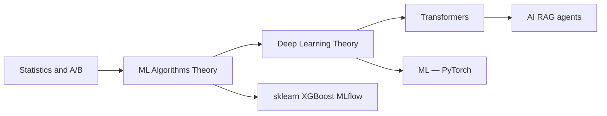
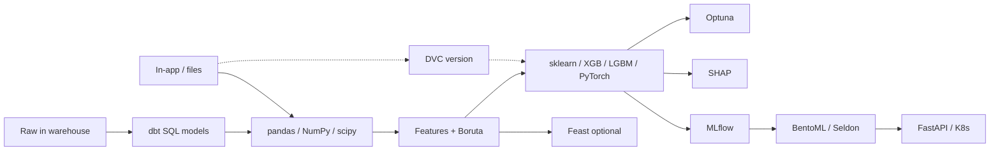

**Key Points:**

- **Theory first when learning** — [[Statistics — Theory & A/B Testing]], [[Machine Learning — Algorithms Theory]], [[Deep Learning — Theory]], [[Transformers — Attention & Architecture]] for conceptual depth; Codes notes for tooling.
- **Tabular ML default stack** — [[ML — pandas]] + [[ML — NumPy]] + [[ML — scikit-learn]] for most classical problems; add [[ML — XGBoost]] or [[ML — LightGBM]] for performance.
- **Track experiments** — [[ML — MLflow]] for params, metrics, artifacts, and model registry before production.
- **Warehouse features with dbt** — SQL transforms in **BigQuery** ([[ML — dbt]]) for staging tables and ML-ready marts before pandas/sklearn.
- **Version data & pipelines** — [[DVC]] / [[ML — DVC]] for datasets, `dvc.yaml` stages, and remote storage alongside Git.
- **Serve models** — [[ML — BentoML]] or [[ML — Seldon]] behind [[API - FastAPI]] / Kubernetes; not raw pickle endpoints.
- **Explain & tune** — [[ML — SHAP]] for interpretability, [[ML — Optuna]] for hyperparameters, [[ML — Boruta]] for feature selection.
- **Deep learning & forecasting** — [[ML — PyTorch]] for neural nets; [[ML — Prophet]] for time series baselines.

# Machine Learning — Overview & Stack Map

> **From scratch checklist:** [[Build an ML and MLOps Pipeline from Scratch]] · All roadmaps: [[README]]

## What is Machine Learning (in this vault)?

**Machine learning** here means building **predictive models** from data — training, evaluating, explaining, tracking, and serving models in Python backend and data pipelines. It complements [[AI]] (LLM agents, RAG) and [[NLP]] (text-specific tooling).

Typical outcomes:

- **Classification / regression** on tabular data (sklearn, boosting libraries)
- **Time series forecasting** (Prophet, sklearn)
- **Deep learning** (PyTorch)
- **MLOps** — experiment tracking (MLflow), feature store (Feast), warehouse transforms (dbt), deployment (BentoML, Seldon)
- **Analysis & viz** — pandas, NumPy, matplotlib, seaborn

---

## ML Theory (Concept Notes)

Concept-only cheatsheets — algorithms, statistics, neural nets, transformers. Implementation stays in **Codes/ML —** notes.

| Topic | Note |
| --- | --- |
| Statistics & A/B testing | [[Statistics — Theory & A/B Testing]] |
| Regression, trees, ensembles | [[Machine Learning — Algorithms Theory]] |
| ANN, CNN, RNN, LSTM | [[Deep Learning — Theory]] |
| Attention & transformers | [[Transformers — Attention & Architecture]] |

---

## ML Lifecycle

---

## Tool Categories

| Category | Tools | References |
| --- | --- | --- |
| **Foundation** | NumPy, pandas, scipy | [[ML — NumPy]], [[ML — pandas]], [[ML — scipy]] |
| **Visualization** | matplotlib, seaborn | [[ML — matplotlib]], [[ML — seaborn]] |
| **Classical ML** | scikit-learn | [[ML — scikit-learn]] |
| **Boosting** | XGBoost, LightGBM, H2O | [[ML — XGBoost]], [[ML — LightGBM]], [[ML — H2O]] |
| **Deep learning** | PyTorch | [[ML — PyTorch]] |
| **Time series** | Prophet | [[ML — Prophet]] |
| **Feature selection** | Boruta | [[ML — Boruta]] |
| **Hyperparameter tuning** | Optuna | [[ML — Optuna]] |
| **Explainability** | SHAP | [[ML — SHAP]] |
| **Graphs** | NetworkX | [[ML — NetworkX]] |
| **Feature store** | Feast | [[ML — Feast]] |
| **Warehouse transforms (ELT)** | dbt | [[ML — dbt]] |
| **Experiment tracking** | MLflow | [[ML — MLflow]] |
| **Data & pipeline versioning** | DVC | [[DVC]], [[ML — DVC]] |
| **Model serving** | BentoML, Seldon | [[ML — BentoML]], [[ML — Seldon]] |

---

## When to Use What

| Problem                     | Start with            | Level up                            |
| --------------------------- | --------------------- | ----------------------------------- |
| Tabular classify/regress    | [[ML — scikit-learn]] | [[ML — XGBoost]], [[ML — LightGBM]] |
| AutoML / distributed tables | [[ML — H2O]]          | H2O AutoML                          |
| Neural networks             | [[ML — PyTorch]]      | Custom architectures                |
| Business time series        | [[ML — Prophet]]      | sklearn / boosting with lags        |
| Too many features           | [[ML — Boruta]]       | + domain knowledge                  |
| Best hyperparameters        | [[ML — Optuna]]       | Nested CV with sklearn              |
| Why did model predict X?    | [[ML — SHAP]]         | Per-feature dashboards              |
| Reproducible experiments    | [[ML — MLflow]]       | Registry + promote stages           |
| Version datasets & pipelines | [[DVC]]              | [[ML — DVC]] + Git + remote         |
| SQL feature tables in BigQuery | [[ML — dbt]]       | [[GCP]] + [[ORCHESTRATION — Airflow]] |
| Online features             | [[ML — Feast]]        | Point-in-time joins                 |
| REST model API              | [[ML — BentoML]]      | [[ML — Seldon]] on K8s              |
| EDA plots                   | [[ML — seaborn]]      | [[ML — matplotlib]] for custom      |

---

## ML vs AI in This Vault

| | [[Machine Learning]] | [[AI]] |
| --- | --- | --- |
| Focus | Predict from structured/historical data | LLMs, agents, RAG |
| Typical input | Tables, matrices, time series | Text, documents, tools |
| Core libs | sklearn, XGBoost, MLflow | LangChain, vector DBs |
| Overlap | Embeddings, hybrid RAG+rankers | crawl4ai → features |

---

## Recommended Learning Path

1. **Theory (optional but recommended)** — [[Statistics — Theory & A/B Testing]] → [[Machine Learning — Algorithms Theory]] → [[Deep Learning — Theory]] → [[Transformers — Attention & Architecture]]
2. **Foundation** — [[ML — NumPy]], [[ML — pandas]], [[ML — matplotlib]]
3. **Warehouse prep (optional)** — [[ML — dbt]] on [[GCP]] BigQuery for clean marts
4. **First model** — [[ML — scikit-learn]] pipeline end-to-end
5. **Boost performance** — [[ML — XGBoost]] or [[ML — LightGBM]]
6. **Tune & explain** — [[ML — Optuna]], [[ML — SHAP]]
7. **Data versioning** — [[DVC]] → [[ML — DVC]] pipelines with remote storage
8. **Production** — [[ML — MLflow]] tracking → [[ML — BentoML]] serve via [[API - FastAPI]]
9. **Scale features** — [[ML — Feast]] when teams share feature definitions

Distributed training/jobs: [[Processing]] — [[Processing — Celery]], [[Processing — Ray]]. Cluster deployment: [[K8S]] — [[Codes/K8S — Workloads]], [[Commands/K8S — kubectl & Minikube]].

---

## Related Notes

### Theory

- [[Statistics — Theory & A/B Testing]]
- [[Machine Learning — Algorithms Theory]]
- [[Deep Learning — Theory]]
- [[Transformers — Attention & Architecture]]

### Foundation & visualization

- [[ML — NumPy]]
- [[ML — pandas]]
- [[ML — scipy]]
- [[ML — matplotlib]]
- [[ML — seaborn]]

### Modeling

- [[ML — scikit-learn]]
- [[ML — XGBoost]]
- [[ML — LightGBM]]
- [[ML — H2O]]
- [[ML — PyTorch]]
- [[ML — Prophet]]
- [[ML — NetworkX]]

### Selection, tuning, explainability

- [[ML — Boruta]]
- [[ML — Optuna]]
- [[ML — SHAP]]

### MLOps & serving

- [[ML — dbt]]
- [[DVC]]
- [[ML — DVC]]
- [[ML — MLflow]]
- [[ML — Feast]]
- [[ML — BentoML]]
- [[ML — Seldon]]

### Connected concepts

- [[AI]]
- [[NLP]]
- [[Processing]]
- [[API - FastAPI]]
- [[K8S]]
- [[ORCHESTRATION]]
- [[GCP]]
- [[Python Development]]

---

## Tags

#machine-learning #mlops #sklearn #pytorch #mlflow #data-science #python
