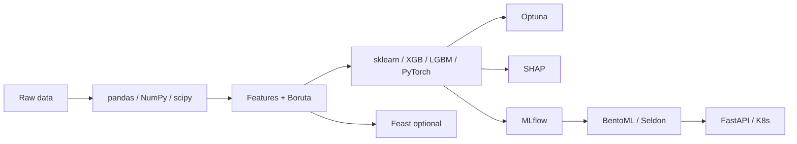

**Key Points:**

- **Tabular ML default stack** — [[ML — pandas]] + [[ML — NumPy]] + [[ML — scikit-learn]] for most classical problems; add [[ML — XGBoost]] or [[ML — LightGBM]] for performance.
- **Track experiments** — [[ML — MLflow]] for params, metrics, artifacts, and model registry before production.
- **Serve models** — [[ML — BentoML]] or [[ML — Seldon]] behind [[API - FastAPI]] / Kubernetes; not raw pickle endpoints.
- **Explain & tune** — [[ML — SHAP]] for interpretability, [[ML — Optuna]] for hyperparameters, [[ML — Boruta]] for feature selection.
- **Deep learning & forecasting** — [[ML — PyTorch]] for neural nets; [[ML — Prophet]] for time series baselines.

# Machine Learning — Overview & Stack Map

## What is Machine Learning (in this vault)?

**Machine learning** here means building **predictive models** from data — training, evaluating, explaining, tracking, and serving models in Python backend and data pipelines. It complements [[AI]] (LLM agents, RAG) and [[NLP]] (text-specific tooling).

Typical outcomes:

- **Classification / regression** on tabular data (sklearn, boosting libraries)
- **Time series forecasting** (Prophet, sklearn)
- **Deep learning** (PyTorch)
- **MLOps** — experiment tracking (MLflow), feature store (Feast), deployment (BentoML, Seldon)
- **Analysis & viz** — pandas, NumPy, matplotlib, seaborn

---

## ML Lifecycle

---

## Tool Categories

| Category | Tools | References |
| --- | --- | --- |
| **Foundation** | NumPy, pandas, scipy | [[ML — NumPy]], [[ML — pandas]], [[ML — scipy]] |
| **Visualization** | matplotlib, seaborn | [[ML — matplotlib]], [[ML — seaborn]] |
| **Classical ML** | scikit-learn | [[ML — scikit-learn]] |
| **Boosting** | XGBoost, LightGBM, H2O | [[ML — XGBoost]], [[ML — LightGBM]], [[ML — H2O]] |
| **Deep learning** | PyTorch | [[ML — PyTorch]] |
| **Time series** | Prophet | [[ML — Prophet]] |
| **Feature selection** | Boruta | [[ML — Boruta]] |
| **Hyperparameter tuning** | Optuna | [[ML — Optuna]] |
| **Explainability** | SHAP | [[ML — SHAP]] |
| **Graphs** | NetworkX | [[ML — NetworkX]] |
| **Feature store** | Feast | [[ML — Feast]] |
| **Experiment tracking** | MLflow | [[ML — MLflow]] |
| **Model serving** | BentoML, Seldon | [[ML — BentoML]], [[ML — Seldon]] |

---

## When to Use What

| Problem | Start with | Level up |
| --- | --- | --- |
| Tabular classify/regress | [[ML — scikit-learn]] | [[ML — XGBoost]], [[ML — LightGBM]] |
| AutoML / distributed tables | [[ML — H2O]] | H2O AutoML |
| Neural networks | [[ML — PyTorch]] | Custom architectures |
| Business time series | [[ML — Prophet]] | sklearn / boosting with lags |
| Too many features | [[ML — Boruta]] | + domain knowledge |
| Best hyperparameters | [[ML — Optuna]] | Nested CV with sklearn |
| Why did model predict X? | [[ML — SHAP]] | Per-feature dashboards |
| Reproducible experiments | [[ML — MLflow]] | Registry + promote stages |
| Online features | [[ML — Feast]] | Point-in-time joins |
| REST model API | [[ML — BentoML]] | [[ML — Seldon]] on K8s |
| EDA plots | [[ML — seaborn]] | [[ML — matplotlib]] for custom |

---

## ML vs AI in This Vault

| | [[Machine Learning]] | [[AI]] |
| --- | --- | --- |
| Focus | Predict from structured/historical data | LLMs, agents, RAG |
| Typical input | Tables, matrices, time series | Text, documents, tools |
| Core libs | sklearn, XGBoost, MLflow | LangChain, vector DBs |
| Overlap | Embeddings, hybrid RAG+rankers | crawl4ai → features |

---

## Recommended Learning Path

1. **Foundation** — [[ML — NumPy]], [[ML — pandas]], [[ML — matplotlib]]
2. **First model** — [[ML — scikit-learn]] pipeline end-to-end
3. **Boost performance** — [[ML — XGBoost]] or [[ML — LightGBM]]
4. **Tune & explain** — [[ML — Optuna]], [[ML — SHAP]]
5. **Production** — [[ML — MLflow]] tracking → [[ML — BentoML]] serve via [[API - FastAPI]]
6. **Scale features** — [[ML — Feast]] when teams share feature definitions

Distributed training/jobs: [[Processing]] — [[Processing — Celery]], [[Processing — Ray]]. Cluster deployment: [[K8S]] — [[Codes/K8S — Workloads]], [[Commands/K8S — kubectl & Minikube]].

---

## Related Notes

### Foundation & visualization

- [[ML — NumPy]]
- [[ML — pandas]]
- [[ML — scipy]]
- [[ML — matplotlib]]
- [[ML — seaborn]]

### Modeling

- [[ML — scikit-learn]]
- [[ML — XGBoost]]
- [[ML — LightGBM]]
- [[ML — H2O]]
- [[ML — PyTorch]]
- [[ML — Prophet]]
- [[ML — NetworkX]]

### Selection, tuning, explainability

- [[ML — Boruta]]
- [[ML — Optuna]]
- [[ML — SHAP]]

### MLOps & serving

- [[ML — MLflow]]
- [[ML — Feast]]
- [[ML — BentoML]]
- [[ML — Seldon]]

### Connected concepts

- [[AI]]
- [[NLP]]
- [[Processing]]
- [[API - FastAPI]]
- [[K8S]]
- [[ORCHESTRATION]]
- [[Python Development]]

---

## Tags

#machine-learning #mlops #sklearn #pytorch #mlflow #data-science #python
