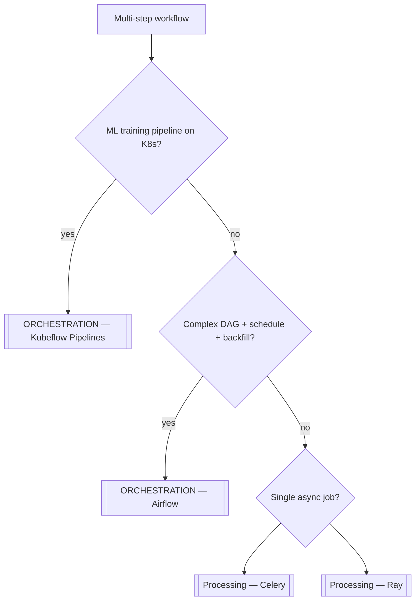

**Key Points:**

- **Orchestration = DAG workflows** — define tasks, dependencies, schedules, and retries; the scheduler runs them in order (not the same as a single [[Processing — Celery]] task).
- **Airflow** — general data/ETL/ops DAGs; Python operators; industry default; managed as **Composer** on [[GCP]].
- **Kubeflow Pipelines** — **ML pipeline** DAGs on [[K8S]]; containerized steps, experiments, integration with [[ML — MLflow]] / [[Machine Learning]].
- **Processing vs orchestration** — Celery/Ray for jobs and compute; Airflow/KFP when you need **dependency graphs**, backfill, and observability across stages.
- **AI orchestration is separate** — [[AI — LangChain]] / [[AI — LangGraph]] for LLM chains; this hub is **data & ML pipelines**.

# ORCHESTRATION — Overview & Workflow Pipeline Stack

## What is Orchestration (in this vault)?

**Orchestration** means coordinating **multi-step workflows** as **directed acyclic graphs (DAGs)** — each step runs when its upstream dependencies succeed, on a **schedule** or manual trigger, with retries and monitoring. Python is the primary authoring language for both tools in this series.

Typical outcomes:

- **Nightly ETL** — extract → transform → load → notify
- **ML pipeline** — preprocess → train → evaluate → register model
- **Backfill** — re-run historical date ranges safely
- **Cross-system jobs** — scrape → warehouse → [[ML — Feast]] materialize

---

## Orchestration vs Processing vs AI

| Layer | Tools | Question it answers |
| --- | --- | --- |
| **Orchestration** | [[ORCHESTRATION — Airflow]], [[ORCHESTRATION — Kubeflow Pipelines]] | "Run B after A succeeds, daily at 2am" |
| **Processing** | [[Processing — Celery]], [[Processing — Ray]] | "Run this task now on a worker" |
| **AI** | [[AI — LangChain]], [[AI — LangGraph]] | "Chain LLM steps and tools" |
| **Platform** | [[K8S]], [[GCP]] Composer | Where schedulers run |

Celery **chains** overlap lightly with DAGs — escalate to Airflow when you need a UI, backfill, SLA monitoring, and many interdependent batch steps.

---

## Decision Flow



---

## Checklist Map

| Tool | Codes note | Best for |
| --- | --- | --- |
| **Airflow** | [[ORCHESTRATION — Airflow]] | ETL, ops DAGs, Composer on GCP |
| **Kubeflow Pipelines** | [[ORCHESTRATION — Kubeflow Pipelines]] | ML steps on Kubernetes |

---

## Airflow vs Kubeflow Pipelines

| | [[ORCHESTRATION — Airflow]] | [[ORCHESTRATION — Kubeflow Pipelines]] |
| --- | --- | --- |
| Primary use | Data / ops workflows | ML training & deployment pipelines |
| Unit of work | Task / Operator | Pipeline component (container) |
| Runtime | Airflow workers (often K8s/Celery) | [[K8S]] pods |
| Authoring | Python DAG files | Python KFP SDK |
| Managed GCP | Cloud Composer | GKE + Vertex AI Pipelines |
| ML tracking | Callback to [[ML — MLflow]] | Native experiment runs |

They can coexist: Airflow triggers a KFP run via operator/API.

---

## Typical Architectures

### Data pipeline (Airflow)

```text
Scheduler → DAG: extract → transform → load BigQuery
         → Slack alert on failure
         → [[GCP]] BigQuery / [[ORM - SQLAlchemy]] sources
```

### ML pipeline (KFP)

```text
KFP run → preprocess component → train component → evaluate
       → log [[ML — MLflow]] → deploy [[ML — Seldon]] on [[K8S]]
```

---

## When to Use What

| Question | Choose |
| --- | --- |
| Nightly warehouse ETL? | [[ORCHESTRATION — Airflow]] |
| ML train/eval/deploy DAG on cluster? | [[ORCHESTRATION — Kubeflow Pipelines]] |
| Fire-and-forget email from API? | [[Processing — Celery]] |
| Hyperparameter sweep cluster? | [[Processing — Ray]] / [[ML — Optuna]] |
| LLM agent workflow? | [[AI — LangGraph]] |
| Cron on GCP fully managed? | Composer → [[GCP]], [[ORCHESTRATION — Airflow]] |

---

## Python in This Stack

Both tools are **Python-first**:

- **Airflow** — `DAG`, `@task`, `PythonOperator`, TaskFlow API
- **KFP** — `@dsl.component`, `@dsl.pipeline`, compile to YAML

See respective **Codes** notes for install, minimal examples, and vault cross-links.

---

## Related Notes

- [[ORCHESTRATION — Airflow]]
- [[ORCHESTRATION — Kubeflow Pipelines]]
- [[Processing]]
- [[Processing — Celery]]
- [[K8S]]
- [[GCP]]
- [[Machine Learning]]
- [[ML — MLflow]]
- [[Python Development]]

---

## Tags

#orchestration #airflow #kubeflow #dag #etl #mlops #python #pipeline #workflow
