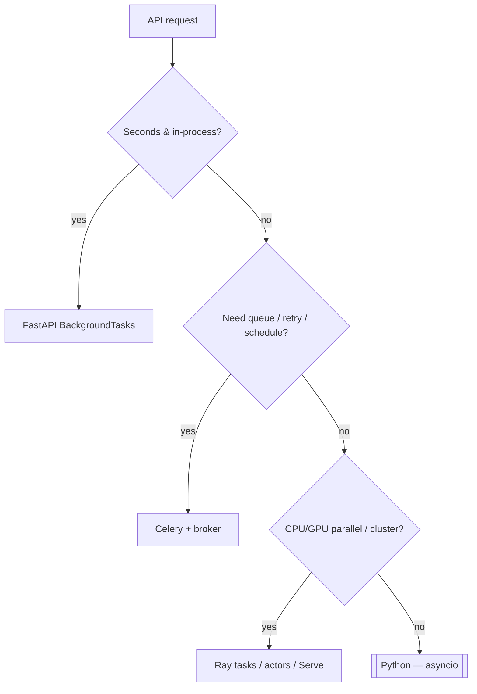

**Key Points:**

- **Background work belongs off the request path** — use [[API - FastAPI]] Background Tasks only for trivial fire-and-forget; escalate to **Celery** or **Ray** when you need retries, schedules, or scale.
- **Celery = task queue** — broker-backed workers (Redis/RabbitMQ), cron (`beat`), perfect for ETL, emails, scrapers, ML batch jobs.
- **Ray = distributed compute** — parallel Python functions, actors, hyperparameter sweeps, and Ray Serve for model deployment clusters.
- **Same broker patterns** — Redis often runs both Celery broker and result backend; Ray brings its own cluster runtime.
- **FastAPI integration** — enqueue Celery tasks from routes; call Ray remotely or run Ray Serve behind a gateway.

# Processing — Overview & Distributed Work Stack

## What is Processing (in this vault)?

**Processing** means running work **outside** the HTTP request lifecycle — async jobs, scheduled tasks, parallel compute, and long-running pipelines. It complements [[Python — asyncio]] (in-process concurrency) and [[Python — multiprocessing]] (single-machine parallelism).

Typical outcomes:

- **Offload slow API work** — send email, generate report, reindex search
- **Scheduled jobs** — nightly ETL, model retraining, scraper cron
- **Parallel batch compute** — score 1M rows, hyperparameter search
- **Distributed ML** — Ray Train / Ray Tune; Celery chains for pipeline stages

---

## When to Use What



| Pattern | Tool | References |
| --- | --- | --- |
| Fire-and-forget after response | FastAPI `BackgroundTasks` | [[API - FastAPI]] |
| In-process async I/O | asyncio | [[Python — asyncio]] |
| Multi-core one machine | multiprocessing | [[Python — multiprocessing]] |
| **Task queue + cron** | **Celery** | [[Processing — Celery]] |
| **Distributed Python + ML scale** | **Ray** | [[Processing — Ray]] |

---

## Celery vs Ray

| | [[Processing — Celery]] | [[Processing — Ray]] |
| --- | --- | --- |
| Model | Message queue → workers | Distributed object store + scheduler |
| Best for | Job queues, cron, ETL stages | Parallel map, actors, Tune, Serve |
| Broker | Redis, RabbitMQ required | Ray cluster (local or K8s) |
| Result storage | Result backend (Redis/DB) | Object refs, Ray datasets |
| Scheduling | Celery Beat | Ray cron / external scheduler |
| ML focus | Batch scoring jobs, pipelines | Ray Tune, Train, Serve |
| FastAPI | `.delay()` / `.apply_async()` | Remote functions, Ray Serve |

They can coexist: Celery triggers nightly ETL; Ray runs heavy training inside a worker or separate cluster.

---

## Typical Architectures

### Celery + FastAPI

```text
Client → FastAPI → enqueue Celery task → Redis/RabbitMQ → Worker(s)
                ← task_id (202) ← poll or webhook
```

See [[Processing — Celery]], [[API - FastAPI]].

### Ray + ML pipeline

```text
Driver script / API → Ray tasks parallelize → object store
                   → Ray Train / Tune → [[ML — MLflow]] log
                   → Ray Serve → inference
```

See [[Processing — Ray]], [[Machine Learning]].

---

## Processing in the Broader Landscape

| Concern | Tool |
| --- | --- |
| HTTP API | [[API - FastAPI]] |
| In-request background | FastAPI Background Tasks |
| Async I/O | [[Python — asyncio]] |
| Task queue | [[Processing — Celery]] |
| Distributed compute | [[Processing — Ray]] |
| Retries (sync call) | [[Python — tenacity]] |
| Scraping at scale | [[Browser Automation — Scrapy]] + Celery beat |
| Model serving | [[ML — BentoML]], Ray Serve |
| Experiment tracking | [[ML — MLflow]] |

---

## Recommended Learning Path

1. **Know the baseline** — [[Python — asyncio]] and when *not* to use it for CPU-bound work
2. **Celery first** — broker, worker, `.delay()`, Beat — [[Processing — Celery]]
3. **Wire FastAPI** — return `task_id`, poll status endpoint
4. **Ray when parallel** — `@ray.remote`, map batches — [[Processing — Ray]]
5. **ML scale-up** — Ray Tune with [[ML — Optuna]]-style search; log to [[ML — MLflow]]

---

## Related Notes

- [[Processing — Celery]]
- [[Processing — Ray]]
- [[API - FastAPI]]
- [[API - FastAPI — Lifespan]]
- [[Python — asyncio]]
- [[Python — multiprocessing]]
- [[Python — tenacity]]
- [[Machine Learning]]
- [[Browser Automation — Scrapy]]
- [[DB — Redis]]
- [[DB — RabbitMQ]]
- [[ORCHESTRATION — Airflow]]
- [[Python Development]]

---

## Tags

#processing #celery #ray #distributed #task-queue #async #python #backend #mlops
