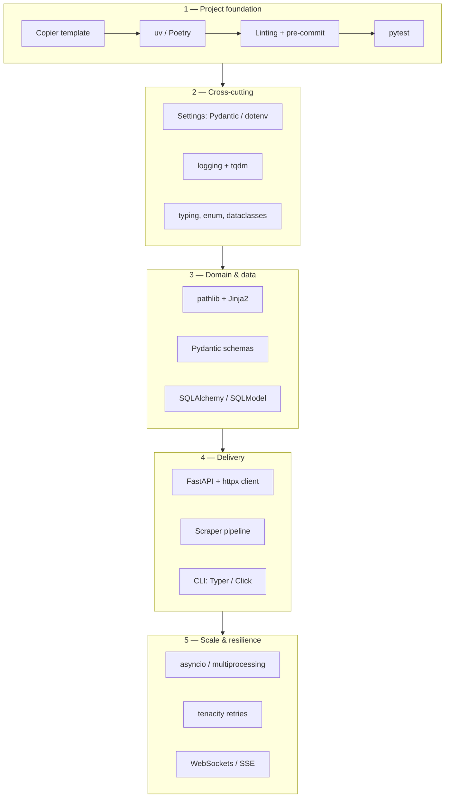
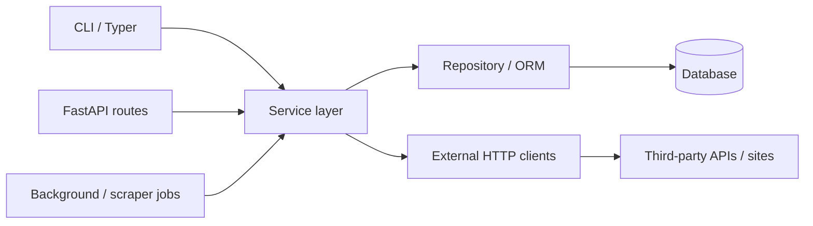
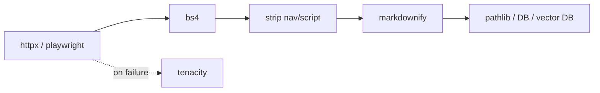

# Python Development

A map of how to **design, structure, and grow** Python backend and automation projects in this vault — from an empty repo to production-ready APIs, scrapers, and CLIs. Use this note for **why** and **in what order**; use linked **Codes** notes for **how**.

> Consolidates the roadmap from [[Build a Python Backend Application from Scratch]] into a single concept with references and design patterns.

---

## What It Is

**Python development** here means building maintainable services and tools with a repeatable stack: typed models, clear layers, async where I/O-bound, tests and linting from day one, and libraries chosen for each job (HTTP, parsing, persistence, CLI) rather than one framework for everything.

Typical outcomes in this knowledge base:

- **REST / real-time APIs** — FastAPI, Pydantic, SQLAlchemy, WebSockets/SSE
- **Data pipelines & scrapers** — httpx, bs4, markdownify, tenacity, asyncio
- **CLIs & internal tools** — Typer, Click, Rich, argparse
- **Shared foundations** — config, logging, pathlib, typing, dataclasses

---

## Why a Defined Flow Matters

Without a sequence, projects tend to mix concerns early (business logic in route handlers, raw SQL in scrapers, no tests until production). A **phase-based flow** keeps each layer stable before the next:

1. **Skeleton** — repo layout, deps, quality gates
2. **Cross-cutting** — config, logging, types
3. **Domain core** — models, services, persistence
4. **Delivery surfaces** — HTTP API, CLI, jobs, scrapers
5. **Hardening** — retries, concurrency, integration tests

The sections below follow that order and point to the right notes.

---

## End-to-End Development Flow



| Phase                  | Purpose                                    | Primary references                                                                                                                                           |
| ---------------------- | ------------------------------------------ | ------------------------------------------------------------------------------------------------------------------------------------------------------------ |
| 1 — Foundation         | Reproducible repo and quality bar          | [[Python — Copier]], [[Python — uv]], [[Python — Poetry]], [[Linting]], [[Linting — Ruff]], [[Linting — pre-commit]], [[Unit Testing - pytest]]                                                            |
| 2 — Cross-cutting      | Config and observability everywhere        | [[Python — Pydantic]], [[Python — python-dotenv]], [[Python — logging]], [[Python — tqdm]], [[Python — typing]], [[Python — enum]], [[Python — dataclasses]] |
| 3 — Domain & data      | Files, templates, validation, persistence  | [[Python — pathlib]], [[Python — Jinja2 Package]], [[ORM - SQLAlchemy]], [[Python — SQLModel]]                                                               |
| 4 — Delivery           | Expose behavior to users and other systems | [[API - FastAPI]], [[Python — httpx Package]], scraping stack below, [[Python — Typer]], [[Python — Click & Rich]], [[Python — argparse]]                    |
| 5 — Resilience & scale | I/O concurrency, retries, real-time        | [[Python — asyncio]], [[Python — multiprocessing]], [[Python — tenacity]], [[Python — websockets Package]]                                                   |

---

## Layered Architecture (Recommended Shape)

Most backend projects in this vault fit a **thin surface, thick domain** layout:



| Layer | Responsibility | Avoid |
| --- | --- | --- |
| **Route / command** | Parse input, auth, HTTP status, call one service method | Business rules, SQL, raw HTML parsing |
| **Service** | Use cases, orchestration, transactions | Framework types, request objects |
| **Repository** | CRUD, queries, unit of work | HTTP or CLI concerns |
| **Schema (Pydantic)** | API request/response, settings | ORM entities leaking to clients |
| **Model (ORM / dataclass)** | Persistence, internal DTOs | Untyped dicts at boundaries |

**Concept references:** [[API - FastAPI — Dependency Injection & User Management]], [[API - FastAPI — Lifespan]], [[ORM - CRUD]], [[ORM - Queries]], [[ORM - Async]], [[Python — Pydantic]].

---

## Design Patterns in Python (Conceptual)

These are the patterns this vault assumes — not every project needs all of them, but knowing the name helps you pick the right note.

### 1. Dependency injection

**Purpose:** Share database sessions, settings, and HTTP clients without globals; swap implementations in tests.

- **FastAPI:** `Depends()` for per-request resources — [[API - FastAPI — Dependency Injection & User Management]]
- **Manual:** pass `Session`, `Settings`, `httpx.AsyncClient` into service constructors
- **Lifespan:** create long-lived clients once — [[API - FastAPI — Lifespan]], [[Python — contextlib]]

### 2. Repository (data access)

**Purpose:** Hide SQL/ORM details behind a small API (`get_user`, `list_orders`).

- **Implementation:** SQLAlchemy session + query modules — [[ORM - CRUD]], [[ORM - Queries]]
- **Async pitfall:** no lazy loads in async — use `selectinload` — [[ORM - Async]]

### 3. DTO / schema separation

**Purpose:** API contracts stay stable when DB columns change.

- **API layer:** Pydantic `BaseModel` — [[Python — Pydantic]], [[API - FastAPI — Pydantic Models]]
- **DB layer:** SQLAlchemy `Mapped` models — [[ORM - Models]]
- **Lightweight internal structs:** `@dataclass` — [[Python — dataclasses]]

### 4. Settings / configuration object

**Purpose:** One validated config loaded at startup (env + files).

- **Pydantic Settings** (preferred for apps) — [[Python — Pydantic]]
- **Simple env files** — [[Python — python-dotenv]]
- **CLI flags** — [[Python — Typer]], [[Python — argparse]]

### 5. Template method (base class + hooks)

**Purpose:** Reuse scrape/ETL flow while customizing per site.

```text
fetch → parse → normalize → persist
         ↑ override in subclass
```

- **Base scraper:** abstract `fetch`, `parse` with shared retry/logging — *TODO: dedicated Codes note*
- **Retries on `fetch`:** [[Python — tenacity]]
- **Parse HTML:** [[Python — BeautifulSoup4 (bs4)]]
- **HTML → Markdown:** [[Python — markdownify]]

### 6. Strategy (pluggable behavior)

**Purpose:** Swap algorithms or backends without changing callers.

| Concern | Sync strategy | Async strategy |
| --- | --- | --- |
| HTTP client | [[Python — requests Package]] | [[Python — httpx Package]] |
| Low-level pool | [[Python — urllib3 Package]] | httpx transport |
| Concurrency model | threads / [[Python — multiprocessing]] | [[Python — asyncio]] |
| HTML parser | `lxml` vs `html.parser` in bs4 | [[Python — BeautifulSoup4 (bs4)]] |

### 7. Decorator / wrapper

**Purpose:** Cross-cutting behavior on functions (retry, timing, auth).

- **Retries:** `@retry` — [[Python — tenacity]]
- **Framework decorators:** FastAPI route decorators — [[API - FastAPI]]
- **Decorator utilities:** `@wraps`, `@lru_cache`, `partial` — [[Python — functools]]
- **Iterators & pipelines:** `batched`, `chain`, `groupby` — [[Python — itertools]]

### 8. Abstract base classes (ABC)

**Purpose:** Define contracts for plugins, scrapers, or storage backends.

- Use `abc.ABC` + `@abstractmethod` for `Storage`, `Scraper`, `Notifier` — [[Python — abc]]
- Combine with typing `Protocol` for structural subtyping — [[Python — typing]]
- Template method + plugin registry patterns — [[Python — abc]]

### 9. Factory

**Purpose:** Centralize creation of sessions, engines, or clients.

- **ORM:** engine + `sessionmaker` — [[ORM - Setup]]
- **HTTP:** `httpx.AsyncClient` in app lifespan — [[Python — httpx Package]], [[API - FastAPI — Lifespan]], [[Python — contextlib]]

### 10. Command (CLI)

**Purpose:** One entry point, multiple subcommands.

- **Modern:** Typer app with subcommands — [[Python — Typer]]
- **Rich output:** [[Python — Click & Rich]]
- **stdlib / no deps:** [[Python — argparse]]

---

## Phase Guide (With References)

### Phase 1 — Project foundation

| Step | What to do | References |
| --- | --- | --- |
| Bootstrap | Start from a Copier template (layout, CI hooks) | [[Python — Copier]] |
| Dependencies | Lock deps with uv or Poetry | [[Python — uv]], [[Python — Poetry]] |
| Code quality | Ruff + pre-commit on every commit | [[Linting — Ruff]], [[Linting — pre-commit]], [[Linting — mypy]] |
| Tests | pytest from the first module | [[Unit Testing - pytest]], [[Unit Test - Basic]], [[Unit Test - Fixtures]] |

### Phase 2 — Cross-cutting concerns

| Step | What to do | References |
| --- | --- | --- |
| Configuration | `BaseSettings` or `.env` for secrets and URLs | [[Python — Pydantic]], [[Python — python-dotenv]] |
| Logging | Structured logs, levels, request correlation | [[Python — logging]] |
| Progress | Long batch jobs and scrapes | [[Python — tqdm]] |
| Types | Hints, `Optional`, generics, `Protocol` | [[Python — typing]], [[Python — enum]] |
| Simple records | Immutable/value objects | [[Python — dataclasses]] |
| Decorators & composition | `@wraps`, caching, `partial`, dispatch | [[Python — functools]] |
| Iterators & pipelines | batching, flatten, group, window | [[Python — itertools]] |
| Specialized containers | count, group, queue, layered config | [[Python — collections]] |
| Context managers | lifespan, sessions, resource cleanup | [[Python — contextlib]] |
| Interfaces & plugins | ABC, template method, registry | [[Python — abc]] |

### Phase 3 — Domain and data

| Step | What to do | References |
| --- | --- | --- |
| Files | Paths, read/write, project layout | [[Python — pathlib]] |
| SQL / reports | Parameterized SQL from templates | [[Python — Jinja2 Package]] |
| Validation | Input/output schemas | [[Python — Pydantic]] |
| Persistence | Tables, migrations, async sessions | [[ORM - SQLAlchemy]], [[ORM - Setup]], [[ORM - Migrations]], [[Python — SQLModel]] |
| Text processing | Regex for logs and parsers | [[Python — re (Regular Expressions)]] |

### Phase 4 — Web scraping and automation

**Purpose:** Reliable extraction of web content for storage or LLM pipelines.



| Step | What to do | References |
| --- | --- | --- |
| Fetch | Async HTTP with timeouts and pooling | [[Python — httpx Package]], [[Python — requests Package]] |
| Resilience | Backoff on 429/5xx/timeouts | [[Python — tenacity]] |
| Parse | DOM traversal, CSS selectors | [[Python — BeautifulSoup4 (bs4)]] |
| Normalize | HTML → Markdown for RAG/docs | [[Python — markdownify]] |
| Orchestrate | Concurrent page fetches | [[Python — asyncio]] |
| Browser / crawl | JS sites, scale, LLM extract | [[Browser Automation]], [[Browser Automation — Playwright]], [[Browser Automation — Scrapy]], [[Browser Automation — crawl4ai]], [[Browser Automation — ScrapeGraphAI]], [[Browser Automation — Scrapling]] |

### Phase 5 — API development

**Purpose:** Expose domain logic over HTTP with validation and docs.

| Topic | References |
| --- | --- |
| Overview & REST | [[API - FastAPI]], [[API - FastAPI — REST Principles & HTTP Methods]] |
| Request/response models | [[API - FastAPI — Pydantic Models]], [[Python — Pydantic]] |
| Modular apps | [[API - FastAPI — Routers & Modular Applications]] |
| Auth & DI | [[API - FastAPI — Dependency Injection & User Management]] |
| Startup/shutdown | [[API - FastAPI — Lifespan]], [[Python — contextlib]] |
| Real-time | [[API - FastAPI — WebSockets]], [[API - FastAPI — Server-Sent Events (SSE)]], [[Python — websockets Package]] |
| HTML responses | [[API - FastAPI — Templates (Jinja2)]], [[Python — Jinja2 Package]] |
| OpenAPI | [[API - FastAPI — OpenAPI Specification]] |
| Tutorials | [[fastapi tutorials]] |

Serve with **Uvicorn** (ASGI); call outbound services with a shared **httpx** client (see [[Python — httpx Package]]).

### Phase 5b — Traditional web frameworks (Flask, Django, Tornado)

See [[Web]] when the delivery surface is **HTML**, **Django admin**, or you maintain legacy Tornado services — not a replacement for [[API - FastAPI]] on new JSON APIs.

| Area | References |
| --- | --- |
| Overview & decision flow | [[Web]] |
| Microframework + Jinja2 | [[Web — Flask]] |
| Batteries-included monolith | [[Web — Django]] |
| Legacy async HTTP / WebSocket | [[Web — Tornado]] |

### Phase 6 — CLI and operator tools

| Use case | Prefer | References |
| --- | --- | --- |
| New project, typed flags | Typer | [[Python — Typer]] |
| Rich tables/progress | Click + Rich | [[Python — Click & Rich]] |
| Stdlib only | argparse | [[Python — argparse]] |

### Phase 7 — AI applications

See [[AI]] for the full stack map, learning path, and all Codes notes.

| Area | References |
| --- | --- |
| Overview & RAG pipeline | [[AI]] |
| Orchestration | [[AI — LangChain]], [[AI — LangGraph]], [[AI — Haystack]], [[AI — LlamaIndex]] |
| Document parsing | [[AI — Docling]], [[AI — MegaParse]] |
| Vector stores | [[AI — Chroma]], [[AI — FAISS]], [[AI — Qdrant]], [[AI — Milvus]] |
| Multi-agent / typed agents | [[AI — CrewAI]], [[AI — Agno]], [[AI — Pydantic AI]], [[AI — DSPy]] |
| Protocols | [[AI — MCP]], [[AI — A2A]], [[AI — ACP]] |
| Evaluation & memory | [[AI — RAGAS]], [[AI — Mem0]] |
| Distributed tasks | [[Processing]], [[Processing — Celery]], [[Processing — Ray]] |

### Phase 7b — Machine learning & MLOps

See [[Machine Learning]] for the full stack map, lifecycle, and all Codes notes.

| Area | References |
| --- | --- |
| Overview & lifecycle | [[Machine Learning]] |
| Foundation | [[ML — NumPy]], [[ML — pandas]], [[ML — scipy]] |
| Visualization | [[ML — matplotlib]], [[ML — seaborn]] |
| Classical ML | [[ML — scikit-learn]], [[ML — XGBoost]], [[ML — LightGBM]], [[ML — H2O]] |
| Deep learning / forecasting | [[ML — PyTorch]], [[ML — Prophet]] |
| Selection & tuning | [[ML — Boruta]], [[ML — Optuna]], [[ML — SHAP]] |
| Graph features | [[ML — NetworkX]] |
| Experiment tracking | [[ML — MLflow]] |
| Feature store | [[ML — Feast]] |
| Model serving | [[ML — BentoML]], [[ML — Seldon]] |

### Phase 7c — Natural language processing

See [[NLP]] for the text processing stack and when to use classical NLP vs [[AI]] LLMs.

| Area | References |
| --- | --- |
| Overview & pipeline | [[NLP]] |
| Production NLP | [[NLP — spaCy]] |
| Corpora & linguistics | [[NLP — NLTK]] |
| Topics & embeddings | [[NLP — Gensim]] |
| Quick sentiment | [[NLP — TextBlob]] |

### Phase 7d — Distributed processing

See [[Processing]] for when to use Celery vs Ray vs in-process async.

| Area | References |
| --- | --- |
| Overview & decision flow | [[Processing]] |
| Task queue & cron | [[Processing — Celery]] |
| Parallel / distributed compute | [[Processing — Ray]] |

### Phase 8 — Anti-bot and proxies (planned)

For sites that block simple httpx scrapers — [[Browser Automation — Scrapling]]; advanced: camoufox, botright, botasaurus, brightdata — *TODO: Codes notes*.

---

## Library Index (All Python Codes Notes)

Grouped for lookup; each link is the **how-to** for that library.

### Project & quality

- [[Python — Copier]] — project templates
- [[Python — uv]] — fast package manager
- [[Python — Poetry]] — alternative dependency manager
- [[Linting]] — code quality hub
- [[Linting — Ruff]] — linter and formatter
- [[Linting — mypy]] — static type checking
- [[Linting — pre-commit]] — git hooks
- [[Unit Testing - pytest]] — testing strategy (concept)

### Language & stdlib-style

- [[Python — typing]]
- [[Python — dataclasses]]
- [[Python — enum]]
- [[Python — functools]]
- [[Python — itertools]]
- [[Python — collections]]
- [[Python — contextlib]]
- [[Python — abc]]
- [[Python — pathlib]]
- [[Python — re (Regular Expressions)]]
- [[Python — logging]]
- [[Python — tqdm]]

### Configuration & validation

- [[Python — Pydantic]]
- [[Python — python-dotenv]]

### Concurrency

- [[Python — asyncio]]
- [[Python — multiprocessing]]

### HTTP & networking

- [[Python — httpx Package]]
- [[Python — requests Package]]
- [[Python — urllib3 Package]]
- [[Python — websockets Package]]

### Web frameworks (HTML & monoliths)

- [[Web]] — concept hub
- [[Web — Flask]]
- [[Web — Django]]
- [[Web — Tornado]]

### Scraping & browser automation

- [[Browser Automation]] — concept hub
- [[Browser Automation — Playwright]]
- [[Browser Automation — Scrapy]]
- [[Browser Automation — crawl4ai]]
- [[Browser Automation — ScrapeGraphAI]]
- [[Browser Automation — Scrapling]]

### Scraping & content (HTTP layer)

- [[Python — BeautifulSoup4 (bs4)]]
- [[Python — markdownify]]
- [[Python — tenacity]]

### Data & templates

- [[Python — Jinja2 Package]]
- [[Python — SQLModel]]
- [[ORM - SQLAlchemy]] (concept) → [[ORM - Setup]], [[ORM - Models]], [[ORM - CRUD]], [[ORM - Queries]], [[ORM - Async]], [[ORM - Migrations]]

### CLI

- [[Python — Typer]]
- [[Python — Click & Rich]]
- [[Python — argparse]]

### Machine learning

- [[Machine Learning]] — concept hub
- [[ML — NumPy]], [[ML — pandas]], [[ML — scipy]]
- [[ML — matplotlib]], [[ML — seaborn]]
- [[ML — scikit-learn]], [[ML — XGBoost]], [[ML — LightGBM]], [[ML — H2O]]
- [[ML — PyTorch]], [[ML — Prophet]], [[ML — NetworkX]]
- [[ML — Boruta]], [[ML — Optuna]], [[ML — SHAP]]
- [[ML — MLflow]], [[ML — Feast]], [[ML — BentoML]], [[ML — Seldon]]

### Natural language processing

- [[NLP]] — concept hub
- [[NLP — spaCy]]
- [[NLP — NLTK]]
- [[NLP — Gensim]]
- [[NLP — TextBlob]]

### Distributed processing

- [[Processing]] — concept hub
- [[Processing — Celery]]
- [[Processing — Ray]]

---

## Choosing the Right Tool (Quick Decisions)

| Question                       | Choose                                                           |
| ------------------------------ | ---------------------------------------------------------------- |
| New API service?               | [[API - FastAPI]] + [[Python — Pydantic]] + [[ORM - SQLAlchemy]] |
| Server-rendered HTML / tool?   | [[Web — Flask]] + [[Python — Jinja2 Package]]                    |
| Monolith with admin + ORM?     | [[Web — Django]]                                                 |
| Script or cron job, sync only? | [[Python — requests Package]] + [[Python — logging]]             |
| Many parallel HTTP calls?      | [[Python — asyncio]] + [[Python — httpx Package]]                |
| Parse HTML?                    | [[Python — BeautifulSoup4 (bs4)]]                                |
| Feed an LLM from a page?       | bs4 clean → [[Python — markdownify]]                             |
| Flaky external API?            | [[Python — tenacity]] on service/client layer                    |
| User-facing CLI?               | [[Python — Typer]]                                               |
| Env-based config?              | [[Python — Pydantic]] settings or [[Python — python-dotenv]]     |
| CPU-bound parallelism?         | [[Python — multiprocessing]] (not asyncio)                       |
| Custom decorator?              | `@wraps` from [[Python — functools]]                             |
| Cache expensive pure function? | `@lru_cache` / `@cache` — [[Python — functools]]                 |
| Batch or stream large data?    | `batched`, `chain`, `islice` — [[Python — itertools]]          |
| Count or group in memory?      | `Counter`, `defaultdict` — [[Python — collections]]            |
| Startup/shutdown resources?    | `@asynccontextmanager` — [[Python — contextlib]]               |
| Plugin or backend contract?    | `ABC` + `@abstractmethod` — [[Python — abc]]                   |
| Lint + format Python?          | [[Linting — Ruff]]                                               |
| Type-check codebase?           | [[Linting — mypy]] + [[Python — typing]]                        |
| Automate checks on commit?     | [[Linting — pre-commit]]                                         |
| JS-heavy page or login flow?   | [[Browser Automation — Playwright]]                              |
| Crawl thousands of URLs?       | [[Browser Automation — Scrapy]]                                  |
| RAG ingest from web?           | [[Browser Automation — crawl4ai]]                                |
| Extract by LLM prompt/schema?  | [[Browser Automation — ScrapeGraphAI]]                           |
| Adaptive / stealth scraping?   | [[Browser Automation — Scrapling]]                               |
| Tabular ML baseline?           | [[ML — scikit-learn]] + [[ML — pandas]]                          |
| Boost tabular performance?     | [[ML — XGBoost]] or [[ML — LightGBM]]                            |
| Track experiments?             | [[ML — MLflow]]                                                  |
| Serve sklearn/PyTorch model?   | [[ML — BentoML]] or [[ML — Seldon]]                              |
| Tune hyperparameters?          | [[ML — Optuna]]                                                  |
| Explain predictions?           | [[ML — SHAP]]                                                    |
| Production text NLP?           | [[NLP — spaCy]]                                                  |
| Topic modeling / doc vectors?  | [[NLP — Gensim]]                                                 |
| Quick sentiment prototype?     | [[NLP — TextBlob]]                                               |
| Background job queue?          | [[Processing — Celery]]                                          |
| Parallel / distributed Python? | [[Processing — Ray]]                                             |

---

## Gaps & TODO (From Inbox)

Items referenced in [[Build a Python Backend Application from Scratch]] but not yet fully documented in **Codes**:

| Topic                                       | Planned focus                                  |
| ------------------------------------------- | ---------------------------------------------- |
| camoufox, botright, botasaurus, brightdata  | Anti-bot and proxies                           |

---

## Connected Concepts

- [[API - FastAPI]] — HTTP APIs
- [[ORM - SQLAlchemy]] — persistence
- [[Unit Testing - pytest]] — quality
- [[Linting]] — Ruff, mypy, pre-commit
- [[Browser Automation]] — Playwright, Scrapy, crawl4ai, ScrapeGraphAI, Scrapling
- [[AI]] — LLM, RAG, agents, vector stores, protocols
- [[Machine Learning]] — sklearn, boosting, MLflow, model serving
- [[NLP]] — spaCy, NLTK, Gensim, TextBlob
- [[Processing]] — Celery, Ray
- [[Web]] — Flask, Django, Tornado
- [[Build a Python Backend Application from Scratch]] — original checklist (superseded by this note for navigation)

---

## Tags

#python #backend #architecture #design-patterns #roadmap #api #scraping #cli #obsidian
