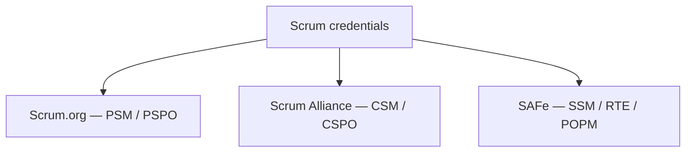

**Key Points:**

- **Three main paths** — Scrum.org (assessment-first), Scrum Alliance (course-first), SAFe (enterprise scaling).
- **PSM I / CSM** — common entry credentials for Scrum Masters; understand the framework, not only pass.
- **Scrum Guide is the source** — especially for Scrum.org exams (2020 guide).
- **Certification ≠ mastery** — daily practice, Retrospectives, and backlog discipline matter more.
- **SAFe certs** — for ART/RTE roles; pair with [[Scrum — Scaling (SAFe & LeSS)]].

# Scrum — Certification

Part of [[Scrum]]. Concept-only.

---

## Why Certify?

- Validates baseline Scrum knowledge
- Signals credibility to employers
- Structures learning for career moves (Scrum Master, Product Owner, RTE)
- **Still:** real skill comes from applying [[Scrum — Framework]] on a real team

---

## Landscape



---

## Scrum.org (assessment-first)

**Philosophy:** Prove knowledge; **no mandatory course** for most exams.

### Professional Scrum Master (PSM)

| Level | Focus |
| --- | --- |
| **PSM I** | Core theory, roles, events, artifacts, empiricism |
| **PSM II** | Scenario judgment — best Scrum response |
| **PSM III** | Expert coaching and organizational mastery |

PSM I is typically **multiple choice**, time-limited, high pass bar (~85%), **does not expire**.

**Topics align with:** [[Scrum — Framework]], [[Scrum — Sprint Planning & User Stories]], [[Scrum — Daily Scrum & Retrospective]].

### Other Scrum.org credentials (conceptual)

| Track | Role |
| --- | --- |
| **PSPO** | Product Owner |
| **PSD** | Developer |
| **PAL** | Agile leadership |
| **SPS** | Scaled Professional Scrum (lighter than SAFe) |
| **PSK** | Scrum with Kanban — [[Scrum — Scrum vs Kanban]] |

---

## Scrum Alliance (course-first)

**Philosophy:** Learn through a **certified course**, then assess; community and continuing education.

### Certified ScrumMaster (CSM)

- **Requires** multi-day training with a Certified Scrum Trainer
- Entry exam on fundamentals and facilitation
- **Renews** periodically via continuing education units and fee

### Progression (conceptual)

| Stage | Certification |
| --- | --- |
| Entry | CSM |
| Advanced | A-CSM (experience + course) |
| Professional | CSP-SM |

Parallel **Product Owner** track: CSPO → A-CSPO → CSP-PO.

---

## SAFe (enterprise scaling)

For roles on an Agile Release Train — see [[Scrum — Scaling (SAFe & LeSS)]].

| Credential | Typical role |
| --- | --- |
| **SAFe Agilist** | Leaders learning SAFe |
| **SAFe Scrum Master (SSM)** | SM inside an ART |
| **POPM** | Product Owner / Manager in SAFe |
| **RTE** | Release Train Engineer |
| **SAFe Architect** | Technical alignment across teams |
| **SPC** | Transformation consultant |

Usually **requires official course**; credentials **expire** and need renewal activities.

---

## Comparing Paths (high level)

| Factor | Scrum.org | Scrum Alliance | SAFe |
| --- | --- | --- | --- |
| Training required | Often no | Yes | Yes |
| Relative cost | Lower entry | Higher (includes course) | Highest |
| Exam style | Rigorous knowledge | Moderate after course | Enterprise context |
| Expiration | Generally none | Renewal cycle | Annual renewal |
| Best fit | Self-study, pure Scrum | Classroom learners | Large org scaling |

---

## Study Approach (conceptual)

### For PSM I

1. Read the **2020 Scrum Guide** repeatedly until familiar
2. Use free **open assessments** on Scrum.org until consistently strong
3. Practice exams for misconceptions (role boundaries, events, empiricism)
4. Remember: **Scrum Master does not assign tasks**; **PO owns WHAT, Developers HOW**

### For CSM

1. Engage fully in the **two-day course**
2. Review materials before the online assessment
3. Focus on **understanding** over memorization

### For SAFe

1. Learn ART, PI, and PI Planning from course materials
2. Map to your organization’s value streams — [[System Design — Delivery & Planning]]

---

## Career Roadmaps (conceptual)

### Scrum Master

```
PSM I or CSM → practice 6–12 months → PSM II or A-CSM
→ deeper experience → PSM III or CSP-SM
→ optional SAFe RTE if enterprise scaling
```

### Product Owner

```
PSPO I or CSPO → practice → advanced PO cert
→ optional SAFe POPM in enterprise
```

---

## Exam Mindset Tips

- **Scrum values:** commitment, focus, openness, respect, courage
- **Role clarity:** PO prioritizes; Developers self-organize delivery; SM serves the process
- **Events are timeboxed** and serve empiricism
- **Certification is a milestone**, not the finish line — [[Scrum — Daily Scrum & Retrospective]] habit builds mastery

---

## Free Learning Resources (external)

- 2020 Scrum Guide (Scrum.org)
- Open assessments (Scrum.org)
- Books: *Scrum* (Sutherland); *Coaching Agile Teams* (Adkins) for SM depth

---

## Related Notes

- [[Scrum]]
- [[Scrum — Framework]]
- [[Scrum — Scaling (SAFe & LeSS)]]
- [[System Design — Delivery & Planning]]

---

## Tags

#scrum #certification #psm #csm #safe #pspo #professional-development
