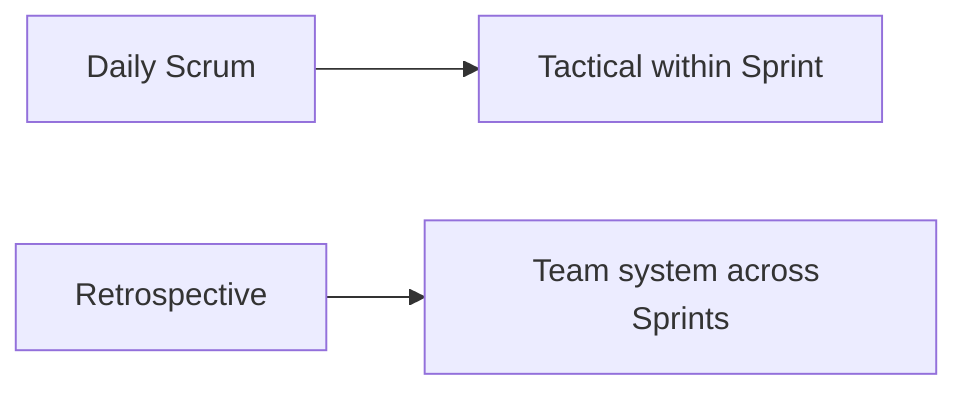

**Key Points:**

- **Daily Scrum is for Developers** — synchronize toward the Sprint Goal, not report status to managers.
- **15 minutes, every day** — blockers surfaced; deep fixes happen in a breakout after.
- **Retrospective improves the system** — how the team works, not what feature shipped.
- **End with actions** — specific, owned, due next Sprint; psychological safety is prerequisite.
- **Review vs Retro** — Review inspects the product; Retro inspects the process.

# Scrum — Daily Scrum & Retrospective

Part of [[Scrum]]. Concept-only.

---

## Daily Scrum

### Purpose

A **15-minute** event for **Developers** to inspect progress toward the **Sprint Goal** and adapt the plan for the next 24 hours.

> Not a status report to the Scrum Master or line manager — the team coordinates with the team.

### Classic three questions (optional)

1. What did I do yesterday toward the Sprint Goal?
2. What will I do today toward the Sprint Goal?
3. What impediments block me?

The 2020 Scrum Guide does not mandate these exact words — any structure that serves the **Sprint Goal** is valid.

### Board-walk alternative

Walk the Sprint board (To Do → In Progress → In Review → Done) item by item: what moved, what is stuck. Keeps focus on work, not individuals.

### Ground rules

| Do | Don't |
| --- | --- |
| Start on time | Wait for latecomers |
| Stay under 15 minutes | Solve problems in the room |
| Tie comments to Sprint Goal | Long technical deep dives |
| Name blockers clearly | Manager assigns new tasks |
| Optional: stand to keep energy | Casual unrelated chat |

### Breakouts (“after-party”)

When discussion is needed, the right subset meets **immediately after** the Daily Scrum — not during the 15 minutes.

### Blockers and the Scrum Master

The Scrum Master **removes organizational impediments** — dependencies, access, cross-team friction — so Developers stay focused on the Increment.

---

## Sprint Retrospective

### Purpose

Last event of the Sprint. Reflect on **how** the team collaborated, not **what** feature was built. Produce **improvements** for the next Sprint.

### Core questions

1. What went well? (keep)
2. What didn’t go well? (stop or fix)
3. What should we try next Sprint? (experiment)

### Popular formats

| Format | Structure |
| --- | --- |
| **Start / Stop / Continue** | Introduce / end / keep practices |
| **4Ls** | Liked, Learned, Lacked, Longed for |
| **Mad / Sad / Glad** | Emotional safety for morale issues |
| **Sailboat** | Wind (helps), Anchor (slows), Rocks (risks), Island (goal) |

### Suggested flow (~90 min for 2-week Sprint)

| Phase | Focus | ~Time |
| --- | --- | --- |
| Set the stage | Safety, Prime Directive | 5 min |
| Gather data | Facts, observations | 10 min |
| Generate insights | Patterns, root causes | 10 min |
| Decide actions | 1–3 improvements | 10 min |
| Close | Appreciation | 5 min |

### Action items must be real

Each improvement should be:

- **Specific** — not “communicate better”
- **Owned** — one person accountable
- **Scheduled** — acted on **this** next Sprint

### Psychological safety

People hide problems if blame is likely. The Scrum Master fosters safety. **Norm Kerth’s Prime Directive:**

> Regardless of what we discover, we understand that everyone did the best job they could, given what they knew at the time, their skills, resources, and the situation at hand.

Connects to [[System Design — Leadership & Culture]].

---

## Daily Scrum vs Retrospective

| | Daily Scrum | Retrospective |
| --- | --- | --- |
| **Horizon** | Next 24 hours | Next Sprint and beyond |
| **Focus** | Sprint Goal progress | Process, tools, collaboration |
| **Cadence** | Every day | Once per Sprint |
| **Fixes** | Tactical plan tweaks | Systemic improvements |

---

## Related Notes

- [[Scrum]]
- [[Scrum — Framework]]
- [[Scrum — Sprint Planning & User Stories]]
- [[System Design — Leadership & Culture]]

---

## Tags

#scrum #daily-scrum #retrospective #psychological-safety #impediments
