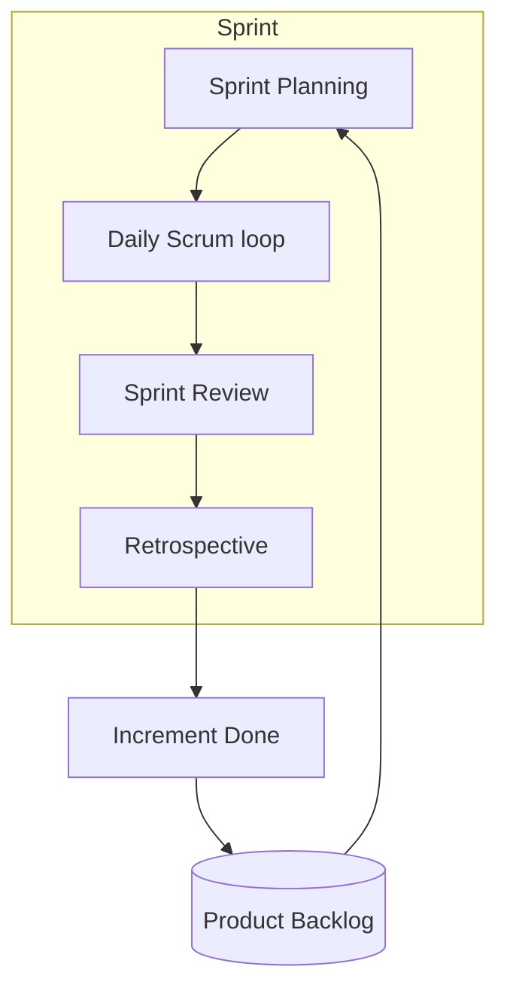

**Key Points:**

- **Empiricism** — transparency, inspection, adaptation; decisions based on what is known now.
- **Three roles** — Product Owner (what), Developers (how), Scrum Master (process).
- **Three artifacts** — Product Backlog, Sprint Backlog, Increment (each with commitments).
- **Five events** — Sprint container plus Planning, Daily Scrum, Review, Retrospective — all timeboxed.
- **Definition of Done** — shared quality bar; without it, “done” is meaningless.

# Scrum — Framework

Part of [[Scrum]]. Concept-only.

---

## The Three Pillars

| Pillar | Meaning |
| --- | --- |
| **Transparency** | Work and progress visible to team and stakeholders |
| **Inspection** | Frequent checks on artifact and progress toward goals |
| **Adaptation** | Adjust plan or process when inspection shows deviation |

---

## The Three Roles

| Role | Accountability |
| --- | --- |
| **Product Owner** | Maximizes product value; owns and orders the [[Scrum — Product Backlog]] |
| **Scrum Master** | Enables Scrum; removes impediments; coaches empiricism |
| **Developers** | Cross-functional creators of the Increment; self-organize the work |

**Common confusion:** The Scrum Master is not the project manager assigning tasks. Developers pull and own the plan for the Sprint.

---

## The Three Artifacts and Commitments

| Artifact | Commitment | Purpose |
| --- | --- | --- |
| **Product Backlog** | Product Goal | Ordered work toward a longer objective |
| **Sprint Backlog** | Sprint Goal | Plan for the current Sprint |
| **Increment** | Definition of Done | Usable, valuable output by end of Sprint |

The **Increment** must be **Done** per the team’s **Definition of Done (DoD)** — e.g. reviewed, tested, integrated, documented as the team agrees.

---

## The Five Events

| Event | Purpose | Typical timebox (2-week Sprint) |
| --- | --- | --- |
| **Sprint** | Container; fixed length 1–4 weeks | 2 weeks common |
| **Sprint Planning** | What can be done + how — see [[Scrum — Sprint Planning & User Stories]] | Up to 8 hours / month of Sprint |
| **Daily Scrum** | 24-hour plan toward Sprint Goal — see [[Scrum — Daily Scrum & Retrospective]] | 15 minutes daily |
| **Sprint Review** | Inspect Increment with stakeholders; adapt backlog | Up to 4 hours / month |
| **Sprint Retrospective** | Improve how the team works | Up to 3 hours / month |

### Sprint Review (concept)

- **Focus:** the product — what was built, what’s next
- **Attendees:** Scrum Team + key stakeholders
- **Outcome:** updated [[Scrum — Product Backlog]] informed by feedback
- **Not** a status slide deck for management only — working product demo preferred

### Scope protection during a Sprint

Once Sprint Planning ends, **scope should not change** in ways that endanger the Sprint Goal. Urgent changes are handled by negotiation with the Product Owner — canceling the Sprint is possible in extreme cases.

---

## Key Principles

| Principle | Practice |
| --- | --- |
| **Timeboxing** | Events end at max duration; deepen work after, not in the meeting |
| **Sprint Goal** | One coherent objective gives focus when trade-offs appear |
| **Self-organization** | Team decides who does which tasks |
| **Pull system** | Team pulls backlog items it can complete, not pushed assignments |
| **Single Product Backlog** | One ordered list per product |

---

## How a Sprint Fits Together

---

## Related Notes

- [[Scrum]]
- [[Scrum — Sprint Planning & User Stories]]
- [[Scrum — Daily Scrum & Retrospective]]
- [[Scrum — Product Backlog]]
- [[System Design — Leadership & Culture]]

---

## Tags

#scrum #framework #roles #artifacts #events #definition-of-done
