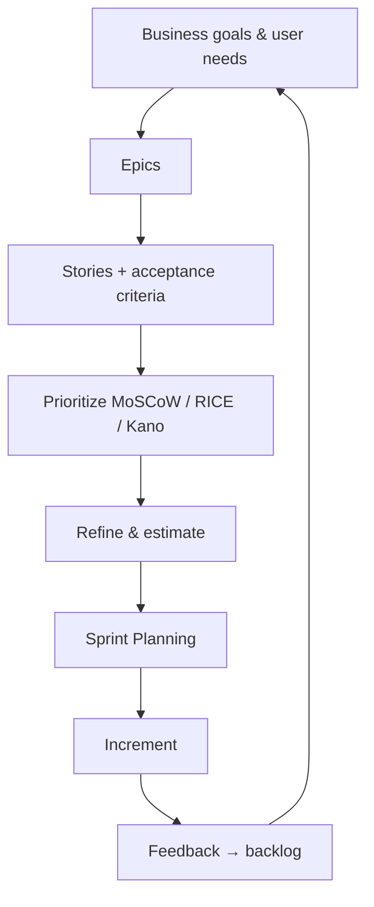

**Key Points:**

- **One ordered Product Backlog per product** — owned by the Product Owner; always evolving.
- **Iceberg model** — top items ready and small; bottom holds epics and ideas.
- **Prioritization is explicit** — MoSCoW, RICE, Kano, or value vs effort — pick what fits your context.
- **Definition of Ready** — entry criteria before Sprint Planning; pairs with [[Scrum — Framework#Definition of Done]].
- **Healthy backlog** — roughly two Sprints of ready work at the top.

# Scrum — Product Backlog

Part of [[Scrum]]. Concept-only.

---

## What Is the Product Backlog?

A **living, ordered list** of everything that might be needed in the product. It is never finished — market, learning, and tech debt continuously reshape it.

Only **one** Product Backlog per product. The **Product Owner** is accountable for ordering; Developers clarify and estimate in refinement.

---

## Product Backlog Items (PBIs)

| Type | Example |
| --- | --- |
| Features | Filter search results by date |
| Bug fixes | Login fails on mobile Safari |
| Technical debt | Migrate auth to new provider |
| Improvements | Shorten checkout from five steps to two |
| Spikes | Research mapping API options — see [[Scrum — Backlog Refinement]] |

---

## The Iceberg Model

```
        ▲  Ready for Sprint (small, estimated, clear AC)
       ███
      ██████
     █████████   ← partially refined features
    ████████████
   ██████████████  ← epics, vague future ideas
        ▼
```

**Backlog refinement** continuously moves items up the iceberg — [[Scrum — Backlog Refinement]].

### Epic → Feature → Story → Task

```
Epic: E-commerce checkout
└── Feature: Payment processing
    ├── Story: Pay by credit card
    │   └── Tasks (created in Sprint Planning)
    ├── Story: Email receipt
    └── Story: Save card for later
```

---

## Prioritization Techniques

### MoSCoW

| Bucket | Meaning |
| --- | --- |
| **Must** | Non-negotiable for success |
| **Should** | Important, not blocking launch |
| **Could** | Nice if capacity allows |
| **Won't** | Out of scope now (explicitly parked) |

### RICE

Score = (Reach × Impact × Confidence) ÷ Effort

| Factor | Question |
| --- | --- |
| **Reach** | Users affected per time period |
| **Impact** | Effect on goal (scaled 0.25–3) |
| **Confidence** | Estimate certainty (e.g. 50–100%) |
| **Effort** | Person-months or relative size |

Higher score → higher priority. Useful when comparing disparate ideas objectively.

### Kano model

| Category | Effect |
| --- | --- |
| **Basic needs** | Absence dissatisfies; presence expected |
| **Performance** | More is better (speed, reliability) |
| **Delighters** | Unexpected positives |
| **Indifferent** | Users don’t care |
| **Dissatisfiers** | Active annoyance |

Order of investment: **basics → performance → delighters**.

### Value vs effort matrix

| | Low effort | High effort |
| --- | --- | --- |
| **High value** | Quick wins — do first | Big bets — plan carefully |
| **Low value** | Fill-ins — later | Time sinks — drop or defer |

---

## Definition of Ready (DoR)

Before an item enters [[Scrum — Sprint Planning & User Stories]], many teams require:

- Written as a user-focused story (or clear intent)
- Acceptance criteria defined
- Estimated by Developers
- Dependencies identified
- Small enough for one Sprint
- Product Owner available to clarify

DoR is the **entry** bar; **Definition of Done** is the **exit** bar — [[Scrum — Framework]].

---

## Backlog Health Signals

| Signal | Healthy | Unhealthy |
| --- | --- | --- |
| Size | ~2–3 months visible work | Years of stale items |
| Top items | Detailed, estimated | Vague, never refined |
| Ordering | Clear rationale | Flat or political |
| Ownership | Product Owner decides | Committee thrash |
| Cadence | Refined every Sprint | Rarely touched |

---

## End-to-end flow



---

## Related Notes

- [[Scrum]]
- [[Scrum — Backlog Refinement]]
- [[Scrum — Sprint Planning & User Stories]]
- [[Scrum — Metrics]]
- [[System Design — Delivery & Planning]]

---

## Tags

#scrum #product-backlog #prioritization #moscow #rice #kano #definition-of-ready
