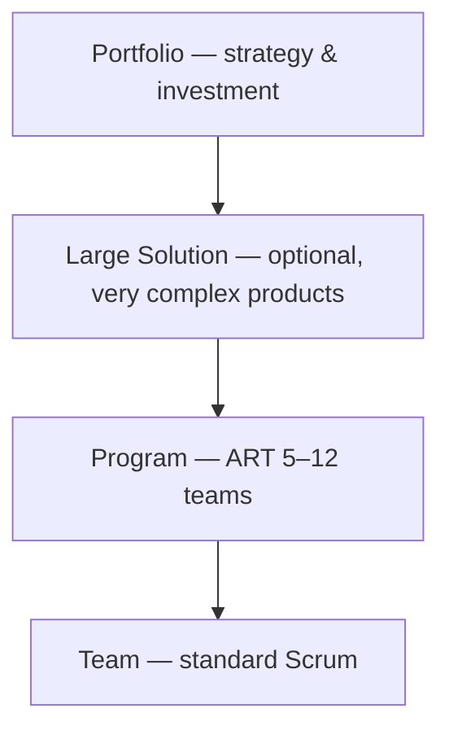
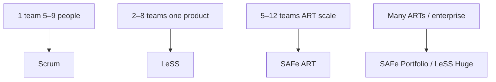

**Key Points:**

- **Single-team Scrum fits ~5–9 people** — one product; beyond that, coordination frameworks help.
- **SAFe** — enterprise structure: Agile Release Train, Program Increments, many new roles.
- **LeSS** — minimal scaling: one Product Owner, one backlog, feature teams.
- **Feature teams beat component teams** at scale — end-to-end delivery reduces handoffs.
- **Choose fit for culture** — SAFe for heavy enterprise alignment; LeSS for product-centric engineering orgs.

# Scrum — Scaling (SAFe & LeSS)

Part of [[Scrum]]. Concept-only.

---

## Why Scale?

Single Scrum team strengths break down when:

- Dozens of Developers share one product
- Multiple teams touch the same codebase
- Releases need cross-department coordination
- Strategy must align many teams

Goal: **preserve small-team agility** while coordinating many teams — see also [[System Design — Delivery & Planning]].

---

## Framework Comparison

| | **SAFe** | **LeSS** |
| --- | --- | --- |
| Full name | Scaled Agile Framework | Large Scale Scrum |
| Philosophy | Top-down coordinated “train” | Bottom-up minimal rules |
| Typical size | 50–thousands | Up to ~8 teams (Huge: more) |
| Complexity | High | Lower |
| Backlogs | Team + program layers | **One** product backlog |
| Cadence | PI (8–12 weeks) + iterations | Same Sprint cadence as Scrum |

---

## SAFe — Scaled Agile Framework

### Idea

Multiple agile teams run as an **Agile Release Train (ART)** — shared mission, shared **Program Increment (PI)** cadence (~8–12 weeks, often four to six two-week iterations plus an Innovation & Planning iteration).

### Levels (full configuration)



### Team level

Standard Scrum: Product Owner, Scrum Master, Developers, iteration goals — [[Scrum — Framework]].

### Program level (ART)

- **5–12 teams**, ~50–125 people, one value stream
- Key roles: **Release Train Engineer (RTE)**, **Product Manager**, **System Architect**, **Business Owners**
- **PI Planning** — multi-day event: vision, team breakouts, dependencies, **PI Objectives**

### PI Planning and ROAM risks

Cross-team planning identifies dependencies. Risks classified:

| Code | Meaning |
| --- | --- |
| **R**esolved | Eliminated |
| **O**wned | Someone accountable |
| **A**ccepted | Known, living with it |
| **M**itigated | Plan in place |

### Portfolio level

Connects strategy to funding: portfolio epics → lean portfolio management → ARTs → delivery.

### SAFe trade-offs

| Strengths | Costs |
| --- | --- |
| Enterprise governance, compliance narratives | Heavy process and training |
| Stakeholder alignment at scale | Can feel like “wagile” if ritual without autonomy |
| Proven in very large orgs | Expensive adoption |

Links to [[Scrum — Certification]] (SAFe track) and [[System Design — Governance & Documentation]].

---

## LeSS — Large Scale Scrum

### Idea

> Add as little process as possible. Same Scrum, more teams.

### Structure

```
One Product Owner
One Product Backlog
    ├── Team 1 (feature team)
    ├── Team 2
    └── Team 3
One shippable Increment per Sprint
```

**LeSS Huge** — 8+ teams with area Product Owners under one overall PO.

### Roles

- **One Product Owner** for the whole product (not one per team)
- **Scrum Master** may serve 1–3 teams
- **Feature teams** — each can deliver end-to-end (discourages backend-only / frontend-only component teams)

### Event changes (multi-team)

| Event | LeSS pattern |
| --- | --- |
| Sprint Planning | Part 1: all teams together; Part 2: per team |
| Daily Scrum | Per team + optional cross-team sync |
| Sprint Review | One joint “bazaar” — stations per team |
| Retrospective | Per team + overall retrospective |
| Refinement | Multi-team for shared items |

### LeSS trade-offs

| Strengths | Costs |
| --- | --- |
| Stays close to Scrum | Requires real organizational redesign |
| Less bureaucracy | Demands a strong, empowered Product Owner |
| Cheaper to adopt than full SAFe | Hard in siloed component structures |

---

## Choosing a Framework

| Choose SAFe when | Choose LeSS when |
| --- | --- |
| Large enterprise, compliance-heavy | Product-led tech company |
| Need top-down portfolio alignment | Want maximum team autonomy |
| Many non-engineering departments | 2–8 teams on **one** product |
| Budget for training and RTE roles | Willing to restructure into feature teams |



---

## Core Truth

The best scaling approach is the one the organization **will actually use** — with real empowerment, not ceremony theater. Start with solid single-team [[Scrum — Framework]] before scaling.

---

## Related Notes

- [[Scrum]]
- [[Scrum — Certification]]
- [[System Design — Delivery & Planning]]
- [[System Design — Strategy & Technology]]

---

## Tags

#scrum #safe #less #scaling #art #pi-planning #feature-teams
