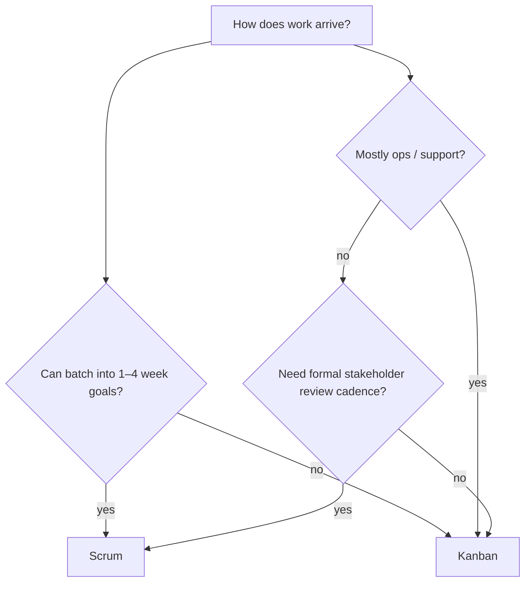

**Key Points:**

- **Scrum** — timeboxed Sprints, fixed roles/events, Sprint Goal and Increment.
- **Kanban** — continuous flow, WIP limits, visualize work; change when capacity allows.
- **Same values possible** — transparency, inspection, adaptation; different mechanics.
- **Kanban fits ops and unpredictable intake** — support queues, run-the-business work.
- **Scrumban** — hybrid: Sprint cadence optional + Kanban board and WIP limits.

# Scrum — Scrum vs Kanban

Part of [[Scrum]]. Concept-only.

---

## Shared Ground

Both support **agile** delivery:

- Visualize work
- Limit work in progress (explicit in Kanban; implicit in Sprint commitment)
- Improve flow through retrospection
- Deliver value incrementally

[[Scrum — Metrics]] cycle/lead time ideas overlap with Kanban flow metrics.

---

## Side-by-Side

| Dimension | Scrum ([[Scrum — Framework]]) | Kanban |
| --- | --- | --- |
| **Cadence** | Fixed Sprint (1–4 weeks) | Continuous flow |
| **Planning** | Sprint Planning each Sprint | Replenishment when capacity opens |
| **Commitment** | Sprint Goal + forecast for Sprint | WIP limits per column/state |
| **Roles** | PO, SM, Developers defined | No required roles (often existing team) |
| **Change mid-cycle** | Scope protected during Sprint | Pull new work when WIP allows |
| **Metrics** | Velocity, burndown | Cycle time, throughput, WIP |
| **Ceremonies** | Five prescribed events | Optional meetings (no fixed list) |

---

## When Scrum Fits Better

- **Product development** with releasable increments every few weeks
- Team benefits from **rhythm** and stakeholder **Sprint Review**
- Priorities shift at Sprint boundaries, not hourly
- Team size ~10 or fewer with stable membership
- Learning goal: [[Scrum — Certification]] and clear framework

Typical in feature teams building [[API - FastAPI]] services or platform capabilities.

---

## When Kanban Fits Better

- **Unpredictable arrival rate** — support tickets, incidents, ad-hoc requests
- **Maintenance and operations** — flow more important than Sprint boundary
- **Continuous deployment** — value ships item-by-item without Sprint packaging
- Team cannot batch work into Sprints without artificial splitting
- Existing process works but needs **visibility and WIP control**

---

## Scrumban (Hybrid)

Common pattern:

- Keep **Sprint Review / Retrospective** rhythm from Scrum
- Use **Kanban board** with WIP limits on the Sprint Backlog
- Pull work as capacity frees instead of committing all tasks day one

Useful when Scrum feels heavy but full Kanban lacks inspect points.

---

## Choosing (Decision Guide)

| Question | Lean toward |
| --- | --- |
| Need Sprint Goal and protected focus? | Scrum |
| Queue never empties; priorities change daily? | Kanban |
| Enterprise mandates PI planning? | [[Scrum — Scaling (SAFe & LeSS)]] (often Scrum-based) |
| Want PSK-style blend? | Study Scrum + Kanban practices together |

---

## Common Misconceptions

| Myth | Reality |
| --- | --- |
| “Kanban is not agile” | It is agile when you inspect and adapt flow |
| “Scrum has no flow metrics” | Cycle time complements velocity |
| “You must pick one forever” | Teams switch or blend as context changes |
| “Kanban has no planning” | Replenishment and refinement still happen |

---

## Related Notes

- [[Scrum]]
- [[Scrum — Framework]]
- [[Scrum — Metrics]]
- [[Scrum — Certification]] — PSK I
- [[System Design — Delivery & Planning]]

---

## Tags

#scrum #kanban #scrumban #agile #flow #wip
