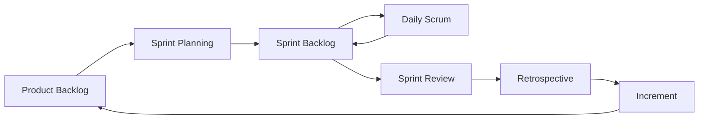

**Key Points:**

- **Scrum is a lightweight agile framework** — fixed-length Sprints, empiricism, and a small set of roles, artifacts, and events.
- **One Product Owner, one Product Backlog** — priority is explicit; the team pulls work and self-organizes how to deliver it.
- **Sprint Goal protects focus** — scope is stable during the Sprint; improvement happens in the Retrospective, blockers in the Daily Scrum.
- **Backlog quality enables planning** — refinement, Definition of Ready, and prioritization (MoSCoW, RICE, Kano) keep Sprint Planning short.
- **Scale only when needed** — single-team Scrum first; [[Scrum — Scaling (SAFe & LeSS)]] when many teams must align.
- **Concept-only** — no tooling or ceremony scripts; links to [[System Design — Delivery & Planning]] for architect context.

# Scrum — Overview & Agile Delivery

> **From scratch checklist:** [[Build for Enterprise Architecture and Agile Delivery from Scratch]] · All roadmaps: [[README]]

## What is Scrum (in this vault)?

**Scrum** is an **agile framework** for delivering complex products in small, inspect-and-adapt cycles. It fits software and knowledge work where requirements evolve. This hub maps the **2020 Scrum Guide** concepts from your Inbox notes into durable Concept pages — ceremonies, backlog practice, metrics, scaling, and certification paths.

Typical outcomes:

- **Predictable rhythm** — 1–4 week Sprints with a clear Increment and Sprint Goal
- **Aligned priorities** — ordered Product Backlog owned by the Product Owner
- **Team ownership** — Developers estimate, plan, and improve without task assignment from managers
- **Transparent progress** — Reviews with stakeholders; metrics for forecasting, not punishment
- **Enterprise coordination** — SAFe or LeSS when one team is not enough

---

## Concept Map

| Theme | Note | Core question |
| --- | --- | --- |
| Core framework | [[Scrum — Framework]] | Who does what, and what are the five events? |
| Planning work | [[Scrum — Sprint Planning & User Stories]] | What fits this Sprint, and how do we describe it? |
| Within-Sprint rhythm | [[Scrum — Daily Scrum & Retrospective]] | Are we on track today, and how do we improve next time? |
| What to build | [[Scrum — Product Backlog]] | What is ordered, sized, and ready to pull? |
| Preparing work | [[Scrum — Backlog Refinement]] | How do items become ready before Planning? |
| Forecasting | [[Scrum — Metrics]] | How much do we finish, and are we healthy mid-Sprint? |
| Many teams | [[Scrum — Scaling (SAFe & LeSS)]] | How do we coordinate without losing agility? |
| Credentials | [[Scrum — Certification]] | PSM, CSM, SAFe — which path fits your role? |
| Alternative flow | [[Scrum — Scrum vs Kanban]] | When is flow-based work better than Sprints? |

---

## The Sprint Loop

---

## Scrum in the Vault

| Partner concept | Connection |
| --- | --- |
| [[System Design — Delivery & Planning]] | Roadmaps, dependencies, risk alongside Sprints |
| [[System Design — Leadership & Culture]] | Psychological safety, servant leadership |
| [[Unit Testing - pytest]] | Definition of Done often includes automated tests |
| [[Linting]] | Quality gates in DoD |
| [[API - FastAPI]] | Increments often ship as deployable services |

---

## When to Use Which Note

| Situation | Open |
| --- | --- |
| New to Scrum | [[Scrum — Framework]] |
| Planning feels chaotic | [[Scrum — Product Backlog]], [[Scrum — Backlog Refinement]] |
| Daily feels like status theater | [[Scrum — Daily Scrum & Retrospective]] |
| Stakeholders ask “when will it ship?” | [[Scrum — Metrics]] |
| 50+ people on one product | [[Scrum — Scaling (SAFe & LeSS)]] |
| Ops/support queue never ends | [[Scrum — Scrum vs Kanban]] |
| Job asks for PSM/CSM/SAFe | [[Scrum — Certification]] |

---

## Recommended Learning Path

1. **Framework** — pillars, roles, artifacts, events
2. **Product Backlog** — ordering, epics, Definition of Ready
3. **Sprint Planning & User Stories** — Sprint Goal, INVEST, acceptance criteria
4. **Backlog Refinement** — splitting, spikes, estimation habits
5. **Daily Scrum & Retrospective** — tactical sync vs process improvement
6. **Metrics** — velocity and burndown for the team, not comparison
7. **Scaling or Kanban** — only when your context requires it
8. **Certification** — optional, after practicing Scrum

---

## Related Notes

- [[Scrum — Framework]]
- [[Scrum — Sprint Planning & User Stories]]
- [[Scrum — Daily Scrum & Retrospective]]
- [[Scrum — Product Backlog]]
- [[Scrum — Backlog Refinement]]
- [[Scrum — Metrics]]
- [[Scrum — Scaling (SAFe & LeSS)]]
- [[Scrum — Certification]]
- [[Scrum — Scrum vs Kanban]]
- [[System Design]]
- [[System Design — Delivery & Planning]]

---

## Tags

#scrum #agile #product-backlog #sprint #safe #less #certification
