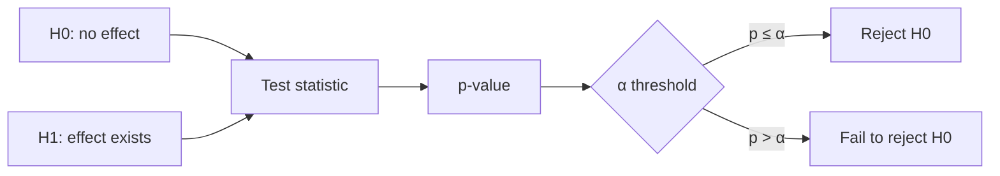
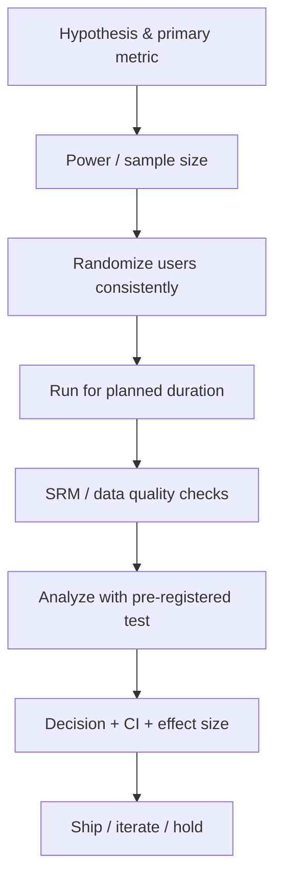

---
aliases:
  - Statistics — Theory & A/B Testing
---

**Key Points:**

- **Statistics grounds decisions** — estimate uncertainty, test hypotheses, and avoid shipping noise as signal.
- **A/B tests are experiments** — randomization, pre-registered metrics, and enough sample size before you call a winner.
- **Pick the right test** — proportions → z-test / chi-square; means → t-test; many groups → ANOVA + post-hoc; non-normal → non-parametric alternatives.
- **Power and sample size first** — underpowered tests waste traffic; overpowered tests detect trivial lifts.
- **Multiple comparisons inflate false positives** — Bonferroni, FDR (Benjamini–Hochberg), or hierarchical testing when you run many metrics.
- **Implementation in Python** — [[ML — scipy]] (`stats`), [[ML — pandas]] for aggregation; production experiment platforms sit outside this vault.

# Statistics — Theory & A/B Testing

> Concept-only reference for **probability**, **inference**, and **experiment design**. Tooling: [[ML — scipy]], [[ML — pandas]], [[ML — seaborn]]. Parent hub: [[Machine Learning]].

---

## What is This Note?

**Statistics** here means the **theory** behind measuring uncertainty and making data-driven decisions — especially **A/B tests** and product experiments. It complements [[Machine Learning — Algorithms Theory]] (prediction) and [[Machine Learning]] (MLOps stack).

Typical outcomes:

- Choose the correct test for a metric type
- Interpret p-values, confidence intervals, and effect sizes without cargo-culting
- Design an A/B test with valid randomization and stopping rules
- Spot common pitfalls (peeking, Simpson's paradox, novelty effects)

---

## Core Concepts

| Concept | Meaning | A/B relevance |
| --- | --- | --- |
| **Population vs sample** | Sample estimates population; error is expected | Your experiment traffic is a sample |
| **Random variable** | Numeric outcome of a random process | Conversion, revenue per user, latency |
| **Distribution** | How values spread (normal, binomial, Poisson) | Drives which test is valid |
| **Parameter vs statistic** | μ (population) vs x̄ (sample mean) | Report sample stats + CI for μ |
| **Estimator** | Rule to compute a statistic from data | Sample mean, sample proportion |
| **Bias & variance** | Systematic error vs run-to-run noise | Small samples → high variance |
| **Central Limit Theorem** | Sample means tend toward normal for large n | Justifies z/t tests on aggregated metrics |
| **Confidence interval** | Range likely to contain true parameter | "Lift is 2%–8%" beats "p < 0.05" alone |
| **Hypothesis test** | Formal decision under a null assumption | H₀: no difference between A and B |

---

## Probability & Distributions (Quick Reference)

| Distribution | Use when | Parameters | Notes |
| --- | --- | --- | --- |
| **Bernoulli / Binomial** | Success/fail per user (conversion) | p, n | A/B on binary outcomes |
| **Normal (Gaussian)** | Continuous metrics, sample means | μ, σ | CLT for aggregated user metrics |
| **Poisson** | Count events (clicks, errors) | λ | Variance = mean |
| **Exponential** | Time until event (survival) | λ | Related to Poisson counts |
| **Chi-square (χ²)** | Goodness-of-fit, contingency tables | df | Independence of categories |
| **Student's t** | Small-sample means, unknown σ | df | Heavier tails than normal |
| **F** | Compare variances / ANOVA | df₁, df₂ | Ratio of chi-squares |

**Assumption checklist:** independence of observations, stable assignment, no interference between variants (network effects break i.i.d.).

---

## Estimation

| Method | Idea | When |
| --- | --- | --- |
| **Point estimate** | Single best guess (x̄, p̂) | Dashboards, quick reads |
| **Interval estimate (CI)** | Range at confidence level (e.g. 95%) | Reporting lift with uncertainty |
| **Maximum likelihood (MLE)** | Parameters that maximize P(data \| θ) | Logistic regression, many ML models |
| **Bayesian** | Prior + data → posterior | Small data, sequential tests (use with care in A/B) |

**Standard error (SE):** spread of an estimator across repeated samples.

- Proportion: SE(p̂) ≈ √(p̂(1−p̂)/n)
- Mean: SE(x̄) = s / √n

---

## Hypothesis Testing Framework

| Term | Definition | Practical read |
| --- | --- | --- |
| **Null (H₀)** | No difference / no effect | Default skepticism |
| **Alternative (H₁)** | Effect you care about | One- or two-sided |
| **Test statistic** | Standardized distance from H₀ | z, t, χ², F |
| **p-value** | P(data this extreme \| H₀ true) | **Not** P(H₀ is true) |
| **Significance α** | False positive rate if H₀ true | Common: 0.05 (not sacred) |
| **Type I error (α)** | Reject true H₀ | False winner |
| **Type II error (β)** | Fail to reject false H₀ | Miss real lift |
| **Power (1−β)** | Detect real effect when present | Target 0.8–0.9 typical |
| **Effect size** | Magnitude of difference | Cohen's d, absolute lift % |

**Always pair p-value with effect size and CI.** Statistical significance ≠ business significance.

---

## Statistical Tests Cheat Sheet

### Two-sample / A-B comparisons

| Metric type | Typical test | H₀ | Notes |
| --- | --- | --- | --- |
| **Conversion rate (proportion)** | Two-proportion **z-test** | p_A = p_B | Large n; use χ² on 2×2 table equivalently |
| **Continuous mean (normal, equal var)** | **Pooled t-test** | μ_A = μ_B | Revenue per user (watch outliers) |
| **Continuous mean (unequal var)** | **Welch's t-test** | μ_A = μ_B | Default when group sizes differ |
| **Paired observations** | **Paired t-test** | mean diff = 0 | Same users before/after |
| **Count / categorical table** | **Chi-square test of independence** | independent | Multiple segments × variants |
| **Non-normal / heavy tails** | **Mann–Whitney U** (Wilcoxon rank-sum) | distributions equal | Robust; tests ranks not means |
| **>2 groups (means)** | **One-way ANOVA** | all μ equal | Then Tukey/Holm post-hoc |
| **>2 proportions** | **Chi-square** | equal proportions | Multi-variant experiments |

### Other common tests

| Situation | Test |
| --- | --- |
| Single proportion vs benchmark | One-proportion z-test |
| Single mean vs benchmark | One-sample t-test |
| Normality check (diagnostic) | Shapiro–Wilk, Q-Q plot |
| Correlation | Pearson (linear), Spearman (monotonic) |
| Variance equality (diagnostic) | Levene's test |

**Python:** `scipy.stats` — `ttest_ind`, `ttest_rel`, `chi2_contingency`, `mannwhitneyu`, `f_oneway`.

---

## A/B Testing — End-to-End

### Design checklist

| Step | Do | Avoid |
| --- | --- | --- |
| **Hypothesis** | One primary metric + guardrails | Fishing for any metric that "wins" |
| **Unit of randomization** | User, session, or account (pick one) | Switching mid-journey |
| **Sample size** | Power analysis before launch | Stopping when p < 0.05 |
| **Duration** | Full business cycles (weekday/weekend) | 24-hour tests for seasonal products |
| **Segments** | Pre-specify subgroups | Post-hoc slicing until significance |
| **Novelty / learning** | Run long enough for steady state | Confusing launch spike with lift |

### Sample size (proportions, rough)

For two-sided test, equal allocation, significance α, power 1−β:

- Need **minimum detectable effect (MDE)** — smallest lift worth detecting
- Larger n for: smaller MDE, higher power, lower α, rarer baseline rate
- Use a calculator or `statsmodels.stats.power` before traffic split

### Analysis metrics

| Metric | Often modeled as | Test |
| --- | --- | --- |
| Click-through rate | Binomial per user | z-test / χ² |
| Sign-up conversion | Binomial | z-test |
| Revenue per user | Continuous (skewed) | Welch t or bootstrap / Mann–Whitney |
| Revenue per paying user | Conditional continuous | Selection bias — define carefully |
| Retention (D7) | Binomial | z-test with cohort window |
| Latency p95 | Continuous | Log-transform or percentile bootstrap |

**Ratio metrics** (clicks/impressions): analyze at user level when possible; delta method or bootstrap for aggregated ratios.

---

## Multiple Testing & Peeking

| Problem | Why it hurts | Mitigation |
| --- | --- | --- |
| **Peeking / optional stopping** | Inflates false positives if you stop early on significance | Fixed horizon; sequential methods (SPRT, always-valid p-values) if needed |
| **Many metrics** | P(any false positive) grows | Bonferroni (conservative), **Benjamini–Hochberg (FDR)**, hierarchical: primary vs secondary |
| **Many variants (A/B/C/…)** | More pairwise comparisons | Pre-specify contrasts; ANOVA first |
| **Repeated experiments** | "Winner" by chance across tests | Holdout, meta-analysis, raise bar for replication |

---

## Common Pitfalls

| Pitfall | Symptom | Fix |
| --- | --- | --- |
| **Sample ratio mismatch (SRM)** | 50/50 split → 48/52 with huge n | Bug in bucketing; do not trust results |
| **Simpson's paradox** | Overall lift opposite in every segment | Report segment-aware; check confounders |
| **Survivorship bias** | Only active users analyzed | Intent-to-treat: all assigned users |
| **Network effects** | One user's variant affects another | Cluster randomization (geo, network) |
| **Outliers dominate** | Mean revenue unstable | Winsorize, log transform, or report median + bootstrap |
| **p-hacking** | Try tests until one passes | Pre-register analysis plan |

---

## Statistics vs Machine Learning

| | Statistics (this note) | [[Machine Learning — Algorithms Theory]] |
| --- | --- | --- |
| Goal | Infer, test, quantify uncertainty | Predict on new data |
| Output | p-value, CI, effect size | Model, score, ranking |
| Assumptions | Explicit, testable | Often validated by CV performance |
| A/B testing | Core use case | ML can personalize (multi-armed bandits) |

**Bandits (concept):** adaptive allocation to better variants during the test — trades pure inference for regret minimization; use when exploration cost is high.

---

## Recommended Learning Path

1. **Distributions & CLT** — know binomial and normal
2. **Estimation & CI** — report intervals, not only point estimates
3. **Hypothesis testing** — z and t for A/B means and proportions
4. **Chi-square & ANOVA** — multi-category and multi-group
5. **Power & sample size** — design before launch
6. **Multiple testing & peeking** — production experiment hygiene
7. **Apply** — analyze a synthetic A/B dataset with [[ML — scipy]] + [[ML — pandas]]

---

## Related Notes

### Theory chain

- [[Machine Learning — Algorithms Theory]]
- [[Deep Learning — Theory]]
- [[Transformers — Attention & Architecture]]

### Tools & hubs

- [[ML — scipy]]
- [[ML — pandas]]
- [[ML — seaborn]]
- [[ML — matplotlib]]
- [[Machine Learning]]
- [[Python Development]]

---

## Tags

#statistics #ab-testing #hypothesis-testing #experimentation #inference #probability #data-science
