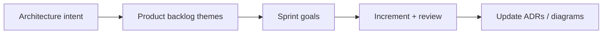

**Key Points:**

- **Architecture serves delivery** — a diagram nobody can build on a roadmap is decoration.
- **Agile is the default rhythm** — Scrum for single teams; SAFe/LeSS when many teams must align — [[Scrum]], [[Scrum — Scaling (SAFe & LeSS)]].
- **Roadmaps show outcomes, not tickets** — themes and milestones, with explicit dependencies.
- **Risk is managed, not wished away** — identify early, assign owners, revisit each increment.
- **Dependencies are the silent killer** — map them across teams, vendors, and compliance gates.

# System Design — Delivery & Planning

Part of [[System Design]]. Concept-only.

---

## Project and Program Management (Architect Lens)

Architects rarely “own the Gantt chart,” but they **shape what is feasible** and **surface blockers** before they become crises.

| Responsibility | Architect contribution |
| --- | --- |
| **Scope** | Boundaries between MVP, phase 2, and platform work |
| **Sequencing** | Which integrations must precede others |
| **Quality gates** | Security, performance, and ops readiness criteria |
| **Release strategy** | Big-bang vs strangler vs parallel run |

---

## Agile Frameworks (When to Use What)

| Framework | Fit | Caveat |
| --- | --- | --- |
| **Scrum** | One product, one team (≈5–9 people), stable priorities | Not a status-report factory for managers |
| **Kanban** | Continuous flow, ops-heavy, unpredictable intake | Less prescriptive sprint commitment |
| **SAFe** | Many teams, ARTs, portfolio alignment | Heavier ceremony; needs RTE discipline |
| **LeSS** | Multi-team Scrum with minimal extra roles | Requires true organizational change |

See [[Scrum]] and linked concept notes for ceremonies, backlog, metrics, and scaling. This note **connects** architecture work to that rhythm.

---

## Roadmap Planning and Prioritization

### Outcome-based roadmap

| Horizon | Content |
| --- | --- |
| **Now** | Committed sprint / PI objectives |
| **Next** | Sized epics with known dependencies |
| **Later** | Bets and research spikes |

### Prioritization lenses

- **Value** — revenue, cost save, risk removed
- **Learning** — reduces unknown before big spend
- **Dependencies** — unlocks other teams
- **Compliance** — non-negotiable dates (GDPR, SOC2 — see [[System Design — Governance & Documentation]])

### Architect in refinement

- Clarify **non-functional requirements** (latency, RPO/RTO, tenancy)
- Flag **platform vs product** work so velocity is not fake-inflated by hidden foundation tasks
- Split epics when **integration risk** is larger than coding risk

---

## Risk Identification and Mitigation

| Risk type | Example | Mitigation pattern |
| --- | --- | --- |
| **Technical** | Unproven scale on [[DB — Kafka]] | Spike + load test + rollback plan |
| **Organizational** | Shared service team bottleneck | Executive escalation, interim SLA |
| **Vendor** | SaaS roadmap mismatch | Contract exit, abstraction boundary |
| **Security** | PII in wrong region | Data classification workshop |
| **Operational** | No on-call for new service | Runbook + [[DB — Prometheus & Grafana]] alerts before GA |

**Risk register habits:** owner, likelihood, impact, mitigation, review date.

---

## Dependency Management

### Types of dependencies

- **Team** — API not published until Q2
- **Data** — migration from legacy warehouse
- **Infrastructure** — [[K8S]] cluster upgrade, [[GCP]] org policy
- **Legal** — DPA signed with processor
- **People** — hiring SRE before multi-region

### Visualization

A **dependency board** (internal or with partners) beats buried comments in tickets. Critical path items get **weekly** executive visibility.

### Architectural response to deps

- **Anti-corruption layer** — shield new domain from legacy shapes
- **Feature flags** — decouple deploy from release
- **Contract-first** — publish API/schema stubs early for parallel development

---

## Delivery Anti-Patterns

| Anti-pattern | Why it hurts |
| --- | --- |
| “Big design up front” with no feedback | Misses learning; document rots |
| Architecture review after code freeze | Expensive rework |
| Same team owns fifteen microservices | Cognitive load; no real ownership |
| Ignoring ops until launch | [[K8S]] and observability debt |

---

## Related Notes

- [[System Design]]
- [[Scrum]]
- [[System Design — Stakeholders & Communication]]
- [[System Design — Economics & Performance]]
- [[System Design — Governance & Documentation]]
- [[K8S]] — deployment and rollout concepts
- [[Processing]] — async and batch delivery boundaries

---

## Tags

#system-design #delivery #roadmap #risk #dependencies #agile #scrum #safe
