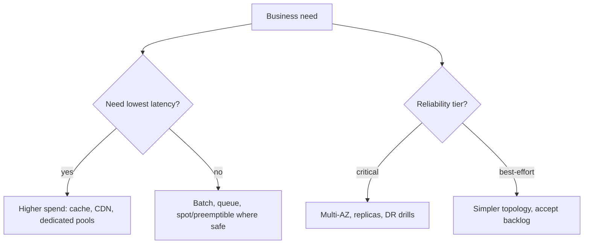

**Key Points:**

- **Every architecture has a price tag** — CapEx vs OpEx, license vs engineering time, and ongoing run cost.
- **FinOps is a design discipline** — tagging, right-sizing, and autoscale choices on [[GCP]] (and peers) belong in reviews.
- **Build vs buy** — buy commodity, build differentiation; document exit strategy either way.
- **KPIs and SLAs are contracts with reality** — define measurable success before launch.
- **Capacity planning bridges forecast and architecture** — growth assumptions drive [[DB]], [[K8S]], and network choices.

# System Design — Economics & Performance

Part of [[System Design]]. Concept-only.

---

## Budgeting and Cost Management

### CapEx vs OpEx

| | CapEx | OpEx |
| --- | --- | --- |
| **Typical** | Data center hardware, perpetual licenses (amortized) | Cloud consumption, SaaS subscriptions, managed services |
| **Planning** | Depreciation schedules | Monthly burn, budgets per team/product |
| **Architect trade-off** | Long commit, slower pivot | Elastic, risk of sprawl without governance |

Cloud-native stacks in this vault ([[GCP]], [[K8S]]) skew **OpEx-heavy** — architects must partner with finance on **unit economics** (cost per transaction, per tenant, per inference).

### Cloud cost optimization (FinOps)

| Practice | Intent |
| --- | --- |
| **Labeling / chargeback** | Who spent what; drives accountability |
| **Right-sizing** | Match CPU/memory to p95, not peak fantasy |
| **Tiering storage** | Hot vs archive for logs and ML artifacts |
| **Serverless where fit** | Scale-to-zero for spiky [[API - FastAPI]] workloads |
| **Reserved capacity** | When baseline load is predictable |

Link technical choices: over-sharded [[DB — Kafka]] clusters, always-on GPU nodes, and unbounded log retention in [[DB — ELK]] are **architecture bills**, not surprises.

### Build vs buy

| Favor build | Favor buy |
| --- | --- |
| Core differentiator | Commodity (auth, email, payments) |
| Unique compliance boundary | Mature market with strong SLAs |
| Team can operate it 24/7 | No ops bench yet |

**Document:** integration surface, data residency, vendor lock-in, and **switching cost**.

### ROI and TCO

- **ROI** — (benefit − cost) / cost over a defined period; include **risk reduction** (fewer breaches, less downtime).
- **TCO** — build + run + migrate + retire; include **people cost** (on-call, training).

Architects supply **assumption tables** — growth rate, traffic doubling time, failure cost per hour — so finance can stress-test.

---

## Benchmarking and Performance

### Defining KPIs and success metrics

| Layer | Example metrics |
| --- | --- |
| **Business** | Conversion, churn, cost per order |
| **Product** | Task completion time, error rate seen by user |
| **Service** | Availability, p95 latency, error budget burn |
| **Data** | Pipeline freshness, duplicate rate |

Tie KPIs to **owners** and review cadence — monthly for product, weekly for SLOs in production.

### Capacity planning

1. **Baseline** — current peak RPS, storage growth, queue depth
2. **Forecast** — marketing events, tenant onboarding, ML batch windows
3. **Headroom** — target utilization (e.g., 60% CPU at peak)
4. **Plan B** — throttle, queue, or degrade gracefully before hard failure

Maps to scaling patterns in [[K8S]] (horizontal pods), [[DB — Redis]] (cache), and [[Processing — Celery]] (worker pool). Validate with [[Load Testing]] before major launches.

### Competitive analysis

- **Feature parity** — table stakes vs differentiators
- **Non-functional** — latency, regions, compliance certifications
- **Ecosystem** — integrations partners already use

Use findings to **justify** build vs buy and roadmap ordering — not as vanity slides.

### Performance baselines and SLA negotiation

| Term | Meaning |
| --- | --- |
| **SLA** | Contractual commitment (often with credits) |
| **SLO** | Internal target stricter than SLA |
| **SLI** | Measurable indicator (e.g., successful requests / total) |

**Negotiation tips:**

- Measure **your** baseline before promising vendor or customer numbers
- Separate **availability** from **latency** and **support response**
- Define **maintenance windows** and **exclusions** (client bugs, force majeure)
- Align with observability in [[DB — Prometheus & Grafana]] and log forensics in [[DB — ELK]]

---

## Economics vs Performance Trade-offs

---

## Related Notes

- [[System Design]]
- [[System Design — Strategy & Technology]]
- [[System Design — Delivery & Planning]]
- [[GCP]]
- [[DB — Prometheus & Grafana]]
- [[DB — ELK]]
- [[K8S]]

---

## Tags

#system-design #finops #capex #opex #roi #tco #sla #slo #capacity-planning #performance
