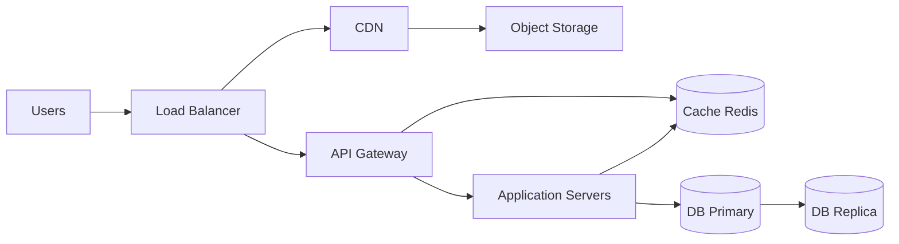
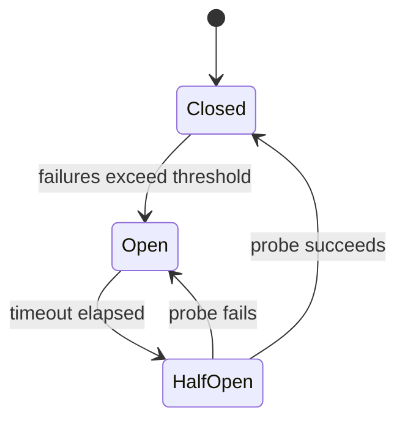

**Key Points:**

- **System design (technical)** — designing **scalable, reliable, maintainable** systems that meet functional and non-functional requirements; complements the **architect practice** notes in [[System Design]].
- **Start with requirements** — clarify scope, traffic, consistency, and latency before drawing boxes.
- **Scale horizontally first** — add machines, cache hot paths, async heavy work; vertical scale has a ceiling.
- **Every component is a trade-off** — CAP, cost, complexity; document decisions in ADRs — [[System Design — Governance & Documentation]].
- **Link to platform depth** — load balancers and K8s in [[K8S]]; stores and replication in [[DB]]; queues in [[Processing]]; observability in [[DB — Prometheus & Grafana]].
- **Twelve core patterns** — load balancing through auto scaling; know **when each helps and when it breaks** — see below.

# System Design — Fundamentals & Patterns

> Cheatsheet-style reference for **distributed systems** and **interview-style** design. For stakeholder, governance, and delivery skills see [[System Design]].

Part of [[System Design]]. Concept-only — implementation lives in platform hubs.

---

## What is System Design?

**System design** is the process of designing **scalable, reliable, and maintainable** systems to satisfy given requirements — both **what** the system does (functional) and **how well** it does it (non-functional).

In this vault:

| Lens | Where |
| --- | --- |
| Technical building blocks | **This note** + [[DB]], [[K8S]], [[GCP]] |
| Architect practice (people, process) | [[System Design — Stakeholders & Communication]] … [[System Design — Governance & Documentation]] |

---

## System Design Principles

| Principle | Meaning | Vault hooks |
| --- | --- | --- |
| **Scalability** | Handle growing load without redesign | Horizontal scale, sharding — below |
| **Reliability & availability** | Works correctly; stays up when parts fail | Replicas, health checks, [[K8S]] |
| **Performance** | Meets latency and throughput targets | Caching, CDN, async — [[Load Testing]] |
| **Cost efficiency** | Right-size infra; avoid over-engineering | [[System Design — Economics & Performance]], [[GCP]] |
| **Maintainability** | Teams can change it safely | Simplicity, docs, ADRs |
| **Security** | Protect data and access | [[Cybersecurity — Fundamentals & Controls]], IAM |
| **Simplicity** | Prefer boring, proven patterns first | YAGNI; evolve when metrics demand |

---

## System Design Process

Use this sequence in reviews, RFCs, and whiteboard sessions:

```text
1. Understand requirements     → functional + non-functional; ask clarifying questions
2. Define system scope         → in/out of v1; users, scale estimates
3. High-level design           → major components and data flow (diagram)
4. Detailed design             → APIs, schemas, algorithms, failure modes
5. Identify bottlenecks        → DB, hot keys, single points of failure
6. Scale & optimize            → cache, shard, queue, replicate
7. Review & iterate            → trade-offs, ADR, stakeholder sign-off
```

Pair step 7 with [[System Design — Stakeholders & Communication]] and [[System Design — Governance & Documentation]].

---

## Key Non-Functional Requirements (NFRs)

| NFR | Question | Typical levers |
| --- | --- | --- |
| **Scalability** | Can we handle 10× traffic? | Horizontal scale, sharding, stateless apps |
| **Availability** | What uptime (e.g. 99.9%)? | Redundancy, failover, multi-AZ |
| **Consistency** | Must all readers see the same data now? | Strong vs eventual — below |
| **Latency** | p95/p99 response time? | Cache, CDN, region placement |
| **Durability** | Do we survive disk/node loss? | Replication, backups, [[DVC]]-style versioning for ML artifacts |
| **Security** | Who can access what? | AuthN/Z, encryption, audit logs |

Document NFRs explicitly in RFCs — [[System Design — Delivery & Planning]].

---

## Reference Architecture

Classic web stack (maps to cheatsheet diagram):



| Component | Role | This vault |
| --- | --- | --- |
| Load balancer | Distributes traffic | [[K8S]] Ingress / Service; [[GCP]] load balancing |
| CDN | Edge static assets | Cloud CDN; cache headers from [[API - FastAPI]] |
| Object storage | Images, videos, exports | [[GCP]] GCS; [[DB — MongoDB]] GridFS (niche) |
| API gateway | Single entry, auth, rate limits | Gateway + [[API - FastAPI]] behind [[K8S]] |
| Cache | Hot reads, session store | [[DB — Redis]] |
| App servers | Business logic | [[API - FastAPI]], [[Web — Django]], [[Web — Flask]] |
| DB primary / replica | Writes / read scaling | [[ORM - SQLAlchemy]], [[DB — PostgreSQL]], [[DB — MongoDB]] |

---

## Scaling Strategies

| Strategy | Idea | When |
| --- | --- | --- |
| **Vertical scaling** | Bigger CPU/RAM on one machine | Quick fix; hard upper bound |
| **Horizontal scaling** | More identical servers | Default for stateless APIs |
| **Database sharding** | Split data by key across DBs | Write/read scale beyond one node |
| **Caching** | Store frequent reads in memory | Read-heavy, tolerates staleness |
| **Load balancing** | Spread requests across instances | Always with horizontal app tier |
| **Asynchronous processing** | Queues for slow or bursty work | Email, ML, crawls — [[Processing — Celery]], [[DB — Kafka]], [[DB — RabbitMQ]] |

**Order of operations:** stateless app tier → cache → read replicas → shard → async offload.

---

## Common Components

| Component | Purpose | Examples in vault |
| --- | --- | --- |
| **Load balancer** | Distribute incoming traffic | [[K8S]] Service, Ingress |
| **API gateway** | Routing, auth, throttling | Kong, cloud gateway + FastAPI |
| **Application server** | Business logic | [[API - FastAPI]], [[Web — Django]] |
| **Database** | Persistent structured data | [[DB — PostgreSQL]], [[DB — MongoDB]], [[DB — Neo4j]] |
| **Cache** | Fast key-value reads | [[DB — Redis]] |
| **Message queue** | Async, decoupled workers | [[DB — RabbitMQ]], [[DB — Kafka]] |
| **CDN** | Edge delivery of static content | CloudFront / Cloud CDN |
| **Object storage** | Large blobs | GCS, S3 |
| **Monitoring** | Health, SLOs, alerts | [[DB — Prometheus & Grafana]], [[DB — ELK]] |
| **Logging** | Searchable event history | [[DB — ELK]], structured logs from apps |

---

## 12 Architecture Patterns (ByteByteGo-style)

High-level patterns every developer should recognize — and **when they fail**. Maps to common interview and whiteboard topics.

| # | Pattern | One-line | When it helps | When it fails / pitfalls | Vault |
| --- | --- | --- | --- | --- | --- |
| 1 | **Load balancing** | Spread traffic across servers | Stateless app tier, horizontal scale | Sticky sessions on wrong LB; one slow node poisons pool without health checks | [[K8S]] Service, Ingress; [[GCP]] |
| 2 | **Caching** | Hot data in memory | Read-heavy, tolerates staleness | Cache stampede, stale reads, invalidation bugs | [[DB — Redis]] |
| 3 | **CDN** | Static assets at the edge | Global users, images/JS/CSS | Dynamic HTML not cacheable; cache purge lag | [[GCP]] Cloud CDN |
| 4 | **Message queue** | Producer enqueues; consumer pulls | Decouple services, smooth spikes, retries | Queue backlog growth; poison messages; ordering needs | [[DB — RabbitMQ]], [[Processing — Celery]] |
| 5 | **Pub-Sub** | Many subscribers on a topic | Fan-out events (notifications, audit) | Slow subscriber blocks others unless async; no single consumer guarantee | [[DB — Kafka]], [[DB — Redis]] pub/sub |
| 6 | **API gateway** | Single entry: route, auth, TLS | Many microservices, consistent edge policy | Gateway becomes bottleneck; config sprawl | [[API - FastAPI]] + gateway; [[K8S]] Ingress |
| 7 | **Circuit breaker** | Stop calling a failing dependency | Cascading failures, flaky downstream | Opens too aggressively (false positives) or too late | App libs (tenacity/resilience4j pattern); design in RFC |
| 8 | **Service discovery** | Find live instances dynamically | Auto-scaled or ephemeral pods | Stale registry; split-brain during partitions | [[K8S]] DNS + Services; Consul/etcd (concept) |
| 9 | **Sharding** | Split data by shard key | DB write/read beyond one node | Hot shards, cross-shard joins, rebalancing pain | [[DB — MongoDB]], [[DB — PostgreSQL]] (Citus) |
| 10 | **Rate limiting** | Cap requests per client/window | Abuse, fairness, protect DB | Legit traffic throttled; distributed limit needs shared store | [[API - FastAPI — Rate Limiting (SlowAPI)]], [[DB — Redis]] |
| 11 | **Consistent hashing** | Map keys to nodes on a ring | Cache clusters, distributed stores | Uneven vnode distribution; full ring remap on big topology change | [[DB — Redis]] Cluster; CDN origin selection |
| 12 | **Auto scaling** | Add/remove instances from metrics | Variable load, cost control | Scale lag (cold start); oscillation without cooldown | [[K8S]] HPA; [[GCP]] Cloud Run; [[Load Testing]] |

### Queue vs Pub-Sub

```text
Message queue (point-to-point):  Producer → [Queue] → one Consumer (or competing consumers)
Pub-Sub (fan-out):               Publisher → Topic → Subscriber A, B, C (all get copy)
```

Use a **queue** when exactly one worker should process each job ([[Processing — Celery]]). Use **pub-sub** when many services react to the same event ([[DB — Kafka]] topics).

### Circuit breaker states



**Closed** — normal calls. **Open** — fail fast, no hammering downstream. **Half-open** — trial request to test recovery. Pair with timeouts and retries — [[Python — tenacity]] for app-level patterns.

### Consistent hashing (why it matters)

Without it, adding a cache node can remap **most** keys. A **hash ring** assigns keys to nodes so only neighbors move when nodes join or leave — critical for [[DB — Redis]] Cluster and large CDN caches.

### Auto scaling signals

| Signal | Scale out when | Watch for |
| --- | --- | --- |
| CPU / memory | Sustained high utilization | Lag behind traffic spikes |
| Request rate / queue depth | Backlog or latency SLO breach | Over-scale on brief bursts |
| Custom metric | Business KPI (e.g. queue length) | Wrong metric → wrong capacity |

Validate with [[Load Testing]] before trusting HPA rules in production — [[K8S]].

---

## Data Consistency Models

| Model | Behavior | Use when |
| --- | --- | --- |
| **Strong consistency** | All nodes see same data immediately | Banking balances, inventory locks |
| **Eventual consistency** | Replicas converge over time | Social feeds, analytics, CDN |
| **Causal consistency** | Preserves cause-effect order | Comment threads after parent post |
| **Session consistency** | Consistent within one user session | Shopping cart for logged-in user |

**CAP theorem (quick):** in a network partition you trade **Consistency** vs **Availability** — design for partition tolerance; pick C or A per use case.

| Store type | Typical consistency | Vault note |
| --- | --- | --- |
| Single PostgreSQL primary | Strong (single node) | [[DB — PostgreSQL]] |
| Primary + read replicas | Strong writes, eventual reads | Replication lag matters |
| Redis cache | Eventual vs DB | Cache invalidation strategy |
| Kafka / async pipeline | Eventual | [[DB — Kafka]] |
| Dynamo-style / geo DB | Configurable | [[DB]] hub for store choice |

---

## Quick Tips (Cheatsheet)

- **Clarify requirements** — users, QPS, data size, read/write ratio, consistency needs.
- **Start simple** — monolith or modular monolith until metrics prove split.
- **Find bottlenecks** — DB, external APIs, hot keys, serial workflows.
- **State trade-offs** — CAP, latency vs consistency, cost vs redundancy.
- **Communicate clearly** — diagram + numbered walkthrough; justify each box — [[System Design — Stakeholders & Communication]].

### Clarifying questions (examples)

```text
- How many daily active users? Peak QPS?
- Read-heavy or write-heavy?
- Strong consistency required or eventual OK?
- Latency target (p99)?
- Multi-region needed?
- Regulatory / data residency constraints?
```

---

## How This Note Fits the Series

| Cheatsheet topic | Architect practice note |
| --- | --- |
| 12 patterns — when they fail | Document in ADR + postmortems — [[System Design — Governance & Documentation]] |
| Process step 7 — review | [[System Design — Governance & Documentation]] |
| Cost efficiency | [[System Design — Economics & Performance]] |
| Roadmaps & scope | [[System Design — Delivery & Planning]] |
| Executive summary | [[System Design — Stakeholders & Communication]] |
| Build vs buy (managed DB, SaaS) | [[System Design — Strategy & Technology]] |

---

## Recommended Learning Path

1. **This note** — principles, process, reference architecture
2. **Platform depth** — [[DB]], [[K8S]], [[GCP]] as needed for your stack
3. **Measure** — [[Load Testing]], [[DB — Prometheus & Grafana]]
4. **Practice** — [[System Design — Stakeholders & Communication]] for presenting designs

---

## Related Notes

- [[System Design]]
- [[System Design — Economics & Performance]]
- [[System Design — Governance & Documentation]]
- [[DB]]
- [[K8S]]
- [[GCP]]
- [[API - FastAPI]]
- [[API - FastAPI — Rate Limiting (SlowAPI)]]
- [[Processing]]
- [[Load Testing]]

---

## Tags

#system-design #distributed-systems #scalability #cap #architecture #nfr #caching #sharding #load-balancing #circuit-breaker #pub-sub #rate-limiting #auto-scaling
