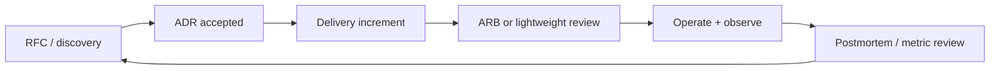

**Key Points:**

- **Governance enables speed with guardrails** — not bureaucracy for its own sake.
- **Architecture Review Boards (ARBs)** — timeboxed, criteria-driven reviews for high-impact change.
- **Compliance is a design input** — GDPR, SOC2, and sector rules shape data flows and retention.
- **RFCs propose; ADRs decide** — separate exploration from commitment.
- **Living documentation** — diagrams and decision logs updated when the system changes.

# System Design — Governance & Documentation

Part of [[System Design]]. Concept-only.

---

## Documentation and Governance

### Architecture Review Boards (ARBs)

| Purpose | Guard against |
| --- | --- |
| **Consistency** | Incompatible security or integration models |
| **Risk** | Single points of failure, unowned services |
| **Cost** | Duplicate platforms, runaway cloud spend |
| **Compliance** | Data crossing borders without controls |

**Healthy ARB habits:**

- **Publish standards** before reviews (what is automatic vs what needs review)
- **Tier reviews** — small changes async; major changes live session
- **Decision in 48–72 hours** — or explicit defer with owner
- **Representatives** — security, ops, data, not only architects

### Compliance and regulatory awareness

| Framework | Architect focus |
| --- | --- |
| **GDPR** | Lawful basis, minimization, retention, DPIA for high risk |
| **SOC 2** | Security, availability, confidentiality controls evidenced |
| **Sector (HIPAA, PCI, etc.)** | Segmentation, encryption, access logging |

Map controls to **concrete elements**: where PII lives ([[ORM - SQLAlchemy]] vs [[DB — MongoDB]]), who can decrypt, audit trail in [[DB — ELK]], access via [[GCP]] IAM. Broader security vocabulary: [[Cybersecurity]], [[Cybersecurity — Frameworks & Compliance]].

**Privacy by design:** default deny, purpose limitation, easy export/delete paths.

### RFC and proposal writing

**RFC (Request for Comments)** — explores a problem and options *before* commitment.

Suggested sections:

1. **Summary** — one paragraph
2. **Problem / opportunity**
3. **Goals and non-goals**
4. **Options considered** — with pros/cons
5. **Recommendation**
6. **Open questions**
7. **Reviewers and timeline**

Comment period (e.g., one week) → revise → **ADR** if approved.

### Architecture Decision Records (ADRs)

Deeper template than RFC outcome — see [[System Design — Stakeholders & Communication]].

| Status | Meaning |
| --- | --- |
| **Proposed** | Under discussion |
| **Accepted** | Team/build must follow |
| **Deprecated** | Superseded; do not extend |
| **Superseded by ADR-xxx** | Link chain for history |

Store ADRs **next to the repo or in a central catalog** — searchable beats slide deck archaeology.

### Maintaining living documentation

| Artifact | Update trigger |
| --- | --- |
| **C4 diagrams** | New service, boundary change, deprecation |
| **Data flow / threat model** | New PII field, integration, region |
| **Runbooks** | On-call pain, new failure mode |
| **SLO doc** | SLA change, new dependency |
| **Radar** | Quarterly tech refresh — [[System Design — Strategy & Technology]] |

**Definition of done** for features includes “docs and ADR updated” when behavior or boundaries change.

---

## Governance vs Delivery Balance

Heavy governance on **everything** stalls teams; **none** invites audit and incident pain. Calibrate tiers with [[System Design — Delivery & Planning]].

---

## Integration with Technical Vault

| Control theme | Where it shows up |
| --- | --- |
| **Secrets** | [[GCP]] Secret Manager; [[K8S]] Secrets |
| **Identity** | IAM, service accounts, API auth in [[API - FastAPI]] |
| **Audit logs** | Central logging [[DB — ELK]] |
| **Change control** | Git history, [[Commands/CLI — Git & GitHub]], release tags |
| **Data retention** | DB TTL, bucket lifecycle on GCS |

---

## Common Governance Anti-Patterns

| Anti-pattern | Fix |
| --- | --- |
| ARB as design-by-committee | Criteria checklist + decider |
| ADRs written after launch | Propose before merge for boundary changes |
| Diagrams in wiki only | Link from repo README / service catalog |
| Compliance as yearly checkbox | Embed in backlog and threat modeling |

---

## Related Notes

- [[System Design]]
- [[System Design — Stakeholders & Communication]]
- [[System Design — Delivery & Planning]]
- [[System Design — Economics & Performance]]
- [[GCP]]
- [[K8S]]
- [[DB — ELK]]
- [[Linting]]
- [[Cybersecurity]]
- [[Cybersecurity — Frameworks & Compliance]]

---

## Tags

#system-design #governance #arb #adr #rfc #gdpr #soc2 #compliance #documentation
