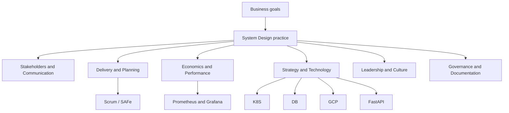

**Key Points:**

- **Two tracks in this series** — **technical fundamentals** (scalability, components, CAP, reference architecture) in [[System Design — Fundamentals & Patterns]]; **architect practice** (stakeholders, governance, economics) in the six notes below.
- **Soft skills are first-class** — stakeholder trust, clear communication, and governance matter as much as stack choices.
- **Decisions are trade-offs** — cost, risk, speed, and compliance; document the *why* in ADRs and RFCs.
- **Delivery ties to agile** — roadmaps and dependencies connect to [[Scrum]] and [[Scrum — Scaling (SAFe & LeSS)]].
- **Concept-only** — no CLI, YAML, or code in this series; technical depth stays in platform hubs.

# System Design — Overview & Architect Practice

> **From scratch checklist:** [[Build for Enterprise Architecture and Agile Delivery from Scratch]] · All roadmaps: [[README]]

## What is System Design (in this vault)?

**System design** spans two complementary views:

1. **Technical fundamentals** — designing scalable, reliable systems: load balancers, caches, replication, consistency, scaling strategies. Start with [[System Design — Fundamentals & Patterns]] (cheatsheet-style); drill into [[DB]], [[K8S]], [[GCP]] for implementation.
2. **Architect practice** — the **professional practice of shaping solutions** from discovery through delivery, cost, governance, and adoption: who to align with, how to communicate, how to plan and measure, and how to keep decisions durable.

Typical outcomes:

- **Stakeholder alignment** — map power and interest, resolve conflicts, get executive buy-in
- **Clear architecture narrative** — ADRs, diagrams (C4, UML), whiteboards that non-engineers understand
- **Predictable delivery** — roadmaps, risks, dependencies alongside agile ceremonies
- **Responsible economics** — CapEx/OpEx, FinOps on [[GCP]], build-vs-buy, ROI/TCO
- **Measurable quality** — KPIs, capacity, SLAs tied to [[DB — Prometheus & Grafana]]-style observability concepts
- **Durable governance** — ARBs, compliance (GDPR, SOC2), living documentation

---

## Skill Map

| Theme | Concept note | Core question |
| --- | --- | --- |
| Technical fundamentals | [[System Design — Fundamentals & Patterns]] | What components, NFRs, and scaling patterns fit? |
| People & messaging | [[System Design — Stakeholders & Communication]] | Who cares, and how do we explain the design? |
| Time & execution | [[System Design — Delivery & Planning]] | What ships when, and what blocks us? |
| Money & SLOs | [[System Design — Economics & Performance]] | What does it cost, and how do we know it works? |
| Direction & stack | [[System Design — Strategy & Technology]] | Where is the business going, and what do we adopt? |
| Teams & influence | [[System Design — Leadership & Culture]] | How do we lead without authority and build trust? |
| Rules & records | [[System Design — Governance & Documentation]] | How are decisions reviewed, stored, and audited? |

---

## Architect Role in the Vault Stack

The architect **does not replace** platform notes — they **frame** when to use [[K8S]] vs Cloud Run, when [[DB — Kafka]] beats [[DB — RabbitMQ]], and how [[ORM - SQLAlchemy]] fits the data model.

---

## When to Use Which Note

| Situation | Open |
| --- | --- |
| Whiteboard / interview-style design | [[System Design — Fundamentals & Patterns]] |
| Pick cache vs replica vs shard | [[System Design — Fundamentals & Patterns]] → [[DB]] |
| Executive asks for a one-pager | [[System Design — Stakeholders & Communication]] |
| Sprint keeps slipping on cross-team deps | [[System Design — Delivery & Planning]] |
| Cloud bill spike or build-vs-buy debate | [[System Design — Economics & Performance]] |
| “Should we adopt X next year?” | [[System Design — Strategy & Technology]] |
| Team resists new standard; conflict in review | [[System Design — Leadership & Culture]] |
| Audit, SOC2, or ADR required | [[System Design — Governance & Documentation]] |

---

## Relationship to Technical Hubs

| Technical hub | Architect lens |
| --- | --- |
| [[GCP]] | FinOps, managed vs self-run, IAM and compliance boundaries |
| [[K8S]] | Operational cost, team skill, multi-tenant isolation |
| [[DB]] | Store selection, retention, observability for SLAs |
| [[API - FastAPI]] / [[Web]] | Integration contracts, versioning, ownership |
| [[Machine Learning]] | Model risk, data governance, serving SLOs |
| [[Processing]] | Async boundaries, failure modes, backlog risk |

---

## Recommended Learning Path

1. **Fundamentals & Patterns** — principles, process, reference architecture, CAP
2. **Stakeholders & Communication** — map audiences before drawing boxes
3. **Delivery & Planning** — connect architecture to roadmaps and risk
4. **Governance & Documentation** — ADRs and review habits early
5. **Economics & Performance** — cost and KPI literacy before big builds
6. **Strategy & Technology** — radar and vendor evaluation
7. **Leadership & Culture** — adoption and cross-functional trust

---

## Related Notes

- [[System Design — Fundamentals & Patterns]]
- [[System Design — Stakeholders & Communication]]
- [[System Design — Delivery & Planning]]
- [[System Design — Economics & Performance]]
- [[System Design — Strategy & Technology]]
- [[System Design — Leadership & Culture]]
- [[System Design — Governance & Documentation]]
- [[GCP]]
- [[K8S]]
- [[DB]]
- [[Python Development]]

---

## Tags

#system-design #architecture #enterprise-architect #solutions-architect #soft-skills #governance #adr
