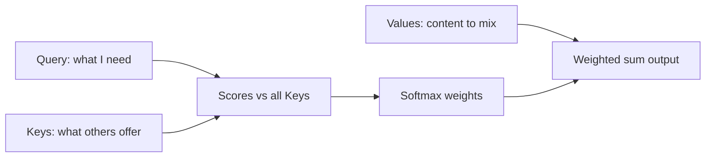
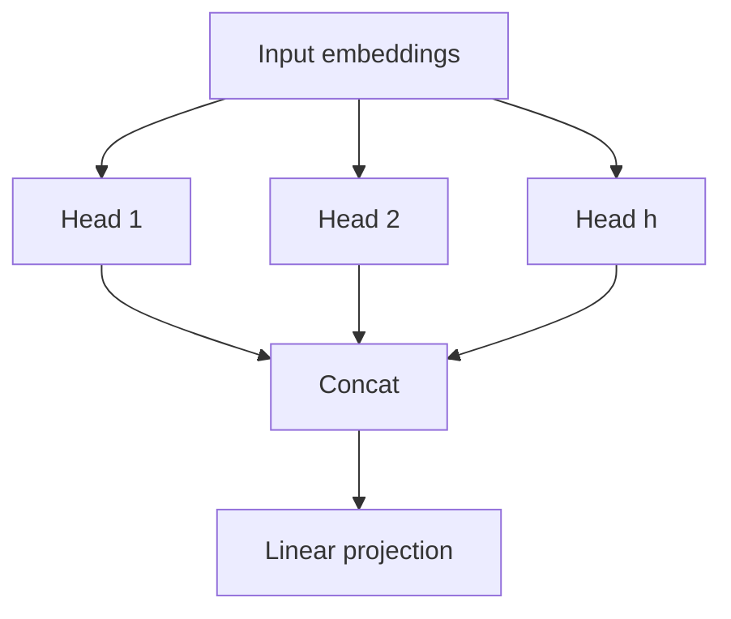
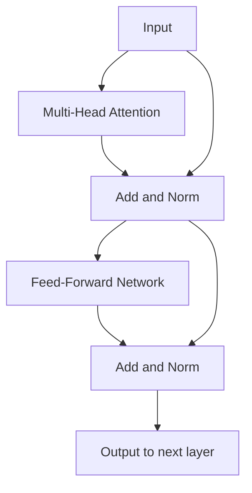
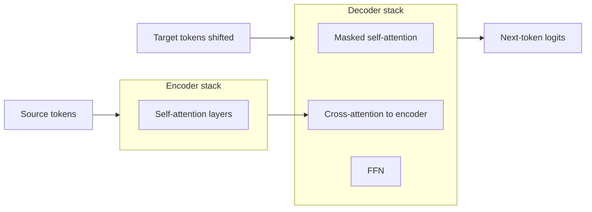
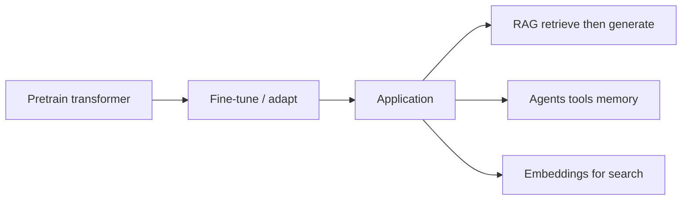

**Key Points:**

- **Attention** lets a model **weight all positions** in a sequence when producing each output — direct long-range links without recurrent steps.
- **Self-attention** compares every token to every token — parallelizable; core of the **Transformer**.
- **Multi-head attention** learns several relationship types (syntax, coreference, locality) in parallel subspaces.
- **Encoder–decoder** (original Transformer) for translation; **decoder-only** (GPT) for generation; **encoder-only** (BERT) for understanding.
- **Positional encoding** injects order because attention alone is permutation-invariant.
- **LLM stack in this vault** — theory here; orchestration in [[AI]], classical text prep in [[NLP]].

# Transformers — Attention & Architecture

> Concept-only reference for **attention mechanisms** and **transformer architectures**. Builds on [[Deep Learning — Theory]]. Application stack: [[AI]], [[NLP]].

---

## What Problem Do Transformers Solve?

**RNNs/LSTMs** process tokens **one step at a time** — hard to parallelize and gradients decay over long distances.

**Transformers** (Vaswani et al., *Attention Is All You Need*, 2017) replace recurrence with **attention** — each position can attend to all others in O(n²) memory/compute per layer, highly parallel on GPU.

Typical outcomes:

- Explain self-attention, multi-head attention, and encoder vs decoder roles
- Choose BERT-style vs GPT-style models conceptually
- Connect transformer theory to RAG and agents in [[AI]]

---

## Attention Mechanism (Intuition)

**Query–Key–Value (QKV) metaphor:** for each token, ask "how relevant is every other token to me?" and **blend their values**.

| Symbol | Role |
| --- | --- |
| **Q (query)** | "What am I looking for?" |
| **K (key)** | "What do I contain?" |
| **V (value)** | "What information do I pass if selected?" |
| **Attention weights** | Softmax of compatibility scores — sum to 1 over keys |

**Scaled dot-product attention:**

Attention(Q, K, V) = softmax(QKᵀ / √d_k) V

| Term | Why |
| --- | --- |
| **QKᵀ** | Pairwise similarity scores |
| **√d_k scaling** | Prevent softmax saturation when dimension is large |

**Cross-attention:** Q from one sequence (decoder), K/V from another (encoder) — decoder "looks at" source sentence.

**Self-attention:** Q, K, V all from the **same** sequence — each token contextualizes against all tokens.

---

## Multi-Head Attention

**Idea:** run **h parallel attention heads** with smaller d_k each; **concatenate** and project.

| Benefit | Explanation |
| --- | --- |
| Multiple relation types | Head 1 ≈ local syntax; head 2 ≈ long dependency |
| Subspace specialization | Different linear projections of Q, K, V per head |

---

## Transformer Block

A standard layer repeats:

1. **Multi-head self-attention** + residual + layer norm
2. **Position-wise feed-forward network (FFN)** — two linear layers with activation (often GELU) + residual + layer norm

| Component | Purpose |
| --- | --- |
| **Residual connections** | Gradient highway through depth |
| **Layer normalization** | Stabilize activations |
| **FFN** | Per-token non-linear transform after mixing |

Stack **N layers** (e.g. 12 for base BERT) — depth = abstraction level.

---

## Positional Information

Self-attention is **order-blind** — permute tokens and attention patterns permute the same way without extra signal.

| Approach | Idea |
| --- | --- |
| **Sinusoidal PE** (original) | Fixed sin/cos functions by position |
| **Learned embeddings** | Trainable position vectors |
| **RoPE / ALiBi** (modern LLMs) | Relative position in attention scores — better length extrapolation |

Position is **added to token embeddings** (or applied in Q/K) before attention.

---

## Encoder–Decoder Architecture (Original Transformer)

Designed for **seq2seq** (e.g. machine translation):

| Part | Attention type | Masking |
| --- | --- | --- |
| **Encoder** | Self-attention on source | None — full bidirectional context |
| **Decoder self-attention** | Causal — past tokens only | **Look-ahead mask** (no peeking at future) |
| **Decoder cross-attention** | Q from decoder, K/V from encoder | Connects output to input |

**Training:** teacher forcing — feed gold previous tokens; **inference:** autoregressive generation one token at a time.

---

## Three Transformer Families

| Family | Architecture | Pretraining objective | Typical use |
| --- | --- | --- | --- |
| **Encoder-only** | BERT, RoBERTa, DeBERTa | Masked language modeling (MLM) | Classification, NER, embeddings |
| **Decoder-only** | GPT, LLaMA, Mistral | Causal LM — predict next token | Generation, chat, code |
| **Encoder–decoder** | T5, BART, original Transformer | Span corruption / denoising | Translation, summarization |

### BERT-style (encoder)

- **MLM:** mask random tokens; predict from bidirectional context
- **NSP (optional):** next sentence prediction — less used in later models
- **Fine-tune:** add classification head on [CLS] or token outputs

### GPT-style (decoder-only)

- **Causal LM:** each token predicts the next — only left context
- **Scaling:** data + parameters + compute → emergent capabilities
- **Instruction tuning / RLHF** — align behavior (product layer in [[AI]])

### T5-style (encoder–decoder)

- Unified "text-to-text" — same framework for many tasks
- Still used; many apps now use decoder-only + prompting instead

---

## Complexity & Practical Limits

| Aspect | Scaling |
| --- | --- |
| **Self-attention** | O(n²) in sequence length n — memory and compute |
| **Long context** | Sparse attention, sliding window, linear attention, state-space models (Mamba) — active research |
| **KV cache** | Store past K/V during autoregressive decode — speeds inference |

**Implication:** very long documents need chunking (RAG in [[AI]]) or specialized long-context models.

---

## From Transformers to LLM Applications

| Layer | Vault reference |
| --- | --- |
| Embeddings | [[AI — Chroma]], [[AI — Qdrant]], sentence-transformers |
| Orchestration | [[AI — LangChain]], [[AI — LangGraph]] |
| Evaluation | [[AI — RAGAS]] |
| Classical NLP hybrid | [[NLP — spaCy]] on chunks |

Transformers **replace** much of classical seq2seq but not all preprocessing — see [[NLP]].

---

## Key Concepts Glossary

| Term | Meaning |
| --- | --- |
| **Tokenization** | Split text to subword units (BPE, SentencePiece) |
| **Embedding** | Dense vector per token |
| **Contextual embedding** | Same word different vectors by surrounding text |
| **Autoregressive** | Generate left-to-right |
| **Perplexity** | exp(average NLL) — language modeling metric |
| **Fine-tuning** | Continue training on task data |
| **LoRA / adapters** | Low-rank updates — efficient fine-tune |
| **Prompting** | Task in context without weight updates |
| **In-context learning** | Model follows examples in prompt |

---

## Transformers vs Earlier NLP

| Era | Model | Strength | Weakness |
| --- | --- | --- | --- |
| Classical | Bag-of-words, TF-IDF + linear | Fast, interpretable | No context |
| Embeddings | Word2Vec, Gensim | Semantic similarity | One vector per word |
| RNN/LSTM | Sequential state | Order modeled | Slow, long-range weak |
| **Transformer** | Global attention | Parallel, long context (within n) | Compute, data hunger |

---

## When to Use What (Conceptual)

| Need | Direction |
| --- | --- |
| Text classification with labels | Fine-tuned encoder or prompt decoder |
| Open-ended generation | Decoder-only LLM |
| Semantic search | Embedding model (often transformer encoder) + [[AI — Chroma]] |
| Structured extraction cheaply | [[NLP — spaCy]] or small fine-tuned model |
| Multi-step reasoning + tools | [[AI — LangGraph]] agent on LLM |
| Understand attention math | This note |
| Train custom vision transformer | [[ML — PyTorch]] + [[Deep Learning — Theory]] |

---

## Recommended Learning Path

1. **Attention intuition** — Q, K, V and weighted sum
2. **Self-attention vs cross-attention**
3. **Full transformer block** — residuals, layer norm, FFN
4. **BERT vs GPT** — bidirectional vs causal
5. **Subword tokenization** — why "transformer" ≠ one token
6. **Apply** — embeddings + RAG in [[AI]]; compare to [[NLP — Gensim]] Word2Vec
7. **Deep dive training** — [[ML — PyTorch]] (optional custom fine-tune)

---

## Related Notes

### Theory chain

- [[Deep Learning — Theory]]
- [[Machine Learning — Algorithms Theory]]
- [[Statistics — Theory & A/B Testing]]

### Application hubs

- [[AI]]
- [[NLP]]
- [[Machine Learning]]
- [[ML — PyTorch]]

---

## Tags

#transformers #attention #self-attention #bert #gpt #llm #nlp #deep-learning #theory
