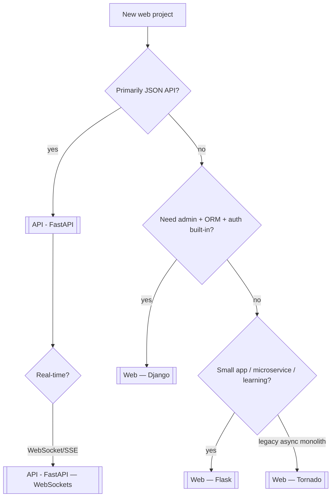

**Key Points:**

- **FastAPI is the default API choice in this vault** — async, OpenAPI, Pydantic; see [[API - FastAPI]] for REST and real-time.
- **Flask = minimal WSGI microframework** — routes, Jinja2, extensions; ideal for small apps, internal tools, and HTML cheatsheet servers.
- **Django = batteries-included monolith** — ORM, admin, auth, migrations; best when the whole product lives in one framework.
- **Tornado = event-loop web server** — async handlers and long-lived connections before ASGI was standard; niche today vs FastAPI.
- **Pick by surface area** — JSON API → FastAPI; CRUD admin site → Django; tiny server-rendered app → Flask; legacy Tornado services → maintain or migrate.

# Web — Overview & Python Web Framework Stack

## What is Web (in this vault)?

**Web** here means **Python frameworks for HTTP applications** — serving HTML pages, JSON APIs, admin UIs, and real-time connections. This hub covers **Flask**, **Django**, and **Tornado**. Modern **async APIs** in this vault default to [[API - FastAPI]]; these notes cover when and how to use the classic stack.

Typical outcomes:

- **Server-rendered pages** — Jinja2 templates, forms, static files
- **Monolith web apps** — auth, ORM, admin, migrations in one project
- **Small internal tools** — list files, show dashboards, cheatsheet viewers
- **Long-lived HTTP** — WebSockets, streaming (Tornado; prefer FastAPI today)

---

## Framework Decision Flow



---

## Flask vs Django vs Tornado vs FastAPI

|                | [[Web — Flask]]                   | [[Web — Django]]               | [[Web — Tornado]]     | [[API - FastAPI]]       |
| -------------- | --------------------------------- | ------------------------------ | --------------------- | ----------------------- |
| Style          | Microframework                    | Full-stack                     | Async web + server    | Async API-first         |
| Interface      | WSGI (sync default)               | WSGI / ASGI (4.x+)             | Own event loop        | ASGI                    |
| ORM            | Extensions / [[ORM - SQLAlchemy]] | Built-in Django ORM            | Bring your own        | [[ORM - SQLAlchemy]]    |
| Admin UI       | No (extensions)                   | **Built-in**                   | No                    | No                      |
| Templates      | [[Python — Jinja2 Package]]       | Django templates               | Tornado templates     | Jinja2 optional         |
| API docs       | Manual / extensions               | DRF + drf-spectacular          | Manual                | **OpenAPI auto**        |
| Learning curve | Low                               | High                           | Medium                | Medium                  |
| Best for       | Small apps, prototypes            | CMS, internal tools, monoliths | Legacy async services | New APIs, microservices |

---

## WSGI vs ASGI (Quick Reference)

| | WSGI | ASGI |
| --- | --- | --- |
| Model | Sync request/response | Async + WebSocket + SSE |
| Servers | Gunicorn, uWSGI, Waitress | Uvicorn, Hypercorn, Daphne |
| Frameworks | Flask, Django (sync) | FastAPI, Starlette, Django 4+ async |
| When | Simple CRUD, CPU-light views | Many concurrent I/O connections |

Flask and Django run on **Gunicorn** workers in production. FastAPI runs on **Uvicorn** (see [[API - FastAPI]]).

---

## Typical Architectures

### Flask — micro app + templates

```text
Browser → Gunicorn → Flask app → Jinja2 render
                              → SQLAlchemy / file read
```

Example pattern: static HTML listing (cheatsheets), internal dashboards. See [[Web — Flask]].

### Django — monolith

```text
Browser → Gunicorn → Django URLconf → View → Model (ORM) → PostgreSQL
                                    → Admin site
                                    → DRF API (optional)
```

See [[Web — Django]], [[ORM - SQLAlchemy]] for SQLAlchemy-first projects outside Django.

### FastAPI — API (vault default)

```text
Client → Uvicorn → FastAPI → Pydantic validate → Service → [[ORM - SQLAlchemy]]
```

See [[API - FastAPI]], [[Python Development]] Phase 5.

---

## Shared Building Blocks

| Concern | Tools in this vault |
| --- | --- |
| Templates | [[Python — Jinja2 Package]] (Flask, FastAPI) |
| HTTP client | [[Python — httpx Package]], [[Python — requests Package]] |
| Persistence | [[ORM - SQLAlchemy]], Django ORM |
| Config | [[Python — Pydantic]], `python-dotenv`, Django settings |
| Testing | [[Unit Testing - pytest]], Django `TestClient`, Flask test client |
| Quality | [[Linting — Ruff]], [[Linting — pre-commit]] |

---

## When to Use What

| Question | Choose |
| --- | --- |
| New JSON API with OpenAPI? | [[API - FastAPI]] |
| Admin + models + auth in one box? | [[Web — Django]] |
| 50-line server-rendered tool? | [[Web — Flask]] |
| Maintain existing Tornado service? | [[Web — Tornado]] (or plan migration to FastAPI) |
| WebSocket chat / live feed (new)? | [[API - FastAPI — WebSockets]] |
| HTML cheatsheet viewer? | [[Web — Flask]] + Jinja2 |
| Background jobs after HTTP? | [[Processing — Celery]] |

---

## Recommended Learning Path

1. **Baseline HTTP** — [[API - FastAPI — REST Principles & HTTP Methods]], [[Python — httpx Package]]
2. **Flask** — routes, blueprints, Jinja2 — [[Web — Flask]]
3. **Django** — if you need admin/ORM/migrations — [[Web — Django]]
4. **Compare** — when Flask extensions feel like reinventing Django, switch frameworks
5. **Production** — Gunicorn + env config + [[Linting — pre-commit]]

---

## Related Notes

- [[Web — Flask]]
- [[Web — Django]]
- [[Web — Tornado]]
- [[API - FastAPI]]
- [[Python — Jinja2 Package]]
- [[ORM - SQLAlchemy]]
- [[Python Development]]
- [[Unit Testing - pytest]]

---

## Tags

#web #flask #django #tornado #wsgi #asgi #python #backend #html #templates
